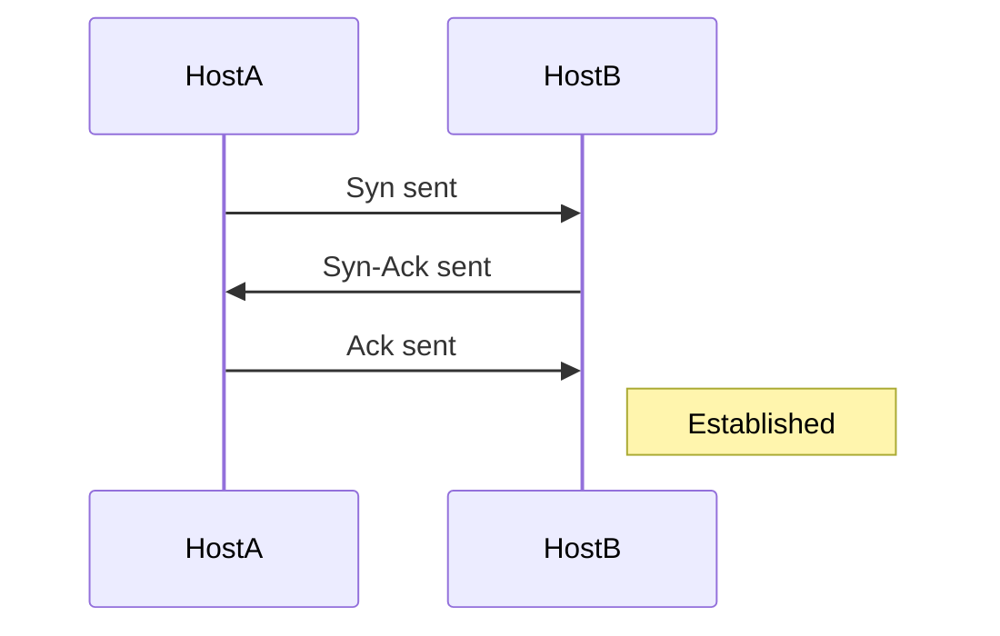
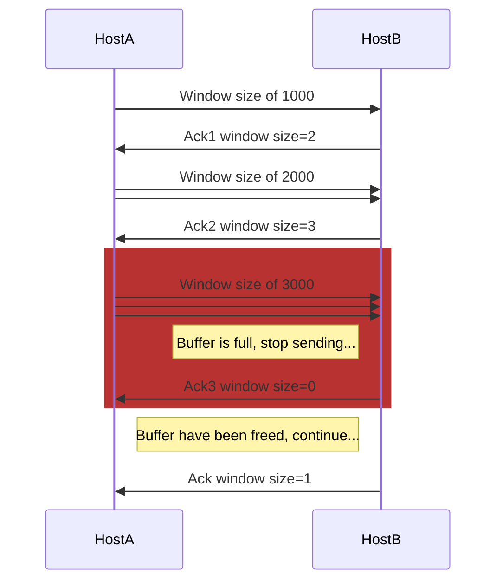
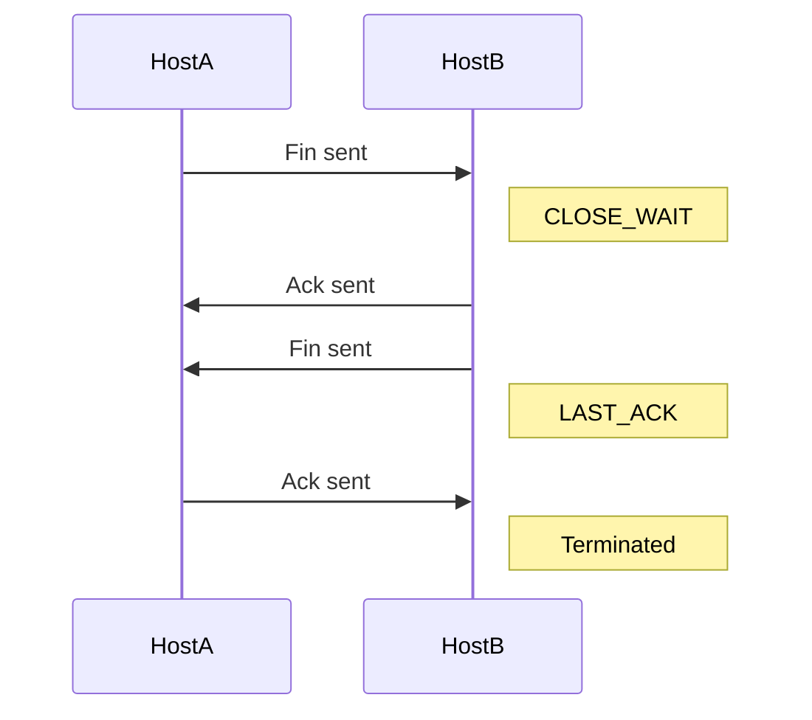

# Networking Fundamentals

> This page introduces networking fundamentals in MikroTik RouterOS, covering the OSI and TCP/IP models, their layers, protocols, and Ethernet communication details including MAC addresses and frame forwarding types.

# Networking Fundamentals

Computer networks consist of many different components and protocols working together. To understand the concept of how node to node communication happens, let's get familiar to the **OSI model** and **TCP/IP model**. Both models help to visualize how communication between nodes is happening.

### OSI Model

The Open Systems Interconnection (OSI) model is a 7-layer model that today is used as a teaching tool. The OSI model was originally conceived as a standard architecture for building network systems, but in real-world networks are much less defined than the OSI model suggests.

- **Layer 7 (Application)** - a protocol that defines the communication between the server and the client, for example, HTTP protocol. If the web browser wants to download an image, the protocol will organize and execute the request;
- **Layer 6 (Presentation)** - ensures data is received in a usable format. Encryption is done here (but in reality it may not be true, for example, IPSec);
- **Layer 5 (Session)** - responsible for setting up, managing and closing sessions between client and server;
- **Layer 4 (Transport)** - transport layers primary responsibility is assembly and reassembly, a data stream is divided into chunks (segments), assigned sequence numbers and encapsulated into protocol header (TCP, UDP, etc.);
- **Layer 3 (Network)** - responsible for logical device addressing, data is encapsulated within an IP header and now called "packet";
- **Layer 2 (Data link)** - Data is encapsulated within a custom header, either 802.3 (Ethernet) or 802.11 (wireless) and is called "frame", handles flow control;
- **Layer 1 (Physical)** - Communication media that sends and receives bits, electric signaling, and hardware interface;

### TCP/IP model

This model has the same purpose as the OSI model but fits better into modern network troubleshooting. Comparing to the OSI model, TCP/IP is a 4-layer model:

- **Application layer (4)** - includes application, presentation and session layers of the OSI model, which significantly simplifies network troubleshooting;
- **Transport layer (3)** - same as a transport layer in the OSI model (TCP, UDP protocols);
- **Internet layer (2)** - does the same as Network layer in the OSI model (include ARP, IP protocols);
- **Link layer (1)** - also called the Network Access layer. Includes both Layer1 and 2 of the OSI model, therefore its primary concern is physical data exchange between network nodes;

| TCP/IP            | OSI Model          | Protocols                       |
|:--|:--|:--|
| Application Layer | Application Layer  | DNS, DHCP,HTTP,SSH etc.         |
|                   | Presentation Layer | JPEG,MPEG,PICT etc.             |
|                   | Session Layer      | PAP, SCP, ZIP etc.              |
| Transport Layer   | Transport Layer    | TCP, UDP                        |
| Internet Layer    | Network Layer      | ICMP, IGMP, IPv4, IPv6, IPSec   |
| Link Layer        | Data Link Layer    | ARP, CDP, MPLS, PPP etc.        |
|                   | Physical Layer     | Bluetooth, Ethernet, Wi-Fi etc. |

## Ethernet

The most commonly used link layer protocol (OSI Layer2) in computer networks is the Ethernet protocol. In order to communicate, each node has a unique assigned address, called **MAC** (Media Access Control address) sometimes it is also called an Ethernet address.

It is 48-bit long and typically was fixed by the manufacturer (could not be changed), but nowadays customization of MAC addresses is widely used, RouterOS also allows to set custom MAC address.

Most commonly used MAC format is 6 hexadecimal numbers separated by colons (`D4:CA:6D:01:22:96`)

RouterOS shows MAC address in a configuration for all Ethernet-like interfaces (Wireless, 60G, VPLS, etc.)

```ros
[admin@rack1_b32_CCR1036] /interface ethernet> print 
Flags: X - disabled, R - running, S - slave 
 #    NAME                  MTU MAC-ADDRESS       ARP             SWITCH               
 0 R  ether1               1500 D4:CA:6D:01:22:96 enabled        
 1 R  ether2               1500 D4:CA:6D:01:22:97 enabled        
 2 R  ether3               1500 D4:CA:6D:01:22:98 enabled        
 3    ether4               1500 D4:CA:6D:01:22:99 enabled        
 4    ether5               1500 D4:CA:6D:01:22:9A enabled        
 5    ether6               1500 D4:CA:6D:01:22:9B enabled        
 6    ether7               1500 D4:CA:6D:01:22:9C enabled        
 7 R  ether8               1500 D4:CA:6D:01:22:9D enabled        
 8    sfp-sfpplus1         1500 D4:CA:6D:01:22:94 enabled        
 9    sfp-sfpplus2         1500 D4:CA:6D:01:22:95 enabled 
```

There are three types of forwarding frames over the Ethernet network:

- **Unicast** - frame with unicast address is sent to all nodes within the collision domain, which typically is Ethernet cable between two nodes or in case of wireless all receivers that can detect wireless signals. Only remote node with matching MAC address will accept the frame (unless the promiscuous mode is enabled)
- **Broadcast** - one of the special addresses (`FF:FF:FF:FF:FF:FF`), a broadcast frame is accepted and forwarded over Layer2 network by all nodes.
- **Multicast** - frames with multicast addresses are received by all nodes configured to listen to this address.

## IP Networking

Ethernet protocol is sufficient to get the data between two nodes on an Ethernet network, but it is not enough to get the data between nodes multiple hops away over multiple Ethernet segments. For Internet/Networking layer (OSI Layer 3) IP (Internet Protocol) is used to identify hosts with unique logical addresses.

Most of the current networks use **IPv4**, which is 32bit address written in dotted-decimal notation (`192.168.88.1`), but use of **IPv6** (128bit address) is expanding.

It is possible to add multiple IP addresses to an interface or to leave the interface without any addresses assigned to it. In the case of bridging or PPPoE connection, the physical interface may not have any address assigned, yet be perfectly usable. Configuring an IP address to a physical interface included in a bridge would mean actually setting it on the bridge interface itself.

### Netmasks

There can be multiple logical networks and to identify which network IP address belongs to, the **netmask** is used. **Netmask** typically is specified as a number of bits used to identify a logical network. The format can also be in decimal notation, for example, the 24-bit netmask can be written as `255.255.255.0`

### IPv4 Addresses

IPv4 uses 4-byte addresses which are segmented in four 8-bit fields called octets. Each octet is converted to a decimal format and separated by a dot. For example:

```
11000000 10101000 00000011 00011000 => 192.168.3.24
```

Let's take a closer look at 192.168.3.24/24 and how valid range is determined from the netmask:

```
11000000 10101000 00000011 00011000 => 192.168.3.24
11111111 11111111 11111111 00000000 => /24 or 255.255.255.0
```

In this example high 24 bits are masked, leaving us with a range of 0-255.  
This range consists of three address types:

- **Network address** - the first address from the range is used to identify the network (in our example network address would be 192.168.3.0)

- **Broadcast address** - the last/highest address from the range ( in our example it is 192.168.3.255). Broadcast address is used to send the data to all possible destinations (**all-hosts broadcast**), which permits the sender to send the data only once, and all receivers receive a copy of it. In the IPv4 protocol, the address 255.255.255.255 is used for **local broadcast**. In addition, a directed (limited) broadcast can be made to network broadcast address.
- **Unicast address** - all other addresses from the range can be used to identify specific host in the network (in our example range is from 1 to 254 for host identification).

The same as in Ethernet protocol there is also a special address range for **multicast**. Multicast address is used to associate with a group of interested receivers. In IPv4, addresses `224.0.0.0` through `239.255.255.255` are designated as multicast addresses. The sender sends a single datagram from its unicast address to the multicast group address and the intermediary routers take care of making copies and sending them to all receivers that have joined the corresponding multicast group;

Logical IP network, unicast, broadcast and multicast visualization:


There are also address ranges reserved for a special purpose:

- [Private address range (RFC 1918)](https://tools.ietf.org/html/rfc1918), that should be used only in local networks and typically are dropped when forwarded to the internet:
  - 10.0.0.0/8 - start: 10.0.0.0; end: 10.255.255.255
  - 172.16.0.0/12 - start: 172.16.0.0; end:172.31.255.255
  - 192.168.0.0/16 - start: 192.168.0.0; end: 192.168.255.255

- 198.18.0.0/15 - benchmarking
- 192.88.99.0/24 - 6to4 relay anycast address range
- 192.0.2.0/24, 198.51.100.0/24, 203.0.113.0/24 - documentation
- 169.254.0.0/16 - auto-configuration address range

#### Point-to-point addressing

Point-to-point addressing, as name implies, can be used to set layer3 network consisting of only two nodes. There are two ways to set such adressing:

- Use /31 address range
- Use /32 addresses where the network address is set as remote node`s ip address.  
  For example:

  ```mermaid
  flowchart LR
    H1 --- H2

    H1["**Host 1**____________________ **Address**: 192.168.0.1/32**Network**: 192.168.0.2"]
    H2["**Host 2**____________________ **Address**: 192.168.0.2/32**Network**: 192.168.0.1"]

    style H1 text-align:left
    style H2 text-align:left
  ```

#### Address configuration

Consider a setup where two routers are directly connected with the cable and we do not want to waste address space:

Router 1:

```ros
/ip address
add address=10.1.1.1/32 interface=ether1 network=172.16.1.1
```

Router 2:

```ros
/ip address
add address=172.16.1.1/32 interface=ether1 network=10.1.1.1
```

## ARP and Tying It All Together

Even though IP packets are addressed using IP addresses, hardware addresses must be used to actually transport data from one host to another.

This brings us to **Address Resolution Protocol (ARP)** which is used for mapping the **IPv4** address of the host to the hardware address (MAC). **ARP** protocol is referenced in [RFC 826](https://tools.ietf.org/html/rfc826). It is a thing of the past which is eliminated by multicast for IPv6, however it will stay as long as IPv4 is in use.

Each network device has a table of currently used ARP entries. Normally the table is built dynamically, but to increase network security, it can be partially or completely built statically by means of adding static entries.

When a host on the local area network wants to send an IP packet to another host in this network, it must look for the Ethernet MAC address of destination host in its ARP cache. If the destination host’s MAC address is not in the ARP table, then the ARP request is sent to find the device with a corresponding IP address. ARP sends a broadcast request message to all devices on the LAN by asking the devices with the specified IP address to reply with its MAC address. A device that recognizes the IP address as its own returns ARP response with its own MAC address:


Let's make a simple configuration and take a closer look at processes when **Host A** tries to ping **Host C**.

At first, we add IP addresses on **Host A**:

```ros
/ip address add address=10.155.101.225/24 interface=ether1
```

**Host B**:

```ros
/ip address add address=10.155.101.221/24 interface=ether1
```

**Host C**:

```ros
/ip address add address=10.155.101.217/24 interface=ether1
```

Let's run a packet sniffer that saves packet dump to the file and run the ping command on **Host A**:

```ros
/tool sniffer
  set file-name=arp.pcap filter-interface=ether1
  start 
/ping 10.155.101.217 count=1
/tool sniffer stop
```

Now you can download arp.pcap file from the router and open it in Wireshark for analyzing:


- **Host A** sends **ARP** message asking who has "10.155.101.217"
- **Host C** responds that 10.155.101.217 can be reached at 08:00:27:3C:79:3A MAC address
- Both **Host A** and **Host C** now have updated their **ARP** tables and ICMP (ping) packets can be sent

If you look at ARP tables of both hosts by running `/ip/arp/print`, you should be able to see relevant entries:

```routeros
[admin@host_a] /ip arp> print 
Flags: D - DYNAMIC; C - COMPLETE
Columns: ADDRESS, MAC-ADDRESS, INTERFACE, VRF, STATUS
 #    ADDRESS         MAC-ADDRESS       INTERFACE     VRF   STATUS
 0 DC 10.155.101.217  08:00:27:3C:79:3A ether1        main  reachable

 [admin@host_b] /ip arp> print 
Flags: D - DYNAMIC; C - COMPLETE
Columns: ADDRESS, MAC-ADDRESS, INTERFACE, VRF, STATUS
 #    ADDRESS         MAC-ADDRESS       INTERFACE     VRF   STATUS
 0 DC 10.155.101.225  08:00:27:85:69:B5 ether1        main  reachable
```

There might be scenarios where different behavior is necessary. RouterOS allows configuring different modes for interfaces that support **ARP**:

- **Enabled** - ARPs will be discovered automatically and new dynamic entries will be added to the ARP table. This is a default mode for interfaces.
- **Disabled** - If the ARP feature is turned off on the interface, then ARP requests from clients are not answered by the router. Therefore, static ARP entry should be added to the clients as well. For example,
  Host A:

  ```ros
  /interface/set ether1 arp=disabled
  /ip arp add mac-address=08:00:27:3C:79:3A address=10.155.101.217 interface=ether1
  ```

  Host B:

  ```ros
  /ip arp add mac-address=08:00:27:85:69:B5 address=10.155.101.225 interface=ether1
  ```

- **Reply Only** - If the ARP property is set to `reply-only` on the interface, then the router only replies to ARP requests. Neighbour MAC addresses will be resolved using `/ip/arp` statically, but there will be no need to add the router's MAC address to other hosts' ARP tables like in the cases where ARP is disabled.

- **Proxy ARP** - A router with properly configured proxy ARP feature acts as a transparent proxy between directly connected networks. This behavior can be useful, for example, if you want to assign dial-in (PPP, PPPoE, PPTP) clients IP addresses from the same address space as used on the connected LAN.

- **Local Proxy ARP** - If the arp property is set to `local-proxy-arp` on an interface, then the router performs proxy ARP to/from this interface only. I.e. for traffic that comes in and goes out of the same interface. In a normal LAN, the default behavior is for two network hosts to communicate directly with each other, without involving the router.
  The router will respond to all client hosts with the router's own interface MAC address instead of the other host's MAC address.

  E.g. If Host A (192.168.88.2/24) queries for the MAC address of Host B (192.168.88.3/24), the router would respond with its own MAC address. In other words, if local-proxy-arp is enabled, the router would assume responsibility for forwarding traffic between Host A 192.168.88.2 and Host B 192.168.88.3. All the ARP cache entries on Hosts A and B will reference the router's MAC address. In this case, the router is performing local-proxy-arp for the entire subnet 192.168.88.0/24.

  An example for RouterOS local-proxy-arp could be a bridge setup with a DHCP server and isolated bridge ports where hosts from the same subnet can reach each other only at Layer3 through bridge IP.

  ```ros
  /interface bridge
  add arp=local-proxy-arp name=bridge1
  /interface bridge port
  add bridge=bridge1 horizon=1 interface=ether2
  add bridge=bridge1 horizon=1 interface=ether3
  add bridge=bridge1 horizon=1 interface=ether4
  ```

  This technology is known by different names:
  - In RFC 3069 it is called VLAN Aggregation;
  - Cisco and Allied Telesis call it Private VLAN;
  - Hewlett-Packard calls it Source-Port filtering or port-isolation;
  - Ericsson calls it MAC-Forced Forwarding (RFC Draft).

#### Proxy ARP Example

Let's look at the example diagram.  


**Host A** (172.16.1.2) on Subnet A wants to send packets to **Host D** (172.16.2.3) on Subnet B. **Host A** has a /16 subnet mask which means that it believes that it is directly connected to all 172.16.0.0/16 network (the same LAN). It broadcasts on Subnet A to clarify the MAC address of **Host D**.

Info from packet analyzer software:

```text
 No.     Time   Source             Destination       Protocol  Info

 12   5.133205  00:1b:38:24:fc:13  ff:ff:ff:ff:ff:ff  ARP      Who has 173.16.2.3?  Tell 173.16.1.2

Packet details:

Ethernet II, Src: (00:1b:38:24:fc:13), Dst: (ff:ff:ff:ff:ff:ff)
    Destination: Broadcast (ff:ff:ff:ff:ff:ff)
    Source: (00:1b:38:24:fc:13)
    Type: ARP (0x0806)
Address Resolution Protocol (request)
    Hardware type: Ethernet (0x0001)
    Protocol type: IP (0x0800)
    Hardware size: 6
    Protocol size: 4
    Opcode: request (0x0001)
    [Is gratuitous: False]
    Sender MAC address: 00:1b:38:24:fc:13
    Sender IP address: 173.16.1.2
    Target MAC address: 00:00:00:00:00:00
    Target IP address: 173.16.2.3
```

With this ARP request, **Host A** (172.16.1.2) is asking **Host D** (172.16.2.3) to send its MAC address.  Layer-2 broadcast means that frame will be sent to all hosts in the same layer-2 broadcast domain which includes the **ether0** interface of the router, but does not reach **Host D**, because router by default does not forward layer-2 broadcasts.

To fix this problem we need to enable `proxy-arp` on ether0:

```ros
/interface/ethernet set ether0 arp=proxy-arp
```

Now, the router knows that the target address (172.16.2.3) is on another subnet and is reachable, it sends a unicast reply to **Host A** with its own **MAC** address. Basically, it is saying "send these packets to me, and I'll get it to where it needs to go."

```text
No.     Time   Source            Destination         Protocol   Info

13   5.133378  00:0c:42:52:2e:cf  00:1b:38:24:fc:13   ARP        172.16.2.3 is at 00:0c:42:52:2e:cf

Packet details:

Ethernet II, Src: 00:0c:42:52:2e:cf, Dst: 00:1b:38:24:fc:13
   Destination: 00:1b:38:24:fc:13
   Source: 00:0c:42:52:2e:cf
   Type: ARP (0x0806)
Address Resolution Protocol (reply)
   Hardware type: Ethernet (0x0001)
   Protocol type: IP (0x0800)
   Hardware size: 6
   Protocol size: 4
   Opcode: reply (0x0002)
   [Is gratuitous: False]
   Sender MAC address: 00:0c:42:52:2e:cf
   Sender IP address: 172.16.1.254
   Target MAC address: 00:1b:38:24:fc:13
   Target IP address: 172.16.1.2
```

When Host A receives ARP response it updates its ARP table, as shown:

```text
C:\Users\And>arp -a
Interface: 173.16.2.1 --- 0x8
  Internet Address      Physical Address      Type
  173.16.1.254          00-0c-42-52-2e-cf    dynamic
  173.16.2.3            00-0c-42-52-2e-cf    dynamic
  173.16.2.2            00-0c-42-52-2e-cf    dynamic
```

After MAC table update, **Host A** forwards all the packets intended for **Host D** (172.16.2.3) directly to router interface ether0 (00:0c:42:52:2e:cf) and the router forwards packets to **Host D**. The ARP cache on the hosts in Subnet A is populated with the MAC address of the router for all the hosts on Subnet B. Hence, all packets destined to Subnet B are sent to the router. The router forwards those packets to the hosts in Subnet B.

Multiple IP addresses by the host are mapped to a single MAC address when proxy ARP is used.

## Transport Layer

Protocols in this layer provide end-to-end communication services for applications. These protocols should ensure that packets arrive in sequence and without error, by swapping acknowledgments of data reception, and retransmitting lost packets.

The best known and widely used is **Transmission Control Protocol (TCP)**, which is used for connection-oriented transmission, it incorporates mechanisms for reliable data transmission.

Connectionless **User Datagram Protocol (UDP)** is another common protocol used for simple data transmission.

### TCP Protocol Operation

Connection-oriented protocol does not send any data until a proper connection is established. **TCP** uses multi-step handshake process whenever the transmitting device tries to establish a connection to the remote node. As a result end-to-end virtual (logical) circuit is created where flow control and acknowledgment for reliable delivery are used. TCP has several message types used in connection establishment and termination process.

**Three-way handshake** process:

1. The **HostA** who needs to initialize a connection sends out an **SYN** (Synchronize) packet with a proposed initial sequence number to the destination **HostB**.
2. When the **HostB** receives a **SYN** message, it replies with a packet where both **SYN** and **ACK** flags are set in the TCP header (SYN-ACK).
3. When the **HostA** receives the SYN-ACK, it replies with the **ACK** (Acknowledgment) packet. **HostB** receives **ACK** and at this stage, the connection is **ESTABLISHED;**



Now that we know how the **TCP** connection is established we need to understand how data transmission is managed and maintained.

Connection-oriented protocol services are often sending acknowledgments (ACKs) after successful delivery. After the packet with data is transmitted, the sender waits for acknowledgment from the receiver. If time expires and the sender did not receive **ACK**, a packet is retransmitted.

Let’s think about what happens when data-grams are sent out faster than the receiving device can process. The receiver stores them in memory called a buffer. But since buffer space is not unlimited, when its capacity is exceeded receiver starts to drop the frames. All dropped frames must be re-transmitted again which is the reason for low transmission performance.

To address this problem, TCP uses a flow control protocol. The window mechanism is used to control the flow of the data. When a connection is established, the receiver specifies the window field in each TCP frame. Window size represents the amount of received data that the receiver is willing to store in the buffer. Window size (in bytes) is sent together with acknowledgments to the sender. So the size of the window controls how much information can be transmitted from one host to another without receiving an acknowledgment. The sender will send only the amount of bytes specified in window size and then will wait for acknowledgments with updated window size.

If the receiving application can process data as quickly as it arrives from the sender, then the receiver will send a positive window advertisement (increase the size of the window) with each acknowledgment. It works until the sender becomes faster than the receiver and incoming data will eventually fill the receiver's buffer, causing the receiver to advertise acknowledgment with a zero window. A sender that receives a zero window advertisement must stop transmit until it receives a positive window.  Let's take a look at the illustrated windowing process:

1. The **HostA** starts to transmit with a window size of 1000, one 1000byte frame is transmitted.
2. Receiver **HostB** returns **ACK** with window size to increase to 2000.
3. The **HostA** receives **ACK** and transmits two frames (1000 bytes each).
4. After that, the receiver advertises an initial window size to 3000. Now sender transmits three frames and waits for an acknowledgement.
5. The first three segments fill the receiver's buffer faster than the receiving application can process the data, so the advertised window size reaches zero indicating that it is necessary to wait before further transmission is possible.
6. The size of the window and how fast to increase or decrease the window size is available in various TCP congestion avoidance algorithms such as Reno, Vegas, Tahoe, etc.



When the data transmission is complete and the host wants to terminate the connection, the termination process is initiated. Unlike **TCP** Connection establishment, which uses a **three-way handshake**, connection termination uses a **four-way** handshake. A connection is terminated when both sides have finished the shutdown procedure by sending a **FIN** (finish) and receiving an **ACK** (Acknowledgment).

**Four-way** termination process:

1. The **HostA**, who needs to terminate the connection, sends a special message with the **FIN** flag, indicating that it has finished sending the data.
2. The **HostB**, who receives the **FIN** segment, does not terminate the connection but enters into a "passive close" (CLOSE\_WAIT) state and sends the **ACK** for the **FIN** back to the **HostA**. If **HostB** does not have any data to transmit to the **HostA** it will also send the **FIN** message. Now the **HostB** enters into LAST\_ACK state. At this point it will no longer accept data from **HostA**, but can continue to transmit data.
3. When the **HostA** receives the last **FIN** from the **HostB**, it enters a (TIME\_WAIT) state, and sends an **ACK** back to the **HostB**.
4. **HostB** gets the **ACK** from the **HostA** and connection is terminated.



## See more

- [RFC 6890](https://tools.ietf.org/html/rfc6890) - list of all reserved IPv4 and IPv6 address ranges
- [RFC 3069](https://tools.ietf.org/html/rfc3069)
