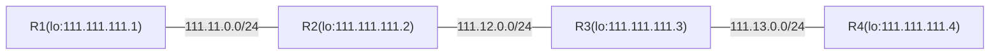

# LDP

> This page introduces MikroTik RouterOS's Label Distribution Protocol (LDP) for establishing IPv4/IPv6 Label Switched Paths (LSPs), detailing prerequisites like loopback IP addresses and IP connectivity, along with an example setup for four routers.

# LDP

MikroTik RouterOS implements Label Distribution Protocol (RFC 3036, RFC 5036, and RFC 7552) for IPv4 and IPv6 address families. LDP is a protocol that performs the set of procedures and exchanges messages by which Label Switched Routers (LSRs) establish Label Switched Paths (LSPs) through a network by mapping network-layer routing information directly to data-link layer switched paths.

## Prerequisites for MPLS

### "Loopback" IP address

Although not a strict requirement, it is advisable to configure routers participating in the MPLS network with "loopback" IP addresses (not attached to any real network interface) to be used by LDP to establish sessions.

This serves 2 purposes:

- As there is only one LDP session between any 2 routers, no matter how many links connect them, the loopback IP address ensures that the LDP session is not affected by interface state or address changes.
- Use of a loopback address as the LDP transport address ensures proper penultimate hop popping behavior when multiple labels are attached to the packet as in the case of VPLS.

In RouterOS, a "loopback" IP address can be configured by creating a dummy bridge interface without any ports and adding the address to it. For example:

```ros
/interface/bridge/add name=lo
/ip/address/add address=10.255.255.1/32 interface=lo
```

### IP connectivity

As LDP distributes labels for active routes, the essential requirement is properly configured IP routing. LDP by default distributes labels for active IGP routes (that is, connected, static, and routing protocol learned routes, except BGP).

For instructions on how to properly set up IGP refer to appropriate documentation sections:

- [OSPF](../unicast/ospf/index.md)
- [Static Routing](../routing-decision.md)
- Etc

LDP supports ECMP routes.

You should be able to reach any loopback address from any location of your network before continuing with the LDP configuration. Connectivity can be verified with the ping tool running from loopback address to loopback address.

## Example Setup

Let's consider that we have four already existing routers set up, with working IP connectivity.



### Ip Reachability

Not going deep into routing setup here is the quick export of the IP and OSPF configurations:

```ros
#R1
/interface/bridge
add name=loopback
/ip/address
add address=111.11.0.1/24 interface=ether2
add address=111.111.111.1 interface=loopback

/routing/ospf/instance
add name=default_ip4 router-id=111.111.111.1
/routing/ospf/area
add instance=default_ip4 name=backbone_ip4
/routing/ospf/interface-template
add area=backbone_ip4 dead-interval=10s hello-interval=1s networks=111.111.111.1 
add area=backbone_ip4 dead-interval=10s hello-interval=1s networks=111.11.0.0/24 

#R2
/interface/bridge
add name=loopback
/ip/address
add address=111.11.0.2/24 interface=ether2
add address=111.12.0.1/24 interface=ether3
add address=111.111.111.2 interface=loopback

/routing/ospf/instance
add name=default_ip4 router-id=111.111.111.2
/routing/ospf/area
add instance=default_ip4 name=backbone_ip4
/routing/ospf/interface-template
add area=backbone_ip4 dead-interval=10s hello-interval=1s networks=111.111.111.2
add area=backbone_ip4 dead-interval=10s hello-interval=1s networks=111.11.0.0/24
add area=backbone_ip4 dead-interval=10s hello-interval=1s networks=111.12.0.0/24

#R3
/interface/bridge
add name=loopback

/ip/address
add address=111.12.0.2/24 interface=ether2
add address=111.13.0.1/24 interface=ether3
add address=111.111.111.3 interface=loopback

/routing/ospf/instance
add name=default_ip4 router-id=111.111.111.3
/routing/ospf/area
add instance=default_ip4 name=backbone_ip4
/routing/ospf/interface-template
add area=backbone_ip4 dead-interval=10s hello-interval=1s networks=111.111.111.3
add area=backbone_ip4 dead-interval=10s hello-interval=1s networks=111.12.0.0/24
add area=backbone_ip4 dead-interval=10s hello-interval=1s networks=111.13.0.0/24

#R4
/interface/bridge
add name=loopback
/ip/address
add address=111.13.0.2/24 interface=ether2
add address=111.111.111.4 interface=loopback

/routing/ospf/instance
add name=default_ip4 router-id=111.111.111.4
/routing/ospf/area
add instance=default_ip4 name=backbone_ip4
/routing/ospf/interface-template
add area=backbone_ip4 dead-interval=10s hello-interval=1s networks=111.111.111.4
add area=backbone_ip4 dead-interval=10s hello-interval=1s networks=111.13.0.0/24

```

Verify that IP connectivity and routing are working properly

```text
[admin@R4] /ip/address> /tool/traceroute 111.111.111.1 src-address=111.111.111.4
Columns: ADDRESS, LOSS, SENT, LAST, AVG, BEST, WORST, STD-DEV
#  ADDRESS        LOSS  SENT  LAST   AVG  BEST  WORST  STD-DEV
1  111.13.0.1     0%       4  0.6ms  0.6  0.6   0.6    0      
2  111.12.0.1     0%       4  0.5ms  0.6  0.5   0.6    0.1    
3  111.111.111.1  0%       4  0.6ms  0.6  0.6   0.6    0      

```

### LDP Setup

In order to start distributing labels, LDP is enabled on interfaces that connect other LDP routers and is not enabled on interfaces that connect customer networks.

On R1 it will look like this:

```ros
/mpls/ldp
add afi=ip lsr-id=111.111.111.1 transport-addresses=111.111.111.1
/mpls/ldp/interface
add interface=ether2    

```

:::info
Note that the transport address gets set to 111.111.111.1. This makes the router originate LDP session connections with this address and also advertise this address as a transport address to LDP neighbors.
:::

Other routers are set up similarly.

R2:

```ros
/mpls/ldp
add afi=ip lsr-id=111.111.111.2 transport-addresses=111.111.111.2
/mpls/ldp/interface
add interface=ether2   
add interface=ether3   

```

On R3:

```ros
/mpls/ldp
add afi=ip lsr-id=111.111.111.3 transport-addresses=111.111.111.3
/mpls/ldp/interface
add interface=ether2   
add interface=ether3   

```

On R4:

```ros
/mpls/ldp
add afi=ip lsr-id=111.111.111.4 transport-addresses=111.111.111.4
/mpls/ldp/interface
add interface=ether2   

```

After LDP sessions are established, R2 should have two LDP neighbors:

```text
[admin@R2] /mpls/ldp/neighbor> print 
Flags: D, I - INACTIVE; O, T - THROTTLED; p - PASSIVE
Columns: TRANSPORT, LOCAL-TRANSPORT, PEER, ADDRESSES
#     TRANSPORT      LOCAL-TRANSPORT  PEER             ADDRESSES    
0 DO  111.111.111.1  111.111.111.2    111.111.111.1:0  111.11.0.1   
                                                       111.111.111.1
1 DOp 111.111.111.3  111.111.111.2    111.111.111.3:0  111.12.0.2   
                                                       111.13.0.1   
                                                       111.111.111.3
```

The local mappings table shows what label is assigned to what route and peers the router has distributed labels to.

```text
[admin@R2] /mpls/ldp/local-mapping> print 
Flags: I - INACTIVE; D - DYNAMIC; E - EGRESS; G - GATEWAY; L - LOCAL
Columns: VRF, DST-ADDRESS, LABEL, PEERS
#       VRF   DST-ADDRESS      LABEL      PEERS          
0  D G  main  10.0.0.0/8       16         111.111.111.1:0
                                          111.111.111.3:0
1 IDE L main  10.155.130.0/25  impl-null  111.111.111.1:0
                                          111.111.111.3:0
2 IDE L main  111.11.0.0/24    impl-null  111.111.111.1:0
                                          111.111.111.3:0
3 IDE L main  111.12.0.0/24    impl-null  111.111.111.1:0
                                          111.111.111.3:0
4 IDE L main  111.111.111.2    impl-null  111.111.111.1:0
                                          111.111.111.3:0
5  D G  main  111.111.111.1    17         111.111.111.1:0
                                          111.111.111.3:0
6  D G  main  111.111.111.3    18         111.111.111.1:0
                                          111.111.111.3:0
7  D G  main  111.111.111.4    19         111.111.111.1:0
                                          111.111.111.3:0
8  D G  main  111.13.0.0/24    20         111.111.111.1:0
                                          111.111.111.3:0

```

The Remote mappings table, on the other hand, shows labels that are allocated for routes by neighboring LDP routers and advertised to this router:

```text
[admin@R2] /mpls/ldp/remote-mapping> print 
Flags: I - INACTIVE; D - DYNAMIC
Columns: VRF, DST-ADDRESS, NEXTHOP, LABEL, PEER
 #    VRF   DST-ADDRESS      NEXTHOP     LABEL      PEER           
 0 ID main  10.0.0.0/8                   16         111.111.111.1:0
 1 ID main  10.155.130.0/25              impl-null  111.111.111.1:0
 2 ID main  111.11.0.0/24                impl-null  111.111.111.1:0
 3 ID main  111.12.0.0/24                17         111.111.111.1:0
 4  D main  111.111.111.1    111.11.0.1  impl-null  111.111.111.1:0
 5 ID main  111.111.111.2                19         111.111.111.1:0
 6 ID main  111.111.111.3                20         111.111.111.1:0
 7 ID main  111.111.111.4                21         111.111.111.1:0
 8 ID main  111.13.0.0/24                18         111.111.111.1:0
 9 ID main  0.0.0.0/0                    impl-null  111.111.111.3:0
10 ID main  111.111.111.2                16         111.111.111.3:0
11 ID main  111.111.111.1                18         111.111.111.3:0
12  D main  111.111.111.3    111.12.0.2  impl-null  111.111.111.3:0
13  D main  111.111.111.4    111.12.0.2  19         111.111.111.3:0
14 ID main  10.155.130.0/25              impl-null  111.111.111.3:0
15 ID main  111.11.0.0/24                17         111.111.111.3:0
16 ID main  111.12.0.0/24                impl-null  111.111.111.3:0
17  D main  111.13.0.0/24    111.12.0.2  impl-null  111.111.111.3:0

```

We can observe that the router has received label bindings for all routes from both its neighbors - R1 and R3.

The remote mapping table will have active mappings only for the destinations that have a direct next-hop, for example, let's take a closer look at 111.111.111.4 mappings. The routing table indicates that the network 111.111.111.4 is reachable via 111.12.0.2 (R3):

```text
[admin@R2] /ip/route> print where dst-address=111.111.111.4
Flags: D - DYNAMIC; A - ACTIVE; o, y - COPY
Columns: DST-ADDRESS, GATEWAY, DISTANCE
    DST-ADDRESS       GATEWAY            DISTANCE
DAo 111.111.111.4/32  111.12.0.2%ether3       110
```

And if we look again at the remote mapping table, the only active mapping is the one received from R3 with assigned label 19. This implies that when R2 is routing traffic to this network, will impose label 19.

```text
17  D main  111.111.111.4    111.12.0.2  19         111.111.111.3:0
```

Label switching rules can be seen in the forwarding table:

```text
[admin@R2] /mpls/forwarding-table> print 
Flags: L, V - VPLS
Columns: LABEL, VRF, PREFIX, NEXTHOPS
#   LABEL  VRF   PREFIX         NEXTHOPS                                            
0 L    16  main  10.0.0.0/8     { nh=10.155.130.1; interface=ether1 }               
1 L    18  main  111.111.111.3  { label=impl-null; nh=111.12.0.2; interface=ether3 }
2 L    19  main  111.111.111.4  { label=19; nh=111.12.0.2; interface=ether3 }       
3 L    20  main  111.13.0.0/24  { label=impl-null; nh=111.12.0.2; interface=ether3 }
4 L    17  main  111.111.111.1  { label=impl-null; nh=111.11.0.1; interface=ether2 }
```

If we take a look at rule number 2, the rule says that when R2 receives the packet with label 19, it will change the label to a new label 19 (assigned by R3).

As you can see from this example, it is not mandatory that labels along the path should be unique.

Now if we look at the forwarding table of R3:

```text
[admin@R3] /mpls/forwarding-table> print 
Flags: L, V - VPLS
Columns: LABEL, VRF, PREFIX, NEXTHOPS
#   LA  VRF   PREFIX         NEXTHOPS                                            
0 L 19  main  111.111.111.4  { label=impl-null; nh=111.13.0.2; interface=ether3 }
1 L 17  main  111.11.0.0/24  { label=impl-null; nh=111.12.0.1; interface=ether2 }
2 L 16  main  111.111.111.2  { label=impl-null; nh=111.12.0.1; interface=ether2 }
3 L 18  main  111.111.111.1  { label=17; nh=111.12.0.1; interface=ether2 } 
```

Rule number 0 shows that the out label is "**impl-null**". The reason for this is that R3 is the last hop before 111.111.111.4 will be reachable and there is no need to swap to any real label. It is known that R4 is the egress point for the 111.111.111.4 network (the router is the egress point for directly connected networks because the next hop for traffic is not an MPLS router), therefore it advertises the "implicit null" label for this route. This tells R3 to forward traffic for the destination 111.111.111.4/32 to R4 unlabelled, which is exactly what the R3 forwarding table entry tells.

:::warning
Action, when the label is not swapped to any real label, is called **Penultimate hop popping**. It ensures that routers do not have to do unnecessary label lookup when it is known in advance that the router will have to route the packet.
:::

## Using traceroute in MPLS networks

RFC4950 introduces extensions to the ICMP protocol for MPLS. The basic idea is that some ICMP messages may carry an MPLS "label stack object" (a list of labels that were on the packet when it caused a particular ICMP message). ICMP messages of interest for MPLS are Time Exceeded and Fragmentation Needed.

An MPLS label carries not only a label value, but also a TTL field. When imposing a label on an IP packet, MPLS TTL is set to the value in the IP header. When the last label is removed from the IP packet, IP TTL is set to the value in MPLS TTL. Therefore, an MPLS switching network can be diagnosed by means of a traceroute tool that supports the MPLS extension.

For example, the traceroute from R1 to R4 looks like this:

```text
[admin@R1] /mpls/ldp/neighbor> /tool/traceroute 111.111.111.4 src-address=111.111.111.1
Columns: ADDRESS, LOSS, SENT, LAST, AVG, BEST, WORST, STD-DEV, STATUS
#  ADDRESS        LOSS  SENT  LAST   AVG  BEST  WORST  STD-DEV  STATUS         
1  111.11.0.2     0%       2  0.7ms  0.7  0.7   0.7          0  <MPLS:L=19,E=0>
2  111.12.0.2     0%       2  0.4ms  0.4  0.4   0.4          0  <MPLS:L=19,E=0>
3  111.111.111.4  0%       2  0.5ms  0.5  0.5   0.5          0 
```

Traceroute results show MPLS labels on the packet when it produced ICMP Time Exceeded. The above means that when R3 received a packet with MPLS TTL 1, it had label 19 on it. This matches the advertised label by R3 for 111.111.111.4. In the same way, R2 observed label 19 on the packet on the next traceroute iteration - R2 switched label 19 to label 19, as explained above. R4 received a packet without labels - R3 did penultimate hop popping as explained above.

### Drawbacks of using traceroute in MPLS network

#### Label switching ICMP errors

One of the drawbacks of using traceroute in MPLS networks is the way MPLS handles produced ICMP errors. In IP networks, ICMP errors are simply routed back to the source of the packet that caused the error. In an MPLS network, it is possible that a router that produces an error message does not even have a route to the source of the IP packet (for example, in the case of asymmetric label switching paths or some kind of MPLS tunneling, e.g. to transport MPLS VPN traffic).

Due to this, produced ICMP errors are not routed to the source of the packet that caused the error but switched further along the label switching path, assuming that when the label switching path endpoint receives an ICMP error, it will know how to properly route it back to the source.

This causes the situation that traceroute in an MPLS network can not be used the same way as in an IP network - to determine the failure point in the network. If the label switched path is broken anywhere in the middle, no ICMP replies will come back, because they will not make it to the far endpoint of the label switching path.

#### Penultimate hop popping and traceroute source address

A thorough understanding of penultimate hop behavior and routing is necessary to understand and avoid problems that penultimate hop popping causes for traceroute.

In the example setup, a regular traceroute from R5 to R1 would yield the following results:

```
[admin@R5] > /tool/traceroute 9.9.9.1
     ADDRESS                                    STATUS
   1         0.0.0.0 timeout timeout timeout
   2         2.2.2.2 37ms 4ms 4ms
                      mpls-label=17
   3         9.9.9.1 4ms 2ms 11ms

```

compared to:

```
[admin@R5] > /tool/traceroute 9.9.9.1 src-address=9.9.9.5
     ADDRESS                                    STATUS
   1         4.4.4.3 15ms 5ms 5ms
                      mpls-label=17
   2         2.2.2.2 5ms 3ms 6ms
                      mpls-label=17
   3         9.9.9.1 6ms 3ms 3ms

```

The reason why the first traceroute does not get a response from R3 is that by default traceroute on R5 uses source address 4.4.4.5 for its probes because it is the preferred source for a route over which the next-hop to 9.9.9.1/32 is reachable:

```
[admin@R5] > /ip/route/print
Flags: X - disabled, A - active, D - dynamic,
C - connect, S - static, r - rip, b - bgp, o - ospf, m - mme,
B - blackhole, U - unreachable, P - prohibit
 #      DST-ADDRESS        PREF-SRC        G GATEWAY         DISTANCE             INTERFACE
 ...
 3 ADC  4.4.4.0/24         4.4.4.5                           0                    ether1
 ...
 5 ADo  9.9.9.1/32                         r 4.4.4.3         110                  ether1
 ...

```

When the first traceroute probe is transmitted (source: 4.4.4.5, destination 9.9.9.1), R3 drops it and produces an ICMP error message (source 4.4.4.3, destination 4.4.4.5) that is switched all the way to R1. R1 then sends an ICMP error back - it gets switched along the label switching path to 4.4.4.5.

R2 is the penultimate hop popping router for network 4.4.4.0/24 because 4.4.4.0/24 is directly connected to R3. Therefore R2 removes the last label and sends an ICMP error to R3 unlabelled:

```
[admin@R2] > /mpls/forwarding-table/print
 # IN-LABEL             OUT-LABELS           DESTINATION        INTERFACE            NEXTHOP
 ...
 3 19                                        4.4.4.0/24         ether2               2.2.2.3
 ...

```

R3 drops the received IP packet because it receives a packet with its own address as a source address. ICMP errors produced by following probes come back correctly because R3 receives unlabelled packets with source addresses 2.2.2.2 and 9.9.9.1, which are acceptable to a router.

Command:

```
[admin@R5] > /tool/traceroute 9.9.9.1 src-address=9.9.9.5
 ...

```

produces expected results, because the source address of traceroute probes is 9.9.9.5. When ICMP errors are traveling back from R1 to R5, the penultimate hop popping for the 9.9.9.5/32 network happens at R3, therefore it never gets to route a packet with its own address as a source address.

## Optimizing label distribution

### Label binding filtering

During the implementation of the given example setup, it has become clear that not all label bindings are necessary. For example, there is no need to exchange IP route label bindings between R1 and R3 or R2 and R4, as there is no chance they will ever be used. Also, if the given network core is providing connectivity only for the mentioned customer ethernet segments, there is no real use to distribute labels for networks that connect routers between themselves. The only routes that matter are /32 routes to endpoints or attached customer networks.

Label binding filtering can be used to distribute only specified sets of labels to reduce resource usage and network load.

There are 2 types of label binding filters:

- Which label bindings should be advertised to LDP neighbors, configured in the `/mpls/ldp/advertise-filter` menu.
- Which label bindings should be accepted from LDP neighbors, configured in the `/mpls/ldp/accept-filter` menu.

Filters are organized in the ordered list, specifying prefixes that must include the prefix that is tested against the filter and neighbor (or wildcard).

In the given example setup, all routers can be configured so that they advertise labels only for routes that allow reaching the endpoints of tunnels. For this, 2 advertise filters need to be configured on all routers:

```ros
/mpls/ldp/advertise-filter/add prefix=111.111.111.0/24 advertise=yes
/mpls/ldp/advertise-filter/add prefix=0.0.0.0/0 advertise=no
```

This filter causes routers to advertise only bindings for routes that are included by the 111.111.111.0/24 prefix which covers loopbacks (111.111.111.1/32, 111.111.111.2/32, etc.) The second rule is necessary because the default filter results when no rule matches are to allow the action in question.

In the given setup there is no need to set up an accept filter because by convention introduced by the 2 abovementioned rules no LDP router will distribute unnecessary bindings.

Note that filter changes do not affect existing mappings, so to take the filter into effect, connections between neighbors need to be reset, either by removing neighbors from the LDP neighbor table or by restarting the LDP instance.

So on R2, for example, we get:

```text
[admin@R2] /mpls/ldp/remote-mapping> print 
Flags: I - INACTIVE; D - DYNAMIC
Columns: VRF, DST-ADDRESS, NEXTHOP, LABEL, PEER
#    VRF   DST-ADDRESS    NEXTHOP     LABEL      PEER           
0 ID main  111.111.111.2              17         111.111.111.3:0
1 ID main  111.111.111.1              16         111.111.111.3:0
2  D main  111.111.111.3  111.12.0.2  impl-null  111.111.111.3:0
3  D main  111.111.111.4  111.12.0.2  18         111.111.111.3:0
4 ID main  111.111.111.2              16         111.111.111.1:0
5  D main  111.111.111.1  111.11.0.1  impl-null  111.111.111.1:0
6 ID main  111.111.111.3              17         111.111.111.1:0
7 ID main  111.111.111.4              18         111.111.111.1:0
```

## LDP on Ipv6 and Dual-Stack links

RouterOS implements RFC 7552 to support LDP on dual-stack links.

Supported AFIs can be selected by LDP instance, as well as explicitly configured per LDP interface.

```ros
/mpls/ldp
add afi=ip,ipv6 lsr-id=111.111.111.1 preferred-afi=ipv6
/mpls/ldp/interface
add interface=ether2 afi=ip
add interface=ether3 afi=ipv6
```

The example above enables the LDP instance to use IPv4 and IPv6 address families and sets the preference to IPv6 with the `preferred-afi` parameter. LDP interface configuration on the other hand explicitly sets that **ether2** supports only IPv4 and **ether3** supports only IPv6.

The main question is how AFI is selected when there is a mix of different AFIs and what if one of the supported AFIs flaps.

The logic behind sending hellos is as follows:

- If an interface has only one AFI:
  - Dual-stack element is not sent.
  - Sends hello only if there is an IP address on the interface from the corresponding AFI.
- If an interface has both AFIs:
  - Dual-stack element is always sent and contains the value from preferred-afi.
  - Sends hellos on each AFI if a corresponding address is present on the interface.

From all received hellos, the peer determines which AFI to use for connection and for which AFIs to bind and send labels. For LDP to be able to use a specific AFI, receiving a hello for that specific AFI is mandatory. The Hello packet contains the transport address necessary for proper LDP operation. By comparing received AFI addresses, the active/passive role is determined.

The logic behind receiving and processing hellos is as follows:

- If the LDP instance has only one AFI (it means that all interfaces can have only that specific AFI operational):
  - Drop hellos from AFIs that are not supported.
  - Ignore/forget the dual-stack element for the hello packet.
  - The role is determined only for this one specific AFI.
  - Labels are sent only for this one specific AFI.
- If the LDP instance has both AFIs (interfaces can have different combinations of supported AFIs):
  - Drop hellos from AFIs that are not configured as supported on the interface.
  - Ignore/forget the dual-stack element (preference is not taken into account) for hello packets, if an interface has only one supported AFI.
  - Drop the hello if the received preference in the dual-stack element does not match the configured `preferred-afi`.

If there are changes in hello packets, the existing session is terminated only if the address family used by labels is changed, otherwise, the session is preserved.

The dual-stack element in hello packets is set only if an interface is determined to be dual-stack compatible:

- Normally such an interface should be able to receive hellos from both AFIs:
  - Before proceeding LDP should wait for a hello from the preferred AFI.
  - If hello is received only from one AFI:
    - If hello from the preferred AFI is not received then it is considered an error.
    - Otherwise, wait for missing hello for x seconds (x = 3 \* hello-interval):
      - If the missing hello appears within a time interval consider the peer to be dual-stack.
      - If the missing hello did not appear, then consider the peer to be single-stack.
      - If the missing hello appeared after the time interval then restart the session.
- The dual-stack element indicates that LDP wants to distribute labels for both AFIs.

In summary, the following combinations of AFIs and dual-stack element (ds6) are possible assuming that preferred-afi=ipv6:

1. ipv4 - wait X seconds, if no changes, then use the IPv4 LDP session and distribute IPv4 labels.
2. ipv4+ds6 - wait for IPv6 hello, the dual-stack element indicates that there should be IPv6.
3. ipv6 - wait X seconds, if no changes, then use the IPv6 LDP session and distribute IPv6 labels.
4. ipv6+ds6 - use IPv6 LDP session and distribute IPv6 labels.
5. ipv4,ipv6 - use IPv6 LDP session and distribute IPv4 and IPv6 labels.
6. ipv4,ipv6+ds6 - use IPv6 LDP session and distribute IPv4 and IPv6 labels.
