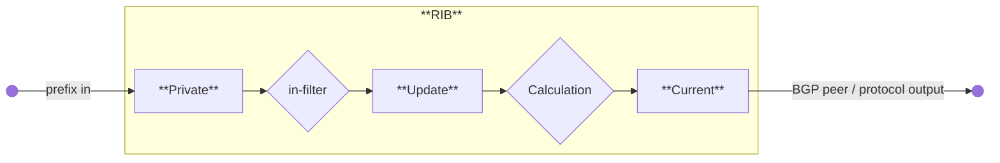

# Routing Decision

> Routing decision in MikroTik RouterOS involves selecting paths for packet transmission using FIB and RIB tables, managing connected networks, default routes, and hardware offloading for efficient packet forwarding.

# Routing Decision

import {MD} from '@site/src/components/common';

Routing is the process of selecting paths across networks to move packets from one host to another. The path selection, also called the routing decision, relies on a routing information table. That table contains route entries, each of which specifies a destination and the next hop used to reach it. A *hop* occurs when a packet passes from one network segment to another.


Typically, routing information has two parts and RouterOS is no exception:

* **FIB** – the Forwarding Information Base used to make packet‑forwarding decisions. It contains a subset of the routing information needed for forwarding.
* **RIB** – the Routing Information Base, which contains all prefixes learned from routing sources such as connected networks, static routes, BGP, RIP, and OSPF.


## Routing Information Base

The RIB contains complete routing information, including static routes, connected networks, and routes learned from dynamic protocols and MPLS label‑binding protocols such as OSPF, BGP, and LDP.  
The RIB does more than simply store routes: it filters routing information to calculate the best route for each destination prefix, builds and updates the FIB, and distributes routes between routing protocols.

By default, all routes are organized in a single **main** routing table.

### Connected Networks

A connected route represents a network that hosts can reach directly (a direct attachment to a Layer 2 broadcast domain). RouterOS automatically creates a connected route for each IP network with at least one enabled interface configured under `/ip/address` or `/ipv6/address`. The RIB tracks connected‑route status but does not modify these routes. For each connected route there is a corresponding IP address item such that:

* **address** part of the `dst-address` of the connected route is equal to a network of IP address item.
* **netmask** part of `dst-address` of the connected route is equal to the netmask part of the address of the IP address item.
* **gateway** of the connected route is equal to the [`actual-interface`](../../cli-reference/ip/address.md#actual-interface) of the IP address item (same as an interface, except for bridge interface ports) and represents an interface where directly connected hosts from the particular Layer3 network can be reached.

Example of connected networks:

```text
[admin@TempTest] /ip/route> print where connect 
Flags: D - DYNAMIC; A - ACTIVE; c - CONNECT
Columns: DST-ADDRESS, GATEWAY, ROUTING-TABLE, DISTANCE
    DST-ADDRESS      GATEWAY  ROUTING-TABLE  DISTANCE
DAc 10.155.125.0/24  ether1   main                  0
DAc 192.168.1.0/24   vlan2    main                  0
```

### Default route

A default route is used when no other route in the table matches the destination. In RouterOS the default route has a `dst-address` of **0.0.0.0/0** for IPv4 or **::/0** for IPv6. If the routing table contains an active default route, lookups in that table always succeed.

Typically home router routing table contains only connected networks and one default route to forward all outgoing traffic to the ISP's gateway:

```text
[admin@TempTest] /ip/route> add gateway=10.155.125.1  
[admin@TempTest] /ip/route> print where dst-address=/0  
Flags: A - ACTIVE; s - STATIC
Columns: DST-ADDRESS, GATEWAY, ROUTING-TABLE, DISTANCE
#    DST-ADDRESS  GATEWAY       ROUTING-TABLE  DISTANCE
4 As 0.0.0.0/0    10.155.125.1  main                  1
```

### Hardware Offloaded Route

Devices with [Layer 3 Hardware Offloading](../../bridging-and-switching/l3-hardware-offloading.md) (L3HW, also called IP switching or HW routing) can offload packet forwarding to the switch chip. When L3HW is enabled, eligible routes display the **H** flag:

```text
[admin@MikroTik] > /ip/route print where static
Flags: A - ACTIVE; s - STATIC, y - COPY; H - HW-OFFLOADED
Columns: DST-ADDRESS, GATEWAY, DISTANCE
#     DST-ADDRESS       GATEWAY         D
0 AsH 0.0.0.0/0         172.16.2.1      1
1 AsH 10.0.0.0/8        10.155.121.254  1
2 AsH 192.168.3.0/24    172.16.2.1      1
```

By default, all routes are candidates for hardware offload. You can fine‑tune offloading by enabling or disabling the [`suppress-hw-offload`](../../cli-reference/ip/route.md#suppress-hw-offload) option on individual IPv4 or IPv6 static routes.
For example, if most traffic goes to a server network, enable offloading only for that destination:

```ros
/ip route set [find where static && dst-address!="192.168.3.0/24"] suppress-hw-offload=yes
```

Now only the route to **192.168.3.0/24** has an H-flag, indicating that it will be the only one eligible to be selected for HW offloading:

```text
[admin@MikroTik] > /ip/route print where static
Flags: A - ACTIVE; s - STATIC, y - COPY; H - HW-OFFLOADED
Columns: DST-ADDRESS, GATEWAY, DISTANCE
#     DST-ADDRESS       GATEWAY         D
0 As  0.0.0.0/0         172.16.2.1      1
1 As  10.0.0.0/8        10.155.121.254  1
2 AsH 192.168.3.0/24    172.16.2.1      1
```

:::warning
H-flag does not indicate that the route is actually HW offloaded, it indicates only that the route can be selected to be HW offloaded.
:::

### Multipath (ECMP) routes

Some setups, such as load balancing, require more than one path to a given destination.


ECMP (Equal Cost Multi-Path) routes have multiple gateway (next‑hop) values. All reachable next hops are copied to the [**FIB**](#forwarding-information-base) for packet forwarding.

You can create these routes manually or they can be learned dynamically by protocols such as OSPF, BGP, or RIP. Multiple equally preferred routes to the same destination receive the **+** flag and are grouped automatically by RouterOS (see example below).

```text
[admin@TempTest] /ip/route> print 
Flags: D - DYNAMIC; I - INACTIVE, A - ACTIVE; C - CONNECT, S - STATIC, m - MODEM; + - ECMP
Columns: DST-ADDRESS, GATEWAY, DISTANCE
#       DST-ADDRESS      GATEWAY       D
0   AS+ 192.168.2.0/24   10.155.125.1  1
1   AS+ 192.168.2.0/24   172.16.1.2    1
```

By default, ECMP uses the **Layer3** hash policy, which hashes source and destination IP addresses (IPv4) or source/destination IP, flow label, and IP protocol (IPv6).  
You can change hashing policies in `/ip/settings` and `/ipv6/settings` to **Layer4** or **inner Layer3** hashing.  
Supported hashing methods include:

|          | IPv4                  | IPv6                                      |
|:--|:--|:--|
| L3       | srcIPv4, dstIPv4      | srcIPv6, dstIPv6, flow label, IP proto    |
| L4       | srcIPv4, dstIPv4, srcPort, dstPort, IP proto | srcIPv6, dstIPv6, srcPort, dstPort, IP Proto |
| L3-Inner | srcIPv4, dstIPv4 (if inner IPv4)srcIPv6, dstIPv6, flow label, IP proto (if inner IPv6)Same as L3 if inner is not present. | srcIPv4, dstIPv4 (if inner IPv4)srcIPv6, dstIPv6, flow label, IP proto (if inner IPv6)Same as L3 if inner is not present. |

### Route Selection

Multiple routes with the same destination can be learned from different protocols or static configurations, but only one best route is used for forwarding. The RIB runs a route‑selection algorithm to choose the best route among the candidates for each destination.

Only routes that meet these criteria participate in route selection:

* Route is not disabled.
* If the type of route is *unicast* it must have at least one reachable next-hop. ( if a gateway is from a connected network and there is a connected route active, the gateway is considered as reachable)
* Route should not be *synthetic*.

The candidate route with the lowest distance becomes active. If multiple candidates share the same distance, the active route is chosen arbitrarily.

For example,

```text
[admin@RB5009_108] /ip/route> print where dst-address=203.0.113.1
Flags: D - DYNAMIC; A - ACTIVE; s - STATIC, o - OSPF
Columns: DST-ADDRESS, GATEWAY, ROUTING-TABLE, DISTANCE
#     DST-ADDRESS     GATEWAY                  ROUTING-TABLE  DISTANCE
  D o 203.0.113.1/32  111.13.0.2%sfp-sfpplus1  main                110
2  As 203.0.113.1/32  111.13.0.2               main                  1
```

In the example, a static route and an OSPF route point to the same destination. OSPF installs its route with the higher default distance (110) compared with the static route (1). The route with the lower distance is selected as the best route.

### Nexthop Lookup

Nexthop lookup is a part of the route selection process. Its main purpose is to find a directly reachable gateway address (next-hop). Only after a valid next-hop is selected router knows which interface to use for packet forwarding.

Nexthop lookup becomes more complicated if routes have a gateway address that is several hops away from this router (e.g. iBGP, multihop eBGP). Such routes are installed in the FIB after the next-hop selection algorithm determines the address of the directly reachable/immediate gateway (shown by `immediate-gw` parameter).

It is necessary to restrict the set of routes that can be used to look up immediate next-hops. Nexthop values of RIP or OSPF routes, for example, are supposed to be directly reachable and should be looked up only using connected routes. This is achieved using scope and target-scope properties.

Routes with a `scope` greater than the maximum accepted value are not used for next-hop lookup. Each route specifies the maximum accepted scope value for its nexthop in the `target-scope` property. The default value of this property allows nexthop lookup only through connected routes, with the exception of iBGP routes that have a larger default value and can lookup nexthop also through IGP and static routes.
<Columns>
<Column>
<center>
| Scope | Route type      | Target scope |
|:--|:--      |:--|
| 0     |                 |              |
| 10    | Connected       | 5            |
| 20    | IGP (OSPF, RIP) | 10           |
| 30    | Static          | 10           |
| 40    | eBGP            | 10           |
| 40    | iBGP            | 30           |
</center>
</Column>
<Column>
Matrix shows which route type (line) can resolve gateways of route types (columns) based on default scope and target-scope values.
<center>
|             | IGP | Static | eBGP | iBGP |
|:--|:--|:--|:--|:--|
| **Connected** |  +  |   +    |  +   |  +   |
| **IGP**       |     |        |      |  +   |
| **Static**    |     |        |      |  +   |
| **eBGP**      |     |        |      |      |
| **iBGP**      |     |        |      |      |
</center>
</Column>
</Columns>

It is possible to alter default behaviour by adjusting a `target-scope` values. For example, if there is a multihop eBGP setup it might be a good idea to resolve nexthops for these routes via IGP protocol routes or static routes. To do this, we can set up input routing filter to change the `target-scope` that is greater than the value of IGP or static `scope`. It is even possible to resolve eBGP routes over iBGP routes by adjusting `scope` and `target-scope` values.

Flexibility of scope adjustmens even allows to create a crazy setup, like resolving OSPF via eBGP.

Routes are processed in scope order, and updates to routes with a larger scope cannot affect the state of nexthop lookup for routes with a smaller scope.

RIB keeps multiple nexthop objects per address, one for each combination of scope and gateway check.

When you change a route's `target-scope` or gateway check, it ***does not affect other routes***, because these properties attach to the nexthop object rather than the route.

Scope values that are invalid are fixed automatically:

* if nexthop scope is set to 255 - RouterOS will internally fix this error by setting its scope to 254.
* if a route's scope is not greater than the maximum accepted scope for gateway lookup, RouterOS fixes the error by setting the nexthop scope to `target-scope + 1`

You can view the actual `scope` and `target-scope` values in the `/routing/nexthop` menu.

You can extend gateway checking by setting the `check-gateway` parameter. The router verifies gateway reachability with ARP probes, ICMP messages, or active BFD sessions. By default it sends an ICMP echo request (*ping*) or ARP request (*arp*) every 10 seconds. If the gateway does not respond within 1 second, the request times out; after two timeouts the gateway is marked unreachable. Receiving a reply makes the gateway reachable again and resets the timeout counter. Adjust these intervals in the `/routing/settings` menu.

```
[admin@CCR2004_2XS_111] /routing/settings> print 
               single-process: no 
  check-gateway-ping-interval: 10s
   check-gateway-ping-timeout: 1s 
     check-gateway-ping-count: 2  
```

:::danger
`gateway` set as non point-to-point interface cannot be used to forward packets with destination multiple hops away.
:::

You cannot use the `check-gateway` parameter on such gateways because no destination IP is known.

### Route Storage

Routing information is stored to minimize memory usage in common cases. These optimizations can have non‑obvious worst‑case scenarios and affect performance.

All routes and gateways are kept in a single hierarchy by the prefix/address.

```
    Dst [4]/0 1/0+4                             18  <-- number of prefixes
         ^  ^ ^ ^ ^
         |  | | | |
         |  | | | \- bytes taken by Route distinguisher or Interface Id
         |  | | \--- vrf/routing table
         |  | \----- AFI
         |  \------- netmask length of prefix
         \---------- bytes taken by prefix value

         [subject to change without notice]
    
```

Each 'Dst' entry corresponds to a unique 'dst-address' (for a route) or gateway address. Each 'Dst' entry requires one or more 'T2Node' objects.

All routes with the same 'dst-address' are kept in Dst in a list sorted by route preference.  
:::info
**WORST CASE**: having many routes with the same 'dst-address' is very slow, even if they are inactive. Updating a sorted list with tens of thousands of elements degrades performance.
:::
Route order changes only when route attributes change. If the route becomes active/inactive, the order does not change.

Each Route has three copies of route attributes:

* **private** -- what is received from the peer, before passing in-filters.
* **updated** -- what is the result of applying in-filters.
* **current** -- what are the attributes currently used by the route.

Periodically (when needed), ***update*** attributes are calculated from ***private*** attributes. This happens when route update is received, or when in-filter is updated.

When the routing table is recalculated, ***current*** attributes are set to the value from ***updated*** attributes.



This means, that usually if there is no in-filter that changes route attributes, ***private***, ***updated,*** and ***current*** share the same value.

Route attributes are kept in several groups:

* L1 Data - all flags, list of extra properties, as-path;
* L2 Data – nexthops, RIP or OSPF metrics, BGP metrics, route tags, originators, and similar attributes.
* L3 Data – distance, scope, kernel type, and MPLS information.
* extra properties - communities, originator, aggregator-id, cluster-list, unknown

Having, for example, many different combinations of `distance` and `scope` route attributes will use more memory!

Matching communities or as-path using regexp will cache the result, to speed up filtering. Each as-path or community value has a cache for all regexp, which is filled on-demand with match results.  
:::info
**WORST CASE**: changing attributes in `in-filter` will make the route program use more memory! Because ***private*** and ***updated*** attributes will be different! Having a lot of different regexps will make matching slow and use a lot of memory! Because each value will have a cache with thousands of entries!
:::

Detailed info about used memory by routing protocols can be seen in `/routing/stats/memory` menu

## Forwarding Information Base

FIB (Forwarding Information Base) contains a copy of the information that is necessary for the packet forwarding:

* vrf tables
* active routes
* policy routing rules
* other routing decision rules

Each route has a **dst-address** property, that specifies all destination addresses this route can be used for. If several routes apply to a particular IP address, the most specific one (with the largest netmask) is used. In cases where the routing table contains several routes with the same **dst-address** and netmask, all equally best routes are combined into one [ECMP](#multipath-ecmp-routes) route, installed into FIB and marked as ''active''

Only one best route can be used for packet forwarding.  
Finding the most specific route that matches a given address is called **routing table lookup**.

When forwarding decision uses additional information, such as the source address of the packet, it is called **policy routing**. Policy routing is implemented as a list of policy routing rules, that select different routing tables based on the destination address, source address, source interface, and routing mark (which can be changed by firewall mangle rules) of the packet.

### Routing table lookup

FIB uses the following information from the packet to determine its destination:

* source address
* destination address
* source interface
* routing mark

Possible routing decisions are:

* receive packet locally
* discard the packet (either silently or by sending an ICMP message to the sender of the packet)
* send the packet to a specific IP address on a specific interface

Routing decision actions are determined by policy rules defined in [/routing/settings](../../cli-reference/routing/settings.md) via the `policy-rules` parameter.  
By default:

```ros
[admin@CCR2004_2S+_107] /routing/settings> print 
               single-process: no         
  check-gateway-ping-interval: 10s        
   check-gateway-ping-timeout: 1s         
     check-gateway-ping-count: 2          
                 policy-rules: mangle     
                               vrf-lookup 
                               vrf-unreach
                               local      
                               user       
                               main  
 ```

* Look up the destination in the routing table marked by mangle rule.
* If interface belongs to a VRF or packet was steered to a VRF, then try to lookup in the VRF table.
* If VRF lookup fails reject the packet.
* Check that the packet has to be locally delivered (the destination address is the address of the router).
* process user defined [routing rules](../../cli-reference/routing/rule.md) (from "user" chain)
* Look up the destination in the `main` routing table.

Depending on the complexity of required tasks, you can change the order of default rules or fine tune the setup by adding your custom rules.

For example, if destination 1.2.3.4 must be resolved only in the `other_table` and additionaly you intend to use mangle, then add your routing rule and move mangle action below your custom rule:

```ros
[admin@r1] /routing/settings> set policy-rules=vrf-lookup,vrf-unreach,local,user,mangle,main
[admin@r1] /routing/rule> add dst-address=1.2.3.4 action=lookup-only-in-table table=other_table
[admin@r1] /routing/rule> print 
Flags: X - disabled, I - inactive; * - default 
 0    dst-address=1.2.3.4 action=lookup-only-in-table table=other_table 
 ```

If a rule has action:

* `drop` or `unreachable`, then it is returned as a result of the routing decision process.
* `lookup` then the destination address of the packet is looked up in the routing table that is specified in the rule. If the lookup fails (no route matches the destination address of the packet), then FIB proceeds to the next rule.
* `lookup-only-in-table` is similar to `lookup` except that lookup fails if none of the routes in the table matches the packet.

Otherwise:

* If the type of the route is blackhole, then return this action as the routing decision result.
* If this is a connected route or route with an interface as the gateway value, then return this interface and the destination address of the packet as the routing decision result.
* If this route has an IP address as the value of the gateway, then return this address and associated interface as the routing decision result.
* If this route has multiple values of nexthop, then pick one of them in a round-robin fashion based on configured [hash policy](#multipath-ecmp-routes).

Keep in mind that setting an interface as a gateway for static routes in general is not a good idea. Interface gateways are useful only in two scenarios:

* on point-to-point type interfaces;
* on interfaces where the destination address is directly connected.

If the routing decision returns an interface and the destination address of the packet as the result on a broadcast network, the router will try to resolve the packet's destination address over the interface by sending ARP probes. If none of the hosts in the same broadcast domain has the IP address, forwarding will fail, so such gateways cannot be used to route packets whose destination is multiple hops away.
