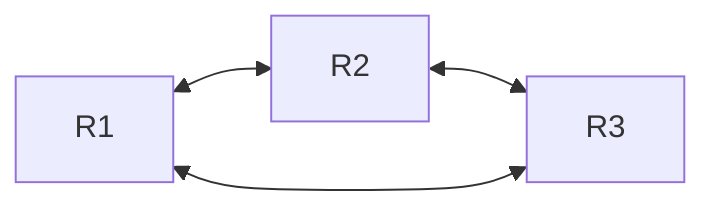
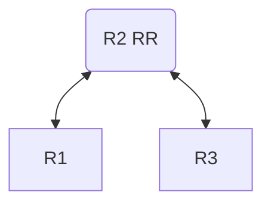

# Peering Sessions

> Introduction on how to establish BGP sessions.

# Peering Sessions

The purpose of an **eBGP** session is to exchange routing information between Autonomous Systems (ASes). Typically, an eBGP session is established on a directly connected physical or logical network (on a single‑hop link) at network exit points, and with default parameters it will fail to connect if the peer is multiple hops away.  
In an EVPN setup, operators typically run eBGP sessions on loopback addresses routed by an IGP. This means that the connection is no longer on a connected network and will fail unless [`multihop`](../../../../cli-reference/routing/bgp.md#multihop)`=yes` is configured.

The AS_PATH attribute is used to prevent routing loops. If the list contains its own AS number (ASN), the route is discarded; but in some specific setups this is not desired behavior. For example, MPLS L3VPN setups need to override the default loop‑prevention mechanism with the [`input.allow-as`](../../../../cli-reference/routing/bgp.md#input.allow-as) parameter to allow a CE router to accept routes that contain its own ASN from multi‑homed or interconnected sites.

The next hop, by default, is changed to itself for obvious reasons, but again this behavior is not desirable in some setups, for example an EVPN overlay. To override the default behavior, set the [`nexthop-choice`](../../../../cli-reference/routing/bgp.md#nexthop-choice) parameter to `propagate`.

## Internal BGP (iBGP) peering

Contrary to **eBGP**, **iBGP** is used to exchange routing information within an Autonomous System. It propagates external routes learned from eBGP peers across an internal network.

By default, **iBGP** sessions are considered multihop and run on top of an Interior Gateway Protocol (IGP), like [OSPF](../ospf/areas-and-virtual-links.md) or ISIS, which provides reachability between the loopback addresses. Next hops of external routes are propagated and the IGP is responsible for the next‑hop resolution. In smaller setups, to reduce configuration complexity, iBGP can be used without an underlying IGP by setting the [`nexthop-choice`](../../../../cli-reference/routing/bgp.md#nexthop-choice) parameter to `force-self` and running iBGP sessions on directly connected networks.

The own AS number is not added to the AS Path list when routes are propagated between iBGP peers; instead, split‑horizon is used for loop protection, which dictates that a route learned from an iBGP peer is not advertised to another iBGP peer. To overcome the split‑horizon limitation, every iBGP router must connect to every other iBGP router, creating a **full mesh**.



The problem with a full mesh is scalability, where the total number of connections is `n*(n-1)/2`. To simplify large-scale iBGP networks, a [Route reflector (RR)](#dynamic-sessions) is used to eliminate the need for a full mesh. It establishes a client–server relationship, where clients peer only with the route reflector, thus reducing the number of connections to `n-1`.



Introduction of RR breaks the standard split-horizon rule to enable route reflection, which is why **ORIGINATOR_ID** and **CLUSTER_LIST** attributes are used to prevent routing loops.

## Session configuration

The [`/routing/bgp/connection`](../../../../cli-reference/routing/bgp.md#routingbgpconnection) menu defines BGP outgoing connections as well as acts as a template matcher for incoming BGP connections.

A very basic BGP configuration example follows. Assume Router1's IP is 192.168.1.1 with AS 65531, and Router2's IP is 192.168.1.2 with AS 65532:

```ros
#Router1
/routing/bgp/instance
add name=myInstance as=65531

/routing/bgp/connection
add name=toR2 remote.address=192.168.1.2 instance=myInstance local.role=ebgp
```

```ros
#Router2
/routing/bgp/instance
add name=myInstance as=65532

/routing/bgp/connection
add name=toR1 remote.address=192.168.1.1 instance=myInstance local.role=ebgp
```

[`local.role`](../../../../cli-reference/routing/bgp.md#local.role) is a mandatory parameter and describes the nature of the session, whether it is an **eBGP** session (as in our example), an [**iBGP**](#internal-bgp-ibgp-peering) session, or if it will act as an iBGP **route-reflector**. In addition, there are other modes for **route leak prevention and detection** from [RFC 9234](https://datatracker.ietf.org/doc/rfc9234/).

The connection does not require a remote AS number to be specified; RouterOS determines it dynamically from the first received **OPEN** message.

The parameter equivalent to other vendors and older RouterOS `update-source` is [`local.address`](../../../../cli-reference/routing/bgp.md#local.address). In most cases, it can be left unconfigured and the router will determine the address.

When a local address is not specified, BGP will try to guess it depending on the current setup:

- If the peer is iBGP
  - If a loopback is available
    - Pick the highest loopback address
  - If a loopback is not available
    - Pick the highest IP address on the router
- If the peer is eBGP
  - If a remote peer's IP is not from a directly connected network:
    - If multihop is not set, BGP throws an error
    - And if multihop is enabled:
      - If a loopback is available
        - Pick the highest loopback address
      - If a loopback is not available
        - Pick the highest IP address on the router
  - If a remote peer's IP is from a directly connected network:
    - If multihop is not set:
      - Pick the router's IP address from that connected network
    - And if multihop is set:
      - If a loopback is available
        - Pick the highest loopback address
      - If a loopback is not available
        - Pick the highest IP address on the router

This menu also exposes template-specific parameters directly, which makes configuration easier in simple scenarios when templates are not necessary.

:::warning
Listening on subnets should not be enabled in unsafe environments; denial of service (DoS) is possible with such a configuration.  
Firewall must be configured to protect the router.  
See the [`listen`](../../../../cli-reference/routing/bgp.md#listen) parameter for more details.
:::

### Active session list

Check the [`/routing/bgp/session`](../../../../cli-reference/routing/bgp.md#routingbgpsession) menu to see if the session is established:

```ros
[admin@MikroTik] /routing/bgp/session> print 
Flags: E - established 
 0 E name="toR2" instance=myInstance 
     remote.address=192.168.1.2 .as=65532 .id=192.168.1.1 .refused-cap-opt=no 
     .capabilities=mp,rr,as4 .afi=ip,ipv6 .messages=43346 .bytes=3635916 .eor="" 
     local.address=192.168.1.1 .as=65531 .id=192.168.44.2 .capabilities=mp,rr,gr,as4 .messages=2 
     .bytes=71 .eor="" 
     output.procid=97 .keep-sent-attributes=no 
     .last-notification=ffffffffffffffffffffffffffffffff0015030601 
     input.procid=97 .limit-process-routes=500000 ebgp limit-exceeded 
     hold-time=3m keepalive-time=1m uptime=4s70ms
```

It shows read-only cached BGP session information: current status, flags, last received notification, and negotiated session parameters.

Even if the BGP session is not active anymore, the cache can still be stored for some time. Routes received from a particular session are removed only if the cache expires, and this allows mitigating extensive routing table recalculations if the BGP session is flapping.

If BGP tries to establish a session for the first time and the TCP connection fails to initiate because of MD5 authentication errors, a blocked firewall, or any other reason that blocks the connection, then there will be no session entry created.

### Parameter grouping

If you noticed, most of the parameters are grouped in the `output`, `input`, `local`, and `remote` sections, making the configuration more readable and easier to understand whether the option is applied to `input` or `output`, or if it influences values local to the router or tries to match parameters of the remote peer.  
For example:

- To specify the output selection chain, you set [`output.filter-chain`](../../../../cli-reference/routing/bgp.md#output.filter-chain)`=myBgpChain`.
- `local.bytes` in the session list indicates how many bytes have been sent.
- `remote.messages` indicates how many packets the remote peer has sent.
- and so on.

### BGP unnumbered

RouterOS is capable of establishing a BGP session dynamically without a global IPv6 address on an interface and without specifying a remote link-local address (BGP Unnumbered connection). The mechanism relies on IPv6 neighbor discovery ([RFC 4861](https://datatracker.ietf.org/doc/html/rfc4861)) to get the neighbor's link-local address and [RFC5549](https://datatracker.ietf.org/doc/html/rfc5549) to advertise IPv4 NLRIs with IPv6 nexthops.

An unnumbered connection is configured if [`remote.address`](../../../../cli-reference/routing/bgp.md#remote.address) is empty and [`local.address`](../../../../cli-reference/routing/bgp.md#local.address) is an interface. In this mode, only one connection per interface is accepted.
It is useful in setups with a lot of point-to-point links, for example, if eBGP is used as an EVPN underlay.

For a router without configured global addresses to send replies for RAs, apply the following ND config:

```ros
/ipv6/nd/prefix/add prefix=none interface=sfp-sfpplus1
```

```ros
[admin@CCR2004_2XS_111] /ipv6/neighbor> print 
Flags: D - DYNAMIC; R - ROUTER
Columns: ADDRESS, MAC-ADDRESS, INTERFACE, VRF
#    ADDRESS                    MAC-ADDRESS        INTERFACE     VRF 
0 DR fe80::de2c:6eff:fec5:a7ff  DC:2C:6E:C5:A7:FF  sfp-sfpplus1  main
```

Add the unnumbered connection config:

```ros
/routing bgp connection
add instance=myInstance local.address=sfp-sfpplus1 .role=ibgp name=unnumbered_2
```

```ros
[admin@CCR2004_2XS_111] /routing/bgp/connection> print 
Flags: D - DYNAMIC, X - DISABLED, I - INACTIVE 
 0   name="unnumbered_2" instance=myInstance 
     local.address=sfp-sfpplus1 .default-address=fe80::de2c:6eff:fea4:b42f%sfp-sfpplus1 .role=ibgp 
     routing-table=main as=333 

[admin@CCR2004_2XS_111] /routing/bgp/session> print 
Flags: E - ESTABLISHED 
 0 E name="unnumbered_2-1" instance=v6_test 
     remote.address=fe80::de2c:6eff:fec5:a7ff%sfp-sfpplus1 .as=333 .id=203.0.113.2 .capabilities=mp,rr,enhe,gr,as4 .afi=ipv6 
     .messages=5181 .bytes=98439 .eor="" 
     local.role=ibgp .address=fe80::de2c:6eff:fea4:b42f%sfp-sfpplus1 .as=333 .id=203.0.113.1 .cluster-id=203.0.113.1 
     .capabilities=mp,rr,enhe,gr,as4 .afi=ipv6 .messages=5181 .bytes=98439 .eor="" 
     output.procid=20 
     input.procid=20 ibgp 
     multihop=yes hold-time=3m keepalive-time=1m uptime=3d14h20m55s640ms last-started=2026-02-12 18:26:59 prefix-count=0 
```

### Dynamic sessions

BGP peer configuration can be quite complex and not very scalable; for example, hub-and-spoke setups or iBGP route reflector setups.

Let's say we have a setup with a route reflector where two peers are connected. To simplify the configuration and make it scalable, we will utilize a BGP template to set common parameters and configure the connection to listen on a loopback address range, which will allow us to add more peers without any configuration on the route reflector.


**Prerequisites**

- IP connectivity on interfaces
- Configured and running OSPF on interfaces

**Route reflector**

Before configuring BGP, we need to add a loopback address and enable OSPF to distribute the loopback route:

```routeros
/ip address
add address=203.0.255.1 interface=lo
/routing ospf interface-template add interfaces=lo area=backbone passive
```

Next create a BGP template with common parameters and a BGP session to listen on our loopback (203.0.255.0/24) address range:

```routeros
/routing bgp instance
add as=65000 name=bgp_inst
/routing bgp template
set default afi=ip multihop=yes nexthop-choice=propagate hold-time=10s
/routing bgp connection
add instance=bgp_inst local.address=203.0.255.1 .role=ibgp-rr name=rr remote.address=\
    203.0.255.0/24 templates=default listen=yes
```

To add a new BGP peer, create an IP connection between the peer and the route reflector, and configure BGP to connect to the reflector's loopback address:

**Peer_1**

```routeros
/ip address
add address=203.0.255.11 interface=lo
/routing ospf interface-template add interfaces=lo area=backbone passive

/routing bgp instance
add as=65000 name=bgp_inst
/routing bgp connection
add instance=bgp_inst local.role=ibgp name=to_rr remote.address=203.0.255.1
```

**Peer_2**

```routeros
/ip address
add address=203.0.255.12 interface=lo
/routing ospf interface-template add interfaces=lo area=backbone passive

/routing bgp instance
add as=65000 name=bgp_inst
/routing bgp connection
add instance=bgp_inst local.role=ibgp name=to_rr remote.address=203.0.255.1
```

**Peer_N**

```routeros
/ip address
add address=203.0.255.1N interface=lo
/routing ospf interface-template add interfaces=lo area=backbone passive

/routing bgp instance
add as=65000 name=bgp_inst
/routing bgp connection
add instance=bgp_inst local.role=ibgp name=to_rr remote.address=203.0.255.1
```

For further use cases, see EVPN, where this method is used in the [EVPN Overlay](../evpn.md#bgp-evpn-overlay) setup.
