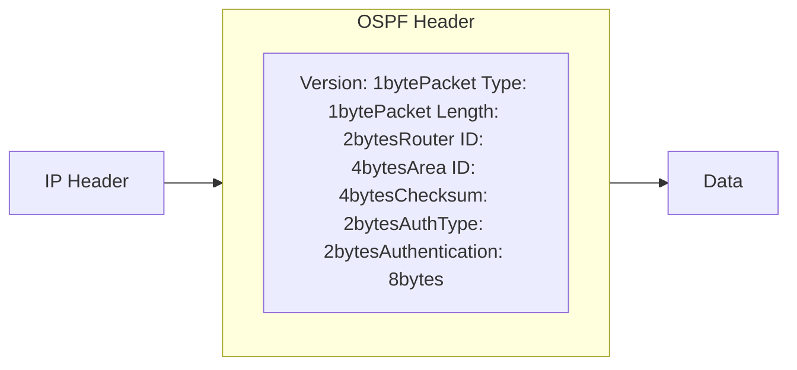
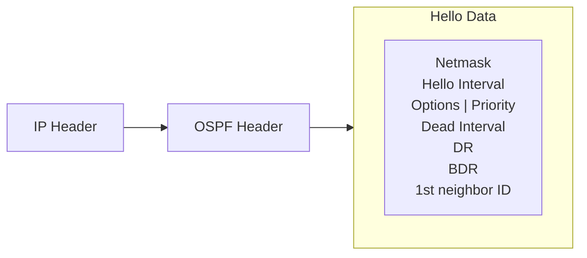

# Neighbor Relationship

> Introduction on how neighbor relationships and adjacencies are formed.

# Neighbor Relationship

OSPF is a link-state protocol that considers the router interface an OSPF link. Whenever OSPF is started, it adds the state of all the links in the local **link-state database**.

Several steps must complete before the OSPF network becomes fully functional:

- Neighbor discovery
- Database synchronization
- Routing calculation

Link-state routing protocols distribute and replicate a database describing the routing topology. The link-state protocol's flooding algorithm ensures that each router has an identical link-state database. The routing table is calculated based on this database.

After all the previous steps are completed, the link-state database on each neighbor contains the full routing domain topology (how many other routers are in the network, how many interfaces routers have, what networks the link between routers connects, the cost of each link, and so on).

## Basic Configuration Example

To start OSPF v2 and v3 instances, add the instances and the backbone area:

```ros
/routing/ospf/instance
add name=v2inst version=2 router-id=1.2.3.4
add name=v3inst version=3 router-id=1.2.3.4
/routing/ospf/area
add name=backbone_v2 area-id=0.0.0.0 instance=v2inst
add name=backbone_v3 area-id=0.0.0.0 instance=v3inst
```

The template matches interfaces where OSPF should discover the neighbors. Specify the network or interface directly.

```ros
/routing/ospf/interface-template
add networks=192.168.0.0/24 area=backbone_v2
add networks=2001:db8::/64 area=backbone_v3
add interfaces=ether1 area=backbone_v3
```

## Communication Between OSPF Routers

OSPF operates over the IP network layer with protocol number 89.
A destination IP address is set to the neighbor's IP address or to one of the OSPF multicast addresses, AllSPFRouters (224.0.0.5) or AllDRouters (224.0.0.6). These addresses are described later in this article.
Every OSPF packet begins with a standard 24-byte header.

<center>

</center>

| Field | Description |
| :-- | :-- |
| **Packet type** | Several types of OSPF packets exist: Hello packet, Database Description (DD) packet, Link-State Request packet, Link-State Update packet, and Link-State Acknowledgment packet. All of these packets except the Hello packet are used for link-state database synchronization. |
| **Router ID** | Defaults to one of the router's IP addresses unless configured manually. |
| **Area ID** | Allows the OSPF router to associate the packet with the proper OSPF area. |
| **Checksum** | Allows the receiving router to determine if a packet was damaged in transit. |
| **Authentication fields** | These fields allow the receiving router to verify that the packet's contents were not modified and that the packet came from the OSPF router whose Router ID appears in the packet. |

Five OSPF packet types ensure proper LSA flooding over the OSPF network:

- **Hello packet** - Discovers OSPF neighbors and builds adjacencies.
- **Database Description (DD)** - Checks for database synchronization between routers. Exchanged after adjacencies are built.
- **Link-State Request (LSR)** - Requests up-to-date pieces of the neighbor's database. Out-of-date parts of the routing database are determined after the DD exchange.
- **Link-State Update (LSU)** - Carries a collection of specifically requested link-state records.
- **Link-State Acknowledgment (LSack)** - Acknowledges other packet types to ensure reliable communication.

## Neighbor Discovery

OSPF discovers potential neighbors by sending Hello packets periodically out of configured interfaces. By default, *Hello packets* are sent out at 10-second intervals. You can change this by setting [`hello-interval`](../../../../cli-reference/routing/ospf.md#hello-interval) in OSPF interface settings. The router learns the existence of a neighboring router when it receives the neighbor's Hello in return with matching parameters.

The transmission and reception of Hello packets also allow a router to detect the failure of the neighbor. If Hello packets are not received within [`dead-interval`](../../../../cli-reference/routing/ospf.md#dead-interval) (which by default is 40 seconds), the router starts to route packets around the failure. The "Hello" protocol ensures that the neighboring routers agree on the Hello interval and Dead interval parameters, preventing situations where Hello packets that are not received in time mistakenly bring the link down.

<center>


</center>
| Field | Description |
| :-- | :-- |
| **Network mask** | The IP mask of the originating router's interface IP address. |
| **Hello interval** | The period between Hello packets (default 10s). |
| **Options** | OSPF options for neighbor information. |
| **Router priority** | An 8-bit value used to aid in the election of the DR and BDR (not set in point-to-point links). |
| **Router dead interval** | The time interval before the neighbor is considered down (by default, four times the Hello interval). |
| **DR** | The router ID of the current DR. |
| **BDR** | The router ID of the current BDR. |
| **Neighbor router IDs** | A list of router IDs for all the originating router's neighbors. |

On each type of network segment, the Hello protocol works a little differently. On point-to-point segments, only one neighbor is possible and no additional actions are required. However, if more than one neighbor can be on the segment, additional actions are taken to make OSPF more efficient.

Two routers do not become neighbors unless the following conditions are met:

- Two-way communication between routers is possible. This is determined by flooding Hello packets.
- The interface should belong to the same area.
- The interface should belong to the same subnet and have the same network mask unless it has network-type configured as **point-to-point**.
- Routers should have the same authentication options and exchange the same password (if any).
- Hello and Dead intervals should be the same in Hello packets.
- External routing and NSSA flags should be the same in Hello packets.

:::info
**Network mask, Priority, DR, and BDR** fields are used only when the neighbors are connected by a broadcast or **NBMA** network segment.
:::

### Discovery on Broadcast Subnets

A node attached to the broadcast subnet can send a single packet, and that packet is received by all other attached nodes. This allows for auto-configuration and information replication. Another important capability in broadcast subnets is multicast. This capability allows sending a single packet which will be received by nodes configured to receive multicast packets. OSPF uses this capability to find OSPF neighbors and detect bidirectional connectivity.

Each OSPF router joins the IP multicast group **AllSPFRouters** (224.0.0.5). Then the router periodically multicasts its Hello packets to the IP address 224.0.0.5. All other routers that joined the same group will receive a multicasted Hello packet. In that way, OSPF routers maintain relationships with all other OSPF routers by sending a single packet instead of sending a separate packet to each neighbor on the segment.

This approach provides several advantages:

- Automatic neighbor discovery by multicasting or broadcasting Hello packets.
- Less bandwidth usage compared to other subnet types.
- On the broadcast segment, n\*(n-1)/2 neighbor relations exist, but those relations are maintained by sending only n Hellos.
- If the broadcast has the multicast capability, OSPF operates without disturbing non-OSPF nodes on the broadcast segment.
- If the multicast capability is not supported, all routers will receive broadcasted Hello packets even if a node is not an OSPF router.

### Discovery on NBMA Subnets

Non-broadcast multiaccess (NBMA) segments are similar to broadcast. They support more than two routers. The only difference is that NBMA does not support a data-link broadcast capability. Due to this limitation, OSPF neighbors must be discovered initially through configuration. On RouterOS, static neighbor configuration is set in the [`/routing/ospf/static-neighbor`](../../../../cli-reference/routing/ospf.md#routingospfstatic-neighbor) menu. To reduce the amount of Hello traffic, most routers attached to the NBMA subnet should be assigned a Router Priority of 0 (set by default in RouterOS). Routers eligible to become Designated Routers should have priority values other than 0. This ensures that during the election of DR and BDR, Hellos are sent only to eligible routers.

### Discovery on PTMP Subnets

Point-to-MultiPoint treats the network as a collection of point-to-point links.

By design, PTMP networks lack broadcast capabilities, so OSPF neighbors must be discovered initially through configuration, the same as for NBMA networks. All communication happens by sending unicast packets directly between neighbors. On RouterOS, the static neighbor configuration is set in the [`/routing/ospf/static-neighbor`](../../../../cli-reference/routing/ospf.md#routingospfstatic-neighbor) menu. Designated Routers and Backup Designated Routers are not elected on point-to-multipoint subnets.

For PTMP networks with broadcast support, a hybrid type named "ptmp-broadcast" can be used. This network type uses multicast Hellos to discover neighbors automatically and detect bidirectional communication between neighbors. After neighbor detection, "ptmp-broadcast" sends unicast packets directly to the discovered neighbors. This mode is compatible with the RouterOS v6 "ptmp" type.

## Master-Slave Relation

Before database synchronization can begin, a hierarchical order for exchanging information must be established to determine which router sends **Database Descriptor** (**DD**) packets first (**Master**). The master router is the one with the higher Router ID. This is a router [`priority`](../../../../cli-reference/routing/ospf.md#priority)-based relation for arranging the exchange of data between neighbors, and it does not affect DR/BDR election (the **DR** does not always have to be the **Master**).

## Database Synchronization

Link-state database synchronization between OSPF routers is very important. Unsynchronized databases can lead to incorrectly calculated routing tables which could cause routing loops or black holes.

OSPF uses two types of database synchronization:

- Initial database synchronization.
- Reliable flooding.

When the connection between two neighbors first comes up, *initial database synchronization* occurs. OSPF uses explicit database download when neighbor connections first come up. This procedure is called **Database exchange**. Instead of sending the entire database, the OSPF router sends only its LSA headers in a sequence of OSPF **Database Description (DD)** packets. The router will send the next DD packet only when the previous packet is acknowledged. When an entire sequence of DD packets has been received, the router knows which LSAs it does not have and which LSAs are more recent. The router then sends **Link-State Request (LSR)** packets requesting desired LSAs, and the neighbor responds by flooding LSAs in **Link-State Update (LSU)** packets. After all the updates are received, neighbors are said to be **fully adjacent**.

Reliable flooding is another database synchronization method. This method is used when adjacencies are already established and the OSPF router must inform other routers about LSA changes. When the OSPF router receives such a Link State Update, it installs a new LSA in the link-state database, sends an acknowledgment packet back to the sender, repackages the LSA in a new LSU, and sends it out to all interfaces except the receiving interface.

OSPF determines if LSAs are up to date by comparing sequence numbers. Sequence numbers start with 0x80000001. The larger the number, the more recent the LSA is. A sequence number is incremented each time the record is flooded, and the neighbor receiving the update resets the Maximum age timer. LSAs are refreshed every 30 minutes, but without a refresh, an LSA remains in the database for the maximum age of 60 minutes.

Databases are not always synchronized between all OSPF neighbors. OSPF decides whether databases must be synchronized depending on the network segment. For example, on point-to-point links, databases are always synchronized between routers. On Ethernet networks, databases are synchronized between certain neighbor pairs.

### Synchronization on Broadcast Subnets

On the broadcast segment, n\*(n-1)/2 neighbor relations exist. A huge amount of Link State Updates and Acknowledgments would be sent over the subnet if the OSPF router tries to synchronize with each OSPF router on the subnet.


This problem is solved by electing one **Designated Router** and one **Backup Designated Router** for each broadcast subnet. All other routers synchronize and form adjacencies only with those two elected routers. This approach reduces the number of adjacencies from n\*(n-1)/2 to only 2n-3.

The image on the right illustrates adjacency formations on broadcast subnets. R1 is the Designated Router and R2 is the Backup Designated Router. For example, if R3 wants to flood Link State Update (LSU) to both R1 and R2, the router sends LSU to the IP multicast address **AllDRouters** (224.0.0.6) and only DR and BDR listen to this multicast address. Then the Designated Router sends LSU addressed to AllSPFRouters, updating the rest of the routers.

#### DR Election

DR and BDR routers are elected from data received in the Hello packet. The first OSPF router on a subnet is always elected as the Designated Router. When a second router is added, it becomes the Backup Designated Router. When an existing DR or BDR fails, a new DR or BDR is elected based on the configured router [`priority`](../../../../cli-reference/routing/ospf.md#priority). The router with the highest priority becomes the new DR or BDR.

Being a Designated Router or Backup Designated Router consumes additional resources. If Router Priority is set to 0, the router does not participate in the election process. This is important when certain slower routers cannot be DR or BDR.

### Synchronization on NBMA Subnets

Database synchronization on NBMA networks is similar to synchronization on broadcast networks. DR and BDR are elected. Databases are initially exchanged only with DR and BDR routers, and flooding always goes through the DR. The only difference is that Link State Updates must be replicated and sent to each adjacent router separately.
