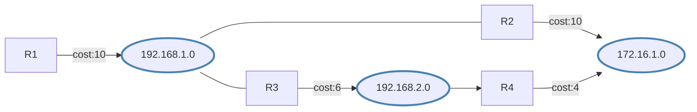
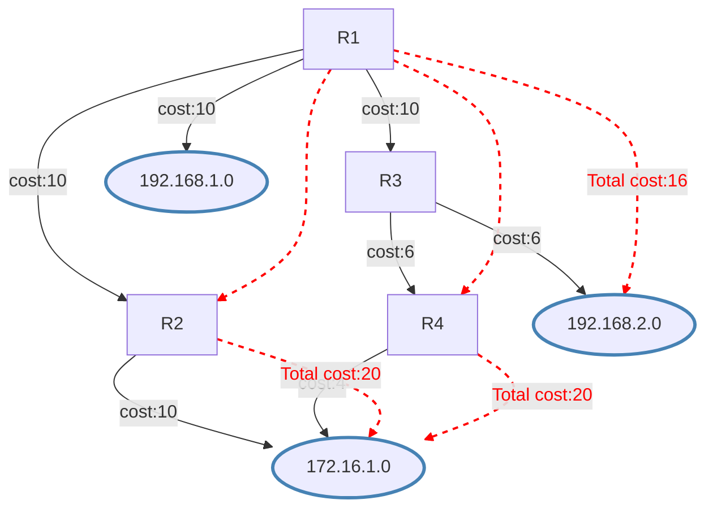

# Routing Table Calculation

> Basic understanding of shortest path calculation.

# Routing Table Calculation

The link-state database describes the routers and links that interconnect them and are appropriate for forwarding. It also contains the cost (metric) of each link. This metric is used to calculate the shortest path to the destination network.

Each router can advertise a different cost for its own link direction. This creates asymmetric links where packets to the destination travel over one path, but the response travels a different path. Asymmetric paths complicate troubleshooting.
Change the cost value in the [`/routing/ospf/interface-template`](../../../../cli-reference/routing/ospf.md#routingospfinterface-template) menu, or create a static OSPF interface in the [`/routing/ospf/interface`](../../../../cli-reference/routing/ospf.md#routingospfinterface) menu. For example, to match an ether2 interface and set a cost of 100:

```ros
/routing/ospf/interface-template
add interfaces=ether2 cost=100 area=backbone_v2
```

The cost of an interface on Cisco routers is inversely proportional to the bandwidth of that interface. A higher bandwidth indicates a lower cost. If similar costs are necessary on RouterOS, then use the formula `Cost = 100000000/bw_in_bps`.

An OSPF router uses Dijkstra's Shortest Path First (SPF) algorithm to calculate the shortest path. The algorithm places the router at the root of a tree and calculates the shortest path to each destination based on the cumulative cost required to reach the destination. Each router calculates its own tree even though all routers use the same link-state database.

## SPT Calculation

Assume the following network. The network consists of 4 routers. OSPF costs for outgoing interfaces are shown near the line representing the link. To build the shortest-path tree for router R1, make R1 the root and calculate the smallest cost for each destination.



Multiple shortest paths have been found to the 172.16.1.0 network. This allows load balancing of the traffic to the destination. Such routes are known as [equal-cost multipath (ECMP)](../../routing-decision.md#multipath-ecmp-routes). After the shortest-path tree is built, the router builds the routing table accordingly. Networks are reached according to the cost calculated in the tree.



The routing table calculation looks simple; however, when some of the OSPF extensions are used or OSPF areas are calculated, the routing calculation gets more complicated.

## Forwarding Address

An OSPF router can set the **forwarding-address** to something other than itself, indicating an alternate next-hop is possible. In most cases, the forwarding address is set to **0.0.0.0**, which suggests the route is reachable only by using the advertising router.

The forwarding address is set in the LSA if the following conditions are met:

- OSPF must be enabled on the next-hop interface.
- The next-hop address falls into the network provided by OSPF networks.

A router receiving such an LSA can use a forwarding address if OSPF is able to resolve the forwarding address. If the forwarding address is not resolved directly, the router sets the next-hop for the forwarding address from the LSA as a gateway. If the forwarding address is not resolved at all, the gateway will be the originator-id. Resolution happens only by using OSPF instance routes, not the whole routing table.

Consider the following example setup:


Router **R1** has a static route to the external network _192.168.0.0/24_. OSPF is running between R1, R2, and R3, and the static route is distributed across the OSPF network.

The problem in such a setup is obvious. R2 cannot reach the external network directly. Traffic to the LAN network from **R2** will be forwarded over router **R1**, but the network diagram shows **R2** can directly reach the router connected to the LAN network.

Knowing the forwarding address conditions, you can make router **R1** set the forwarding address. Add the 10.1.101.0/24 network to the OSPF networks in router **R1**'s configuration:

```ros
/routing/ospf/interface-template add area=backbone_v2 networks=10.1.101.0/24
```

Now verify the forwarding address works:

```ros
[admin@r2] /ip/route> print where dst-address=192.168.0.0/24
Flags: D - DYNAMIC; A - ACTIVE; o, y - COPY
Columns: DST-ADDRESS, GATEWAY, DISTANCE
    DST-ADDRESS       GATEWAY            DISTANCE
DAo 192.168.0.0/24    10.1.101.1%ether1       110

```

On all OSPF routers, you will see the LSA set with a forwarding address other than 0.0.0.0.

```ros
[admin@r2] /routing/ospf/lsa> print where id=192.168.0.0
Flags: S - self-originated, F - flushing, W - wraparound; D - dynamic 

 1  D instance=default_ip4 type="external" originator=10.1.101.10 id=192.168.0.0 
      sequence=0x80000001 age=19 checksum=0xF336 body=
        options=E
        netmask=255.255.255.0
        forwarding-address=10.1.101.1
        metric=10 type-1
        route-tag=0
```

:::tip
OSPF adjacency between routers in the 10.1.101.0/24 network is not required.
:::
