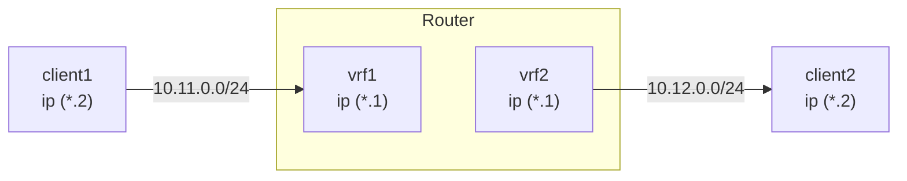
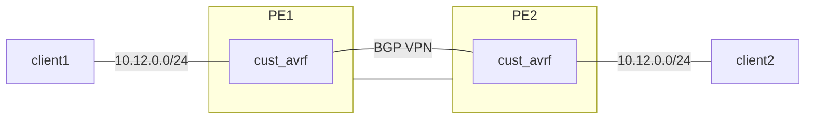

# VRF

> RouterOS enables creating multiple Virtual Routing and Forwarding (VRF) instances for BGP-based MPLS VPNs, allowing separate routing tables and IP prefix isolation. VRF configurations are managed via the `/ip/vrf` menu, with routing table mappings created automatically. Each VRF supports up to 1024 instances and requires explicit service configuration for VRF-aware

# VRF

## Description

RouterOS allows creating multiple Virtual Routing and Forwarding (**VRF**) instances on a single router. This is valuable for BGP-based MPLS VPNs. Unlike BGP VPLS, which is OSI Layer 2 technology, BGP VRF VPNs work in Layer 3 and exchange IP prefixes between routers. VRFs solve the problem of overlapping IP prefixes and provide the required privacy with separate routing for different VPNs.

You can set up VRF-Lite configurations or use multi-protocol BGP with the VPNv4 address family to distribute routes from VRF routing tables to other routers or to different routing tables on the same router.

## Configuration

A VRF table is created in the [**`/ip/vrf`**](../../cli-reference/ip/vrf.md) menu. After the VRF configuration is created, a routing table mapping is added (a dynamic table with the same name is created). Each active VRF will always have a mapped routing table.

```ros
[admin@arm-bgp] /ip/vrf> print
Flags: X - disabled; * - builtin
 0  * name="main" interfaces=all

[admin@arm-bgp] /routing/table> print
Flags: D - dynamic; X - disabled, I - invalid; U - used
 0 D   name="main" fib

```

The order of the added VRFs is significant. To properly match which interface belongs to the VRF, place VRFs in the correct order (matching is done starting from the top entry, similar to firewall rules).

:::info
Since each VRF has a mapped routing table, the max count of unique VRFs is limited to 1024.
:::

Consider the following example:

```ros
[admin@arm-bgp] /ip/vrf> print
Flags: X - disabled; * - builtin
 0  * name="main" interfaces=all
 1    name="myVrf" interfaces=lo_vrf
```

Since the first entry matches all interfaces, the second VRF has no interfaces added. To fix the problem, the order of the entries must be changed.

```ros
[admin@arm-bgp] /ip/vrf> move 1 0
[admin@arm-bgp] /ip/vrf> print
Flags: X - disabled; * - builtin
 0    name="myVrf" interfaces=lo_vrf
 1  * name="main" interfaces=all
```

Connected routes from the interfaces assigned to the VRF are installed in the corresponding routing table automatically.

:::info
When the interface is assigned to the VRF, connected routes are added to the VRF routing table. However, RouterOS services do not automatically know which VRF to use just by specifying the IP address in the configuration. Each service needs VRF support and explicit configuration. For information on whether a service has VRF support and VRF configuration options, refer to the appropriate service documentation.
:::

For example, configure the SSH service to listen for connections on the interfaces belonging to the VRF:

```ros
[admin@arm-bgp] /ip/service> set ssh vrf=myVrf
[admin@arm-bgp] /ip/service> print
Flags: X, I - INVALID
Columns: NAME, PORT, CERTIFICATE, VRF
#   NAME     PORT  CERTIFICATE  VRF
0   telnet     23               main
1   ftp        21
2   www        80               main
3   ssh        22               myVrf
4 X www-ssl   443  none         main
5   api      8728               main
6   winbox   8291               main
7   api-ssl  8729  none         main
```

Add routes to the VRF by specifying the routing-table parameter when adding the route in the [**`/ip/route`**](../../cli-reference/ip/route.md) menu, and indicate in which routing table to resolve the gateway by appending @name after the gateway IP:

```ros
/ip/route/add dst-address=192.168.1.0/24 gateway=172.16.1.1@myVrf routing-table=myVrf
```

Traffic leaking between VRFs is possible when the gateway is explicitly set to be resolved in another VRF, for example:

```ros
# add route in the myVrf, but resolve the gateway in the main table
/ip/route/add dst-address=192.168.1.0/24 gateway=172.16.1.1@main routing-table=myVrf

# add route in the main table, but resolve the gateway in the myVrf
/ip/route/add dst-address=192.168.1.0/24 gateway=172.16.1.1@myVrf
```

:::info
If the gateway configuration does not have an explicitly configured table to be resolved in, the gateway is resolved in the "main" table.
:::

## Supported services

Different services can be placed in a specific VRF where the service listens for incoming or creates outgoing connections. By default, all services use the `main` table, but you can change this with a separate `vrf` parameter or by specifying the VRF name separated by "@" at the end of the IP address.

Below is the list of supported services.

| Service | Support | Comment |
|---|---|---|
| **[BGP](./unicast/bgp/understanding-bgp.md)** | + | `/routing/bgp/template add name=bgp-template1 vrf=vrf1``/routing/bgp/vpls add name=bgp-vpls1 site-id=10 vrf=vrf1``/routing/bgp/vpn add label-allocation-policy=per-vrf vrf=vrf1` |
| **[E-mail](../../system-information-and-utilities/e-mail.md)** | + | `/tool/e-mail set address=192.168.88.1 vrf=vrf1` |
| **[IP Services](../../system-information-and-utilities/services.md)** | + | VRF is supported for `telnet`, `www`, `ssh`, `www-ssl`, `api`, `winbox`, `api-ssl` services. The `ftp` service does not support changing the VRF.`/ip/service/set telnet vrf=vrf1` |
| **[L2TP Client](../../virtual-private-networks/l2tp/index.md)** | + | `/interface/l2tp-client add connect-to=192.168.88.1@vrf1 name=l2tp-out1 user=l2tp-client` |
| **[MPLS](./mpls/index.md)** | + | `/mpls/ldp/add vrf=vrf1` |
| **[Netwatch](../../diagnostics-monitoring-and-troubleshooting/netwatch.md)** | + | `/tool/netwatch/add host=192.168.88.1@vrf1` |
| **[NTP](../../system-information-and-utilities/ntp.md)** | + | `/system/ntp/client/set vrf=vrf1``/system/ntp/server/set vrf=vrf1` |
| **[OSPF](./unicast/ospf/index.md)** | + | `/routing/ospf/instance add disabled=no name=ospf-instance-1 vrf=vrf1` |
| **[ping](../../diagnostics-monitoring-and-troubleshooting/ping.md)** | + | `/ping 192.168.88.1 vrf=vrf1` |
| **[RADIUS](../../authentication-authorization-accounting/radius.md)** | + | `/radius/add address=192.168.88.1@vrf1``/radius/incoming/set vrf=vrf1` |
| **[RIP](./unicast/rip.md)** | + | `/routing/rip/instance/add name=rip-instance-1 vrf=vrf1` |
| **[RPKI](./unicast/rpki.md)** | + | `/routing/rpki/add vrf=vrf1` |
| **[SNMP](../../diagnostics-monitoring-and-troubleshooting/snmp.md)** | + | `/snmp/set vrf=vrf1` |
| **[EoIP](../../virtual-private-networks/eoip.md)** | + | `/interface/eoip add remote-address=192.168.1.1@vrf1` |
| **[IPIP](../../virtual-private-networks/ipip.md)** | + | `/interface/ipip/add remote-address=192.168.1.1@vrf1` |
| **[GRE](../../virtual-private-networks/gre.md)** | + | `/interface/gre/add remote-address=192.168.1.1@vrf1` |
| **[SSTP-client](../../virtual-private-networks/sstp.md#sstp-client)** | + | `/interface/sstp-client/add connect-to=192.168.1.1@vrf1` |
| **[OVPN-client](../../virtual-private-networks/openvpn.md#ovpn-client)** | + | `/interface/ovpn-client/add connect-to=192.168.1.1@vrf1` |
| **[L2TP-ether](../../virtual-private-networks/l2tp/index.md#l2tp-ether)** | + | `/interface/l2tp-ether/add connect-to=192.168.2.2@vrf` |
| **[VXLAN](../../bridging-and-switching/vxlan.md)** | + | `/interface/vxlan/add vni=10 vtep-vrf=vrf1` |
| **[Fetch](../../system-information-and-utilities/fetch.md)** | + | `/tool/fetch address=10.155.28.236@vrf1 mode=ftp src-path=my_file.pcap user=admin password=""` |
| **[DNS](../../network-management/dns.md)** | +  Starting from RouterOS v7.21 | Specifies in which VRF the router will listen for DNS queries.`/ip/dns/set vrf=vrf1`Specifies which VRF is used to contact upstream servers.`/ip/dns/set servers=8.8.8.8@vrf1` |
| **[DHCP-Relay](../../network-management/dhcp.md)** | +  Starting from RouterOS v7.15 | `/ip/dhcp-relay/set dhcp-server-vrf=vrf1`*If the DHCP client is in the same VRF, a special parameter in the "ip dhcp-relay" configuration is not needed.* |
| **[Remote logging](../../diagnostics-monitoring-and-troubleshooting/log/index.md)** | +  Starting from RouterOS v7.19 | `/system/logging/action add name=remote1 remote=192.168.1.1 target=remote vrf=vrf1` |

## VRF interfaces in firewall

:::warning
Before RouterOS v7.14, firewall filter rules with the property in/out-interface would apply to interfaces within a VRF instance. Starting from RouterOS v7.14, these rules no longer target individual interfaces within a VRF, but rather the VRF interface as a whole.
:::

Starting from RouterOS v7.14, when interfaces are added to a VRF, a virtual VRF interface is created automatically. To match traffic that belongs to a VRF interface, use the VRF virtual interface in firewall filters, for example:

```ros
/ip/vrf/add interfaces=ether5 name=vrf5
/ip/firewall/filter/add chain=input in-interface=vrf5 action=accept
```

If several interfaces belong to one VRF but you need to match only one of these interfaces, use connection marks. For example:

```ros
/ip/vrf/add interfaces=ether15,ether16 name=vrf1516
/ip/firewall/mangle
add action=mark-connection chain=prerouting connection-state=new in-interface=ether15 new-connection-mark=input_allow passthrough=yes
/ip/firewall/filter
add action=accept chain=input connection-mark=input_allow
```

## Examples

### Simple VRF-Lite Setup

Consider a setup where two customer VRFs require access to the internet:

```ros
/ip/address
add address=172.16.1.2/24 interface=public
add address=192.168.1.1/24 interface=ether1
add address=192.168.2.1/24 interface=ether2

/ip/route
add gateway=172.16.1.1

# add VRF configuration
/ip/vrf
add name=cust_a interface=ether1 place-before 0
add name=cust_b interface=ether2 place-before 0

# add vrf routes
/ip/route
add gateway=172.16.1.1@main routing-table=cust_a
add gateway=172.16.1.1@main routing-table=cust_b

# masquerade local source
/ip/firewall/nat/add chain=srcnat out-interface=public action=masquerade
```

It can be necessary to ensure that packets arriving on the "public" interface reach the correct VRF.
This can be solved by marking new connections originating from the VRF customers and steering the traffic by routing marks of incoming packets on the "public" interface.

```ros
# mark new customer connections
/ip/firewall/mangle
add action=mark-connection chain=prerouting connection-state=new new-connection-mark=\
    cust_a_conn src-address=192.168.1.0/24 passthrough=no
add action=mark-connection chain=prerouting connection-state=new new-connection-mark=\
    cust_b_conn src-address=192.168.2.0/24 passthrough=no

# mark routing
/ip/firewall/mangle
add action=mark-routing chain=prerouting connection-mark=cust_a_conn \
    in-interface=public new-routing-mark=cust_a
add action=mark-routing chain=prerouting connection-mark=cust_b_conn \
    in-interface=public new-routing-mark=cust_b
```

### Static Inter-VRF Routes

In general, you should exchange all routes between VRFs by using [BGP](./unicast/bgp/understanding-bgp.md) local import and export functionality. If that is not sufficient, use static routes to achieve this so-called route leaking.

You can install a route with a gateway in a different routing table than the route itself in two ways.

The first way is to explicitly specify the routing table in the gateway field when adding a route. This is only possible when leaking a route and gateway from the "main" routing table to a different routing table (VRF). Example:

```ros
# add route to 5.5.5.0/24 in 'vrf1' routing table with gateway in the main routing table
add dst-address=5.5.5.0/24 gateway=10.3.0.1@main routing-table=vrf1
```

The second way is to explicitly specify the interface in the gateway field. The interface specified can belong to a VRF instance. Example:

```ros
# add route to 5.5.5.0/24 in the main routing table with gateway at 'ether2' VRF interface
add dst-address=5.5.5.0/24 gateway=10.3.0.1%ether2 routing-table=main
# add route to 5.5.5.0/24 in the main routing table with 'ptp-link-1' VRF interface as gateway
add dst-address=5.5.5.0/24 gateway=ptp-link-1 routing-table=main
```

As observed, two variations are possible — specifying the gateway as *ip\_address%interface* or simply specifying an *interface*. Use the first for broadcast interfaces in most cases. Use the second for point-to-point interfaces, and also for broadcast interfaces if the route is a connected route in some VRF. For example, if you have an address `1.2.3.4/24` on interface *ether2* that is put in a VRF, a connected route to `1.2.3.0/24` exists in that VRF's routing table. It is acceptable to add a static route `1.2.3.0/24` in a different routing table with an interface-only gateway, even though *ether2* is a broadcast interface:

```ros
add dst-address=1.2.3.0/24 gateway=ether2 routing-table=main

```

### Static VRF-Lite Connected Route Leaking

Sometimes it is necessary to access directly connected resources from another VRF. In this example, two connected networks each reside in their own VRF, and you want to allow client1 to access client2.



```ros
/ip/address
add address=10.11.0.1/24 interface=sfp-sfpplus1
add address=10.12.0.1/24 interface=sfp-sfpplus2

# add VRF configuration
/ip/vrf
add name=vrfTest1 interface=sfp-sfpplus1 place-before 0
add name=vrfTest2 interface=sfp-sfpplus2 place-before 0

```

A connected network is reachable on a specific VRF by setting the gateway to "interface@vrf".

```ros
# add vrf routes
/ip/route
add dst-address=10.11.0.0/24 gateway="sfp-sfpplus1@vrfTest1" routing-table=vrfTest2
add dst-address=10.12.0.0/24 gateway="sfp-sfpplus2@vrfTest2" routing-table=vrfTest1

```

**Verify routes and reachability**

```text
[admin@CCR2004_2XS] /ip/route> print detail
Flags: D - dynamic; X - disabled, I - inactive, A - active;
c - connect, s - static, r - rip, b - bgp, o - ospf, i - is-is, d - dhcp, v - vpn, m - modem, y - bgp-mpls-vpn; H - hw-offloaded; + - ecmp

    DAc   dst-address=10.11.0.0/24 routing-table=vrfTest1 gateway=sfp-sfpplus1@vrfTest1 immediate-gw=sfp-sfpplus1 distance=0 scope=10 suppress-hw-offload=no
          local-address=10.11.0.1%sfp-sfpplus1@vrfTest1

 1  As   dst-address=10.12.0.0/24 routing-table=vrfTest1 pref-src="" gateway=vrfTest2 immediate-gw=vrfTest2 distance=1 scope=30 target-scope=10
          suppress-hw-offload=no

 2  As   dst-address=10.11.0.0/24 routing-table=vrfTest2 pref-src="" gateway=vrfTest1 immediate-gw=vrfTest1 distance=1 scope=30 target-scope=10
          suppress-hw-offload=no

    DAc   dst-address=10.12.0.0/24 routing-table=vrfTest2 gateway=sfp-sfpplus2@vrfTest2 immediate-gw=sfp-sfpplus2 distance=0 scope=10 suppress-hw-offload=no
          local-address=10.12.0.1%sfp-sfpplus2@vrfTest2

```

```text
[admin@cl2] > /ping 10.11.0.2 src-address=10.12.0.2
  SEQ HOST                                     SIZE TTL TIME       STATUS
    0 10.11.0.2                                 56  64 67us
    1 10.11.0.2                                 56  64 61us
    sent=2 received=2 packet-loss=0% min-rtt=61us avg-rtt=64u

```

:::warning
Trying to leak overlapping networks does not work.
:::

**Accessing the router's local address in another VRF**

```text
[admin@cl2] > /ping 10.11.0.1 src-address=10.12.0.2
  SEQ HOST                                     SIZE TTL TIME       STATUS
    0 10.11.0.1                                                   timeout
    1 10.11.0.1                                                   timeout
    sent=2 received=0 packet-loss=100%

```

The approach with "interface@vrf" gateways works only when the router is forwarding packets. To access local VRF addresses, you need to route to the VRF interface.

```ros
# add vrf routes
/ip/route
add dst-address=10.11.0.0/24 gateway=vrfTest1@vrfTest1 routing-table=vrfTest2
add dst-address=10.12.0.0/24 gateway=vrfTest2@vrfTest2 routing-table=vrfTest1

```

```text
[admin@cl2] > /ping 10.11.0.1 src-address=10.12.0.2
  SEQ HOST                                     SIZE TTL TIME       STATUS
    0 10.11.0.1                                 56  64 67us
    1 10.11.0.1                                 56  64 61us
    sent=2 received=2 packet-loss=0% min-rtt=61us avg-rtt=64u

```

### Dynamic VRF-Lite Route Leaking

With large enough setups, static route leaking is not sufficient. Consider the same setup as in the static route leaking example plus IPv6 addresses, just for demonstration.

```ros
/ip/address
add address=10.11.0.1/24 interface=sfp-sfpplus1
add address=10.12.0.1/24 interface=sfp-sfpplus2

# add VRF configuration
/ip/vrf
add name=vrfTest1 interface=sfp-sfpplus1 place-before 0
add name=vrfTest2 interface=sfp-sfpplus2 place-before 0

/ipv6/address
add address=2001:1::1 advertise=no interface=sfp-sfpplus1
add address=2001:2::1 advertise=no interface=sfp-sfpplus2

```

You can use [BGP VPN](../../cli-reference/routing/bgp.md#routingbgpvpn) to leak local routes without actually establishing a BGP session.

```ros
/routing/bgp/vpn
add export.redistribute=connected .route-targets=1:1 import.route-targets=1:2 label-allocation-policy=per-vrf name=bgp-mpls-vpn-1 \
    route-distinguisher=1.2.3.4:1 vrf=vrfTest1
add export.redistribute=connected .route-targets=1:2 import.route-targets=1:1 label-allocation-policy=per-vrf name=bgp-mpls-vpn-2 \
    route-distinguisher=1.2.3.4:1 vrf=vrfTest2
```

:::warning
Be careful with import/export route targets. If not set up properly, local VRF routes from the same VRF will be imported.
:::

The connected routes between VRFs are now exchanged.

```text
[admin@CCR2004_2XS] > /routing/route/print where dst-address in 111.0.0.0/8 && afi=ip4
...
 Ac   afi=ip4 contribution=active dst-address=111.11.0.0/24 routing-table=vrfTest1 gateway=sfp-sfpplus1@vrfTest1 immediate-gw=sfp-sfpplus1 distance=0 scope=10
       belongs-to="connected" local-address=111.11.0.1%sfp-sfpplus1@vrfTest1
       debug.fwp-ptr=0x202421E0
 Ay   afi=ip4 contribution=best-candidate dst-address=111.12.0.0/24 routing-table=vrfTest1 label=17 gateway=vrfTest2@vrfTest2 immediate-gw=sfp-sfpplus2
       distance=200 scope=40 target-scope=10 belongs-to="bgp-mpls-vpn-1-bgp-mpls-vpn-2-connected-export-import"
       bgp.ext-communities=rt:1:2 .atomic-aggregate=no .origin=incomplete
       debug.fwp-ptr=0x202425A0
 Ay   afi=ip4 contribution=best-candidate dst-address=111.11.0.0/24 routing-table=vrfTest2 label=16 gateway=vrfTest1@vrfTest1 immediate-gw=sfp-sfpplus1
       distance=200 scope=40 target-scope=10 belongs-to="bgp-mpls-vpn-2-bgp-mpls-vpn-1-connected-export-import"
       bgp.ext-communities=rt:1:1 .atomic-aggregate=no .origin=incomplete
       debug.fwp-ptr=0x202424E0
 Ac   afi=ip4 contribution=active dst-address=111.12.0.0/24 routing-table=vrfTest2 gateway=sfp-sfpplus2@vrfTest2 immediate-gw=sfp-sfpplus2 distance=0 scope=10
       belongs-to="connected" local-address=111.12.0.1%sfp-sfpplus2@vrfTest2
       debug.fwp-ptr=0x20242240

```

And IPv6 too:

```text
[admin@CCR2004_2XS] /routing/route> print detail where dst-address in 2001::/8 && afi=ip6
...
 Ac   afi=ip6 contribution=active dst-address=2001:1::/64 routing-table=vrfTest1 gateway=sfp-sfpplus1@vrfTest1 immediate-gw=sfp-sfpplus1 distance=0 scope=10
       belongs-to="connected" local-address=2001:1::1%sfp-sfpplus1@vrfTest1
       debug.fwp-ptr=0x20242300
 Ay   afi=ip6 contribution=active dst-address=2001:2::/64 routing-table=vrfTest1 label=17 gateway=vrfTest2@vrfTest2 immediate-gw=sfp-sfpplus2 distance=200
       scope=40 target-scope=10 belongs-to="bgp-mpls-vpn-1-bgp-mpls-vpn-2-connected-export-import"
       bgp.ext-communities=rt:1:2 .atomic-aggregate=no .origin=incomplete
       debug.fwp-ptr=0x202425A0
 Ay   afi=ip6 contribution=active dst-address=2001:1::/64 routing-table=vrfTest2 label=16 gateway=vrfTest1@vrfTest1 immediate-gw=sfp-sfpplus1 distance=200
       scope=40 target-scope=10 belongs-to="bgp-mpls-vpn-2-bgp-mpls-vpn-1-connected-export-import"
       bgp.ext-communities=rt:1:1 .atomic-aggregate=no .origin=incomplete
       debug.fwp-ptr=0x202424E0
 Ac   afi=ip6 contribution=active dst-address=2001:2::/64 routing-table=vrfTest2 gateway=sfp-sfpplus2@vrfTest2 immediate-gw=sfp-sfpplus2 distance=0 scope=10
       belongs-to="connected" local-address=2001:2::1%sfp-sfpplus2@vrfTest2
       debug.fwp-ptr=0x20242360

```

### Dynamic VRF-Lite Route Leaking (Old Workaround)

Before RouterOS v7.14, no mechanism existed to leak routes from one VRF instance to another on the same router.

As a workaround, it was possible to create a tunnel between two locally configured loopback addresses and assign each tunnel endpoint to its own VRF. Dynamic routing protocols or static routes could then leak routes between both VRFs.

The downside of this approach is that a tunnel must be created between each pair of VRFs where routes should be leaked (creating a full mesh), which significantly complicates the configuration even with just a few VRFs, let alone more complex setups.

For example, leaking routes between 5 VRFs requires n × (n − 1) / 2 connections, which results in a setup with 20 tunnel endpoints and 20 [OSPF](./unicast/ospf/index.md) instances on one router.

Example configuration with two VRFs:

```ros
/interface/bridge
add name=dummy_custC
add name=dummy_custB
add name=lo1
add name=lo2

/ip/address
add address=111.255.255.1 interface=lo1 network=111.255.255.1
add address=111.255.255.2 interface=lo2 network=111.255.255.2
add address=172.16.1.0/24 interface=dummy_custC network=172.16.1.0
add address=172.16.2.0/24 interface=dummy_custB network=172.16.2.0

/interface/ipip
add local-address=111.255.255.1 name=ipip-tunnel1 remote-address=111.255.255.2
add local-address=111.255.255.2 name=ipip-tunnel2 remote-address=111.255.255.1

/ip/address
add address=192.168.1.1/24 interface=ipip-tunnel1 network=192.168.1.0
add address=192.168.1.2/24 interface=ipip-tunnel2 network=192.168.1.0

/ip/vrf
add interfaces=ipip-tunnel1,dummy_custC name=custC
add interfaces=ipip-tunnel2,dummy_custB name=custB

/routing/ospf/instance
add disabled=no name=i2_custB redistribute=connected,static,copy router-id=192.168.1.1 routing-table=custB vrf=custB
add disabled=no name=i2_custC redistribute=connected router-id=192.168.1.2 routing-table=custC vrf=custC
/routing/ospf/area
add disabled=no instance=i2_custB name=custB_bb
add disabled=no instance=i2_custC name=custC_bb
/routing/ospf/interface-template
add area=custB_bb disabled=no networks=192.168.1.0/24
add area=custC_bb disabled=no networks=192.168.1.0/24

```

**Results**

```ros
[admin@rack1_b36_CCR1009] /routing/ospf/neighbor> print
Flags: V - virtual; D - dynamic
 0  D instance=i2_custB area=custB_bb address=192.168.1.1 priority=128 router-id=192.168.1.2 dr=192.168.1.1 bdr=192.168.1.2
      state="Full" state-changes=6 adjacency=41m28s timeout=33s

 1  D instance=i2_custC area=custC_bb address=192.168.1.2 priority=128 router-id=192.168.1.1 dr=192.168.1.1 bdr=192.168.1.2
      state="Full" state-changes=6 adjacency=41m28s timeout=33s

[admin@rack1_b36_CCR1009] /ip/route> print where routing-table=custB
Flags: D - DYNAMIC; A - ACTIVE; c, s, o, y - COPY
Columns: DST-ADDRESS, GATEWAY, DISTANCE
     DST-ADDRESS       GATEWAY                         DISTANCE
  DAo 172.16.1.0/24     192.168.1.1%ipip-tunnel2@custB       110
  DAc 172.16.2.0/24     dummy_custB@custB                      0
  DAc 192.168.1.0/24    ipip-tunnel2@custB                     0

[admin@rack1_b36_CCR1009] > /ip/route/print where routing-table=custC
Flags: D - DYNAMIC; A - ACTIVE; c, o, y - COPY
Columns: DST-ADDRESS, GATEWAY, DISTANCE
    DST-ADDRESS       GATEWAY                         DISTANCE
  DAc 172.16.1.0/24     dummy_custC@custC                      0
  DAo 172.16.2.0/24     192.168.1.2%ipip-tunnel1@custC       110
  DAc 192.168.1.0/24    ipip-tunnel1@custC                     0

```

### The Simplest MPLS VPN Setup


In this example, a rudimentary [MPLS](./mpls/index.md) backbone (consisting of two Provider Edge (PE) routers PE1 and PE2) is created and configured to forward traffic between Customer Edge (CE) routers CE1 and CE2 belonging to the *cust-one* VPN.

**CE1 Router**

```ros
/ip/address/add address=10.1.1.1/24 interface=ether1
# use static routing
/ip/route/add dst-address=10.3.3.0/24 gateway=10.1.1.2
```

**CE2 Router**

```ros
/ip/address/add address=10.3.3.4/24 interface=ether1
/ip/route/add dst-address=10.1.1.0/24 gateway=10.3.3.3
```

**PE1 Router**

```ros
/interface/bridge/add name=lobridge
/ip/address/add address=10.1.1.2/24 interface=ether1
/ip/address/add address=10.2.2.2/24 interface=ether2
/ip/address/add address=10.5.5.2/32 interface=lobridge
/ip/vrf/add name=cust-one interfaces=ether1
/mpls/ldp/add enabled=yes transport-address=10.5.5.2 lsr-id=10.5.5.2
/mpls/ldp/interface/add interface=ether2
/routing/bgp/template/set default as=65000

/routing/bgp/vpn
add vrf=cust-one \
  route-distinguisher=1.1.1.1:111 \
  import.route-targets=1.1.1.1:111 \
  import.router-id=cust-one \
  export.redistribute=connected \
  export.route-targets=1.1.1.1:111 \
  label-allocation-policy=per-vrf
/routing/bgp/connection
add template=default remote.address=10.5.5.3 address-families=vpnv4 local.address=10.5.5.2

# add route to the remote BGP peer's loopback address
/ip/route/add dst-address=10.5.5.3/32 gateway=10.2.2.3
```

**PE2 Router (Cisco)**

```
ip vrf cust-one
rd 1.1.1.1:111
route-target export 1.1.1.1:111
route-target import 1.1.1.1:111
exit

interface Loopback0
ip address 10.5.5.3 255.255.255.255

mpls ldp router-id Loopback0 force
mpls label protocol ldp

interface FastEthernet0/0
ip address 10.2.2.3 255.255.255.0
mpls ip

interface FastEthernet1/0
ip vrf forwarding cust-one
ip address 10.3.3.3 255.255.255.0

router bgp 65000
neighbor 10.5.5.2 remote-as 65000
neighbor 10.5.5.2 update-source Loopback0
address-family vpnv4
neighbor 10.5.5.2 activate
neighbor 10.5.5.2 send-community both
exit-address-family
address-family ipv4 vrf cust-one
redistribute connected
exit-address-family

ip route 10.5.5.2 255.255.255.255 10.2.2.2

```

**Results**

Check that VPNv4 route redistribution is working:

```ros
[admin@PE1] /routing/route> print detail where afi="vpn4"
Flags: X - disabled, F - filtered, U - unreachable, A - active;
c - connect, s - static, r - rip, b - bgp, o - ospf, d - dhcp, v - vpn, m - modem, a - ldp-address, l - l
dp-mapping, g - slaac, y - bgp-mpls-vpn;
H - hw-offloaded; + - ecmp, B - blackhole
 Ab   afi=vpn4 contribution=active dst-address=111.16.0.0/24&1.1.1.1:111 routing-table=main label=16
       gateway=111.111.111.4 immediate-gw=111.13.0.2%ether9 distance=200 scope=40 target-scope=30
       belongs-to="bgp-VPN4-111.111.111.4"
       bgp.peer-cache-id=*2C00011 .as-path="65511" .ext-communities=rt:1.1.1.1:111 .local-pref=100
       .atomic-aggregate=yes .origin=igp
       debug.fwp-ptr=0x202427E0

[admin@PE1] /routing/bgp/advertisements> print
 0 peer=to-pe2-1 dst=10.1.1.0/24 local-pref=100 origin=2 ext-communities=rt:1.1.1.1:111 atomic-aggregate=yes

```

Check that 10.3.3.0 is installed in IP routes, in the cust-one route table:

```ros
[admin@PE1] > /ip/route/print where routing-table="cust-one"
Flags: D - DYNAMIC; A - ACTIVE; c, b, y - BGP-MPLS-VPN
Columns: DST-ADDRESS, GATEWAY, DISTANCE
# DST-ADDRESS     GATEWAY         DISTANCE
0 ADC 10.1.1.0/24 ether1@cust-one        0
1 ADb 10.3.3.0/24 10.5.5.3              20
```

A closer look at the IP routes in the cust-one VRF shows that the 10.1.1.0/24 IP prefix is a connected route on an interface configured to belong to the cust-one VRF. The 10.3.3.0/24 IP prefix was advertised with BGP as a VPNv4 route from PE2 and is imported into this VRF routing table, because the configured `import.route-targets` matched the BGP extended communities attribute it was advertised with.

```ros
[admin@PE1] /routing/route> print detail where routing-table="cust-one"
Flags: X - disabled, F - filtered, U - unreachable, A - active;
c - connect, s - static, r - rip, b - bgp, o - ospf, d - dhcp, v - vpn, m - modem, a - ldp-address, l - l
dp-mapping, g - slaac, y - bgp-mpls-vpn;
H - hw-offloaded; + - ecmp, B - blackhole
  Ay   afi=ip4 contribution=active dst-address=10.1.1.0/24 routing-table=cust-one
        gateway=ether1@cust-one immediate-gw=ether1 distance=0 scope=10 belongs-to="connected"
        local-address=10.1.1.2%ether1@cust-one
        debug.fwp-ptr=0x202420C0

 Ay   afi=ip4 contribution=active dst-address=10.3.3.0/24 routing-table=cust-one label=16
        gateway=10.5.5.3 immediate-gw=10.2.2.3%ether2 distance=20 scope=40 target-scope=30
        belongs-to="bgp-mpls-vpn-1-bgp-VPN4-10.5.5.3-import"
        bgp.peer-cache-id=*2C00011 .ext-communities=rt:1.1.1.1:111 .local-pref=100
        .atomic-aggregate=yes .origin=igp
        debug.fwp-ptr=0x20242840

[admin@PE1] /routing/route> print detail where afi="vpn4"
Flags: X - disabled, F - filtered, U - unreachable, A - active;
c - connect, s - static, r - rip, b - bgp, o - ospf, d - dhcp, v - vpn, m - modem, a - ldp-address, l - l
dp-mapping, g - slaac, y - bgp-mpls-vpn;
H - hw-offloaded; + - ecmp, B - blackhole
 Ay   afi=vpn4 contribution=active dst-address=10.1.1.0/24&1.1.1.1:111 routing-table=main label=19
        gateway=ether1@cust-one immediate-gw=ether1 distance=200 scope=40 target-scope=10
        belongs-to="bgp-mpls-vpn-1-connected-export"
        bgp.ext-communities=rt:1.1.1.1:111 .atomic-aggregate=no .origin=incomplete
        debug.fwp-ptr=0x202426C0

 Ab   afi=vpn4 contribution=active dst-address=10.3.3.0/24&1.1.1.1:111 routing-table=main label=16
        gateway=10.5.5.3 immediate-gw=10.2.2.3%ether2 distance=200 scope=40 target-scope=30
        belongs-to="bgp-VPN4-10.5.5.3"
        bgp.peer-cache-id=*2C00011 .ext-communities=rt:1.1.1.1:111 .local-pref=100
        .atomic-aggregate=yes .origin=igp
        debug.fwp-ptr=0x202427E0

```

The same for Cisco:

```
PE2#show ip bgp vpnv4 all
BGP table version is 5, local router ID is 10.5.5.3
Status codes: s suppressed, d damped, h history, * valid, > best, i - internal,
r RIB-failure, S Stale
Origin codes: i - IGP, e - EGP, ? - incomplete
Network Next Hop Metric LocPrf Weight Path
Route Distinguisher: 1.1.1.1:111 (default for vrf cust-one)
*>i10.1.1.0/24 10.5.5.2 100 0 ?
*> 10.3.3.0/24 0.0.0.0 0 32768 ?

PE2#show ip route vrf cust-one
Routing Table: cust-one
Codes: C - connected, S - static, R - RIP, M - mobile, B - BGP
D - EIGRP, EX - EIGRP external, O - OSPF, IA - OSPF inter area
N1 - OSPF NSSA external type 1, N2 - OSPF NSSA external type 2
E1 - OSPF external type 1, E2 - OSPF external type 2
i - IS-IS, su - IS-IS summary, L1 - IS-IS level-1, L2 - IS-IS level-2
ia - IS-IS inter area, * - candidate default, U - per-user static route
o - ODR, P - periodic downloaded static route

Gateway of last resort is not set
10.0.0.0/24 is subnetted, 1 subnets
B 10.1.1.0 [200/0] via 10.5.5.2, 00:05:33
10.0.0.0/24 is subnetted, 1 subnets
C 10.3.3.0 is directly connected, FastEthernet1/0
```

You should now be able to ping from CE1 to CE2 and vice versa.

```ros
[admin@CE1] > /ping 10.3.3.4
10.3.3.4 64 byte ping: ttl=62 time=18 ms
10.3.3.4 64 byte ping: ttl=62 time=13 ms
10.3.3.4 64 byte ping: ttl=62 time=13 ms
10.3.3.4 64 byte ping: ttl=62 time=14 ms
4 packets transmitted, 4 packets received, 0% packet loss
round-trip min/avg/max = 13/14.5/18 ms
```

### A More Complicated Setup (Changes Only)


As opposed to the simplest setup, this example has two customers: cust-one and cust-two.

Two VPNs are configured for them — cust-one and cust-two — and all routes are exchanged between them (this is also called "route leaking").

This is not the most typical setup, because routes are usually not exchanged between different customers. By default, access from one VRF site to a different VRF site in another VPN is prevented (this is the "Private" aspect of VPNs). Separate routing provides privacy and is also required to solve the problem of overlapping IP network prefixes. Route exchange is in direct conflict with these two requirements but can sometimes be needed (for example, as a temporary solution when two customers are migrating to a single network infrastructure).

**CE1 Router, *cust-one***

```ros
/ip/route/add dst-address=10.4.4.0/24 gateway=10.1.1.2
```

**CE2 Router, *cust-one***

```ros
/ip/route/add dst-address=10.4.4.0/24 gateway=10.3.3.3

```

**CE1 Router, *cust-two***

```ros
/ip/address/add address=10.4.4.5 interface=ether1
/ip/route/add dst-address=10.1.1.0/24 gateway=10.3.3.3
/ip/route/add dst-address=10.3.3.0/24 gateway=10.3.3.3
```

**PE1 Router**

```ros
# replace the old BGP VPN with this:
/routing/bgp/vpn
add vrf=cust-one \
  export.redistribute=connected \
  route-distinguisher=1.1.1.1:111 \
  import.route-targets=1.1.1.1:111,2.2.2.2:222  \
  export.route-targets=1.1.1.1:111

```

**PE2 Router (Cisco)**

```
ip vrf cust-one
rd 1.1.1.1:111
route-target export 1.1.1.1:111
route-target import 1.1.1.1:111
route-target import 2.2.2.2:222
exit

ip vrf cust-two
rd 2.2.2.2:222
route-target export 2.2.2.2:222
route-target import 1.1.1.1:111
route-target import 2.2.2.2:222
exit

interface FastEthernet2/0
ip vrf forwarding cust-two
ip address 10.4.4.3 255.255.255.0

router bgp 65000
address-family ipv4 vrf cust-two
redistribute connected
exit-address-family
```

### Variation: Replace the Cisco With Another MikroTik

**PE2 MikroTik configuration**

```ros
/interface/bridge/add name=lobridge
/ip/address
add address=10.2.2.3/24 interface=ether1
add address=10.3.3.3/24 interface=ether2
add address=10.4.4.3/24 interface=ether3
add address=10.5.5.3/32 interface=lobridge
/ip/vrf
add name=cust-one interfaces=ether2
add name=cust-two interfaces=ether3
/mpls/ldp/add enabled=yes transport-address=10.5.5.3
/mpls/ldp/interface/add interface=ether1

/routing/bgp/template/set default as=65000
/routing/bgp/vpn
add vrf=cust-one \
  export.redistribute=connected \
  route-distinguisher=1.1.1.1:111 \
  import.route-targets=1.1.1.1:111,2.2.2.2:222 \
  export.route-targets=1.1.1.1:111 \
add vrf=cust-two \
  export.redistribute=connected \
  route-distinguisher=2.2.2.2:222 \
  import.route-targets=1.1.1.1:111,2.2.2.2:222 \
  export.route-targets=2.2.2.2:222 \

/routing/bgp/connection
add template=default remote.address=10.5.5.2 address-families=vpnv4 local.address=10.5.5.3

# add route to the remote BGP peer's loopback address
/ip/route/add dst-address=10.5.5.2/32 gateway=10.2.2.2

```

**Results**

The output of `/ip/route/print` is interesting enough to deserve detailed observation.

```ros
[admin@PE2] /ip/route> print
Flags: X - disabled, A - active, D - dynamic,
C - connect, S - static, r - rip, b - bgp, o - ospf, m - mme,
B - blackhole, U - unreachable, P - prohibit
# DST-ADDRESS PREF-SRC GATEWAY DISTANCE
0 ADb 10.1.1.0/24 10.5.5.2 recurs... 20
1 ADC 10.3.3.0/24 10.3.3.3 ether2 0
2 ADb 10.4.4.0/24 20
3 ADb 10.1.1.0/24 10.5.5.2 recurs... 20
4 ADb 10.3.3.0/24 20
5 ADC 10.4.4.0/24 10.4.4.3 ether3 0
6 ADC 10.2.2.0/24 10.2.2.3 ether1 0
7 A S 10.5.5.2/32 10.2.2.2 reacha... 1
8 ADC 10.5.5.3/32 10.5.5.3 lobridge 0
```

The route 10.1.1.0/24 was received from a remote BGP peer and is installed in both VRF routing tables.

The routes 10.3.3.0/24 and 10.4.4.0/24 are also installed in both VRF routing tables. Each is a connected route in one table and a BGP route in another table. This has nothing to do with their being advertised with BGP. They are simply "advertised" to the local VPNv4 route table and locally reimported after that. Import and export **route-targets** determine in which tables they will end up.

This is evident from their attributes — they do not have the usual BGP properties (route 10.4.4.0/24).

```ros
[admin@PE2] /routing/route> print detail where routing-table=cust-one
...

```

### Unique RD Per-Site vs Unique RD Per-Customer

Consider a BGP VPN setup where two CUST_A sites announce the same network (111.12.0.0/24).



There are two ways to handle setups like this:

- Per-customer (CUST_A VPN on Router 1 has the same [route distinguisher](./route-distinguisher-and-route-target.md) (let's assume RD=1:1) as CUST_A VPN on Router 2).
- Per-site (each CUST_A site has a unique Route Distinguisher).

In the first case, CUST_A sites on Router1 have exported the VPNv4 route and advertise it to the remote PE.

```routeros
 Ay   afi=vpnv4 contribution=active dst-address=111.12.0.0/24&1:1 routing-table=main label=16 gateway=vrf-dummy@vrfTest
       immediate-gw=vrf-dummy distance=200 scope=40 target-scope=10 belongs-to="bgp-mpls-vpn-1-connected-export"
       bgp.ext-communities=rt:1:1 .origin=incomplete
       debug.fwp-ptr=0x20302600
```

CUST_A site on Router2 also exports a VPNv4 route and has received a VPNv4 route from another site as well:

```routeros
 Ab + afi=vpnv4 contribution=active dst-address=111.12.0.0/24&1:1 routing-table=main label=16 gateway=111.11.0.2
       immediate-gw=111.11.0.2%sfp-sfpplus1 distance=200 scope=40 target-scope=30 belongs-to="bgp-VPNv4-111.11.0.2"
       bgp.session=to-tested-1 .ext-communities=rt:1:1 .local-pref=100 .origin=igp
       debug.fwp-ptr=0x203421E0

 Ay + afi=vpnv4 contribution=active dst-address=111.12.0.0/24&1:1 routing-table=main label=32 gateway=vrf-dummy@vrfTest
       immediate-gw=vrf-dummy distance=200 scope=40 target-scope=10 belongs-to="bgp-mpls-vpn-1-connected-export"
       bgp.ext-communities=rt:1:1 .origin=incomplete
       debug.fwp-ptr=0x20342540
```

RouterOS advertises only one best route. In case of ECMP, by default it picks the first one from the list, which happens to be a BGP VPNv4 route received from the remote site, and the remote site will not get the second route. This leads to a situation where one site has two redundant routes in the VRF but the other site does not. On the site where the VRF does not have the installed VPN route and the local route becomes inactive, BGP needs to send a withdraw, recalculate the main table, receive an update from the remote site, and import the new best route into CUST_A VRF, leading to slower convergence.

This behavior can be changed with [route selection filters](./route-selection-and-filtering.md), but it is outside the scope of this example.

A similar situation occurs if the route exported to VPNv4 is also a BGP route received from the customer CE-PE session, except that instead of ECMP, the BGP best-path selection process is applied to VPNv4 routes and only one best route is selected.

If a unique route distinguisher is assigned per site (for example, 1.1.1.1:1 on the first site and 1.1.1.2:1 on the second site), VPNv4 routes are no longer subject to selection because they are now considered unique destinations, and both are imported into the VRF.

**CUST_A on Router1**

```routeros
[admin@CCR2004_2XS_111] /routing/route> print detail
...
 Ay   afi=vpnv4 contribution=active dst-address=111.12.0.0/24&1.1.1.1:1 routing-table=main label=17 gateway=vrf-dummy@vrfTest
       immediate-gw=vrf-dummy distance=200 scope=40 target-scope=10 belongs-to="bgp-mpls-vpn-1-connected-export"
       bgp.ext-communities=rt:1:1 .origin=incomplete
       debug.fwp-ptr=0x20302240

 Ab   afi=vpnv4 contribution=active dst-address=111.12.0.0/24&1.1.1.2:1 routing-table=main label=33 gateway=111.11.0.1
       immediate-gw=111.11.0.1%sfp-sfpplus1 distance=200 scope=40 target-scope=30 belongs-to="bgp-VPNv4-111.11.0.1"
       bgp.session=to-tester-1 .ext-communities=rt:1:1 .local-pref=100 .origin=igp
       debug.fwp-ptr=0x20302480

[admin@CCR2004_2XS_111] /ip/route> print
...
  DAc  111.12.0.0/24       vrf-dummy@vrfTest  vrfTest               0
  D y  111.12.0.0/24       111.11.0.1         vrfTest             200
```

**CUST_A on Router2**

```routeros
[admin@CCR2004_2XS_111] /routing/route> print detail
...
 Ab   afi=vpnv4 contribution=active dst-address=111.12.0.0/24&1.1.1.1:1 routing-table=main label=17 gateway=111.11.0.2
       immediate-gw=111.11.0.2%sfp-sfpplus1 distance=200 scope=40 target-scope=30 belongs-to="bgp-VPNv4-111.11.0.2"
       bgp.session=to-tested-1 .ext-communities=rt:1:1 .local-pref=100 .origin=igp
       debug.fwp-ptr=0x203421E0

 Ay   afi=vpnv4 contribution=active dst-address=111.12.0.0/24&1.1.1.2:1 routing-table=main label=33 gateway=vrf-dummy@vrfTest
       immediate-gw=vrf-dummy distance=200 scope=40 target-scope=10 belongs-to="bgp-mpls-vpn-1-connected-export"
       bgp.ext-communities=rt:1:1 .origin=incomplete
       debug.fwp-ptr=0x20342240

[admin@CCR2004_2XS_111] /ip/route> print
...
 DAc 111.12.0.0/24       vrf-dummy@vrfTest  vrfTest               0
 D y 111.12.0.0/24       111.11.0.2         vrfTest             200
```

In this case, compared to the previous setup, when a local route from any of the sites becomes inactive, the switch to an alternative route happens immediately.

## References

[RFC 4364: BGP/MPLS IP Virtual Private Networks (VPNs)](http://www.ietf.org/rfc/rfc4364.txt)

MPLS Fundamentals, chapter 7, *Luc De Ghein*, Cisco Press 2006
