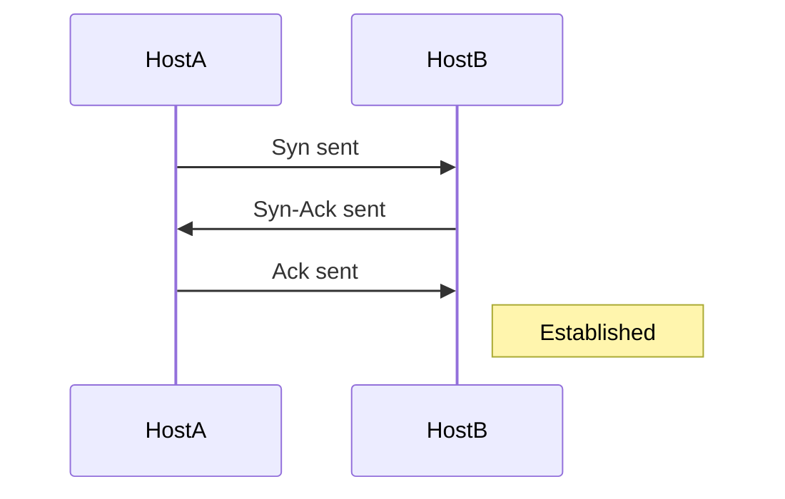
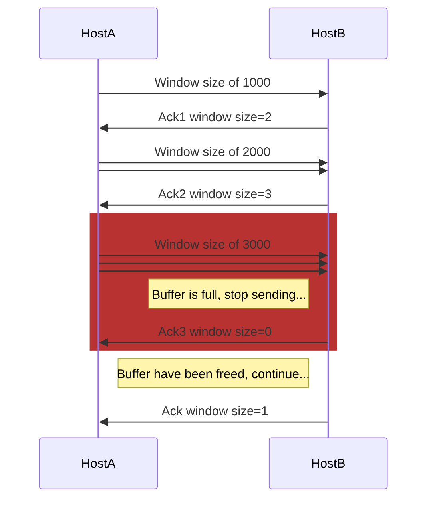
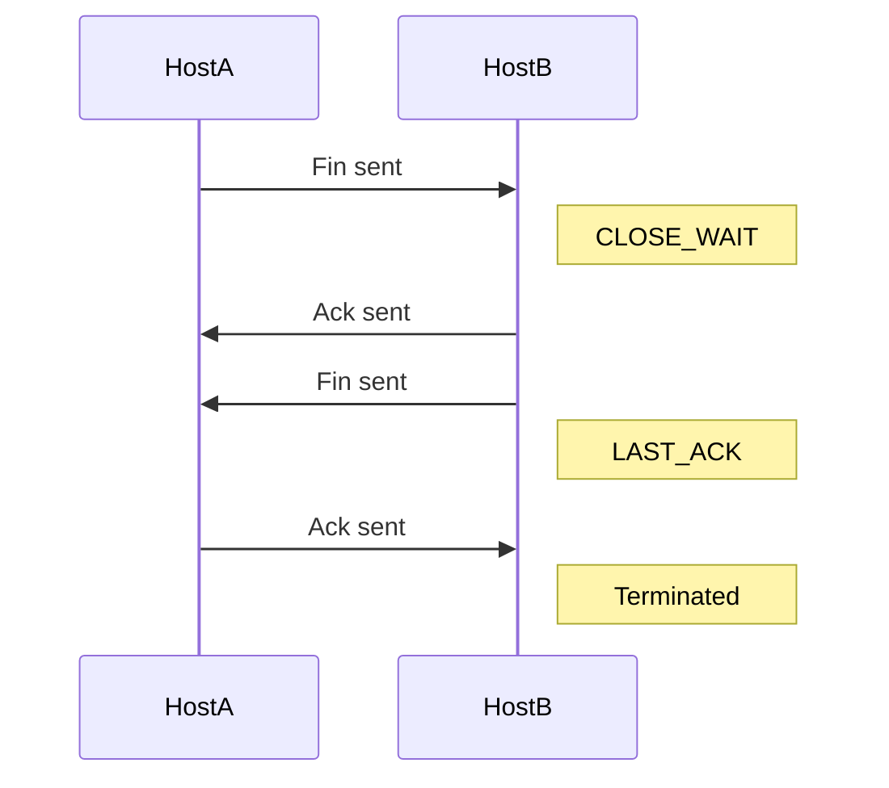

# 网络基础

> 本页介绍 MikroTik RouterOS 中的网络基础知识，涵盖 OSI 和 TCP/IP 模型、各层协议以及以太网通信细节，包括 MAC 地址和帧转发类型。

# 网络基础

计算机网络由许多不同的组件和协议协同工作组成。为了理解节点间通信的概念，让我们熟悉 **OSI 模型** 和 **TCP/IP 模型**。这两种模型有助于可视化节点间通信的过程。

### OSI 模型

开放系统互连（OSI）模型是一个 7 层模型，如今主要作为教学工具使用。OSI 模型最初被设想为构建网络系统的标准架构，但现实世界中的网络远没有 OSI 模型所暗示的那么定义明确。

- **第 7 层（应用层）** - 定义服务器与客户端之间通信的协议，例如 HTTP 协议。如果 Web 浏览器想要下载图片，该协议将组织和执行请求；
- **第 6 层（表示层）** - 确保数据以可用格式接收。加密在此层完成（但实际上可能并非如此，例如 IPSec）；
- **第 5 层（会话层）** - 负责建立、管理和关闭客户端与服务器之间的会话；
- **第 4 层（传输层）** - 传输层的主要职责是数据流的组装与重组，数据流被分割成块（段），分配序列号并封装到协议头中（TCP、UDP 等）；
- **第 3 层（网络层）** - 负责逻辑设备寻址，数据被封装在 IP 头中，此时称为“数据包”；
- **第 2 层（数据链路层）** - 数据被封装在自定义头中，可以是 802.3（以太网）或 802.11（无线），称为“帧”，负责流量控制；
- **第 1 层（物理层）** - 发送和接收比特的通信介质、电信号以及硬件接口；

### TCP/IP 模型

该模型与 OSI 模型目的相同，但更适合现代网络故障排查。与 OSI 模型相比，TCP/IP 是一个 4 层模型：

- **应用层（4）** - 包含 OSI 模型的应用层、表示层和会话层，这大大简化了网络故障排查；
- **传输层（3）** - 与 OSI 模型中的传输层相同（TCP、UDP 协议）；
- **互联网层（2）** - 与 OSI 模型中的网络层功能相同（包括 ARP、IP 协议）；
- **链路层（1）** - 也称为网络接入层。包含 OSI 模型的第 1 层和第 2 层，因此其主要关注点是网络节点之间的物理数据交换；

| TCP/IP            | OSI 模型          | 协议                           |
|:--|:--|:--|
| 应用层 | 应用层  | DNS、DHCP、HTTP、SSH 等         |
|                   | 表示层 | JPEG、MPEG、PICT 等             |
|                   | 会话层      | PAP、SCP、ZIP 等              |
| 传输层   | 传输层    | TCP、UDP                        |
| 互联网层    | 网络层      | ICMP、IGMP、IPv4、IPv6、IPSec   |
| 链路层        | 数据链路层    | ARP、CDP、MPLS、PPP 等        |
|                   | 物理层     | 蓝牙、以太网、Wi-Fi 等 |

## 以太网

计算机网络中最常用的链路层协议（OSI 第 2 层）是以太网协议。为了进行通信，每个节点都有一个唯一的分配地址，称为 **MAC**（媒体访问控制地址），有时也称为以太网地址。

MAC 地址长度为 48 位，通常由制造商固定（不可更改），但如今 MAC 地址的自定义已被广泛使用，RouterOS 也允许设置自定义 MAC 地址。

最常用的 MAC 格式是 6 个十六进制数，用冒号分隔（`D4:CA:6D:01:22:96`）

RouterOS 在所有类似以太网的接口（无线、60G、VPLS 等）的配置中显示 MAC 地址。

```ros
[admin@rack1_b32_CCR1036] /interface ethernet> print 
Flags: X - disabled, R - running, S - slave 
 #    NAME                  MTU MAC-ADDRESS       ARP             SWITCH               
 0 R  ether1               1500 D4:CA:6D:01:22:96 enabled        
 1 R  ether2               1500 D4:CA:6D:01:22:97 enabled        
 2 R  ether3               1500 D4:CA:6D:01:22:98 enabled        
 3    ether4               1500 D4:CA:6D:01:22:99 enabled        
 4    ether5               1500 D4:CA:6D:01:22:9A enabled        
 5    ether6               1500 D4:CA:6D:01:22:9B enabled        
 6    ether7               1500 D4:CA:6D:01:22:9C enabled        
 7 R  ether8               1500 D4:CA:6D:01:22:9D enabled        
 8    sfp-sfpplus1         1500 D4:CA:6D:01:22:94 enabled        
 9    sfp-sfpplus2         1500 D4:CA:6D:01:22:95 enabled 
```

以太网网络中有三种帧转发类型：

- **单播** - 带有单播地址的帧被发送到冲突域内的所有节点，冲突域通常是两个节点之间的以太网电缆，或者在无线情况下是所有能检测到无线信号的接收者。只有 MAC 地址匹配的远端节点才会接受该帧（除非启用了混杂模式）
- **广播** - 一种特殊地址（`FF:FF:FF:FF:FF:FF`），广播帧会被所有节点接受并在第 2 层网络中转发。
- **组播** - 带有组播地址的帧会被所有配置为监听该地址的节点接收。

## IP 网络

以太网协议足以在以太网网络上的两个节点之间传输数据，但不足以在跨越多个以太网段的多个跳数之间传输数据。在互联网/网络层（OSI 第 3 层），使用 IP（互联网协议）通过唯一的逻辑地址来标识主机。

目前大多数网络使用 **IPv4**，这是一种 32 位地址，以点分十进制表示法书写（`192.168.88.1`），但 **IPv6**（128 位地址）的使用正在扩大。

可以为接口添加多个 IP 地址，也可以让接口不分配任何地址。在桥接或 PPPoE 连接的情况下，物理接口可能没有分配任何地址，但仍然可以正常使用。为包含在桥接中的物理接口配置 IP 地址，实际上意味着在桥接接口本身上设置它。

### 子网掩码

可能存在多个逻辑网络，为了识别 IP 地址属于哪个网络，使用 **子网掩码**。**子网掩码** 通常指定为用于标识逻辑网络的位数。格式也可以使用十进制表示法，例如，24 位子网掩码可以写成 `255.255.255.0`

### IPv4 地址

IPv4 使用 4 字节地址，分为四个 8 位字段，称为八位组。每个八位组转换为十进制格式并用点分隔。例如：

```
11000000 10101000 00000011 00011000 => 192.168.3.24
```

让我们仔细看看 192.168.3.24/24 以及如何从子网掩码确定有效范围：

```
11000000 10101000 00000011 00011000 => 192.168.3.24
11111111 11111111 11111111 00000000 => /24 或 255.255.255.0
```

在此示例中，高 24 位被掩码，给我们留下 0-255 的范围。  
该范围包含三种地址类型：

- **网络地址** - 该范围中的第一个地址用于标识网络（在我们的示例中，网络地址为 192.168.3.0）

- **广播地址** - 该范围中的最后一个/最高地址（在我们的示例中为 192.168.3.255）。广播地址用于向所有可能的目的地发送数据（**全主机广播**），这允许发送方只发送一次数据，所有接收者都会收到一份副本。在 IPv4 协议中，地址 255.255.255.255 用于**本地广播**。此外，可以向网络广播地址进行定向（受限）广播。
- **单播地址** - 该范围中的所有其他地址可用于标识网络中的特定主机（在我们的示例中，主机标识范围为 1 到 254）。

与以太网协议一样，也有一个特殊的 **组播** 地址范围。组播地址用于关联一组感兴趣的接收者。在 IPv4 中，`224.0.0.0` 到 `239.255.255.255` 的地址被指定为组播地址。发送方从其单播地址向组播组地址发送单个数据报，中间路由器负责复制并将其发送到所有已加入相应组播组的接收者；

逻辑 IP 网络、单播、广播和组播可视化：


还有一些为特殊目的保留的地址范围：

- [私有地址范围（RFC 1918）](https://tools.ietf.org/html/rfc1918)，应仅在本地网络中使用，通常在转发到互联网时被丢弃：
  - 10.0.0.0/8 - 起始：10.0.0.0；结束：10.255.255.255
  - 172.16.0.0/12 - 起始：172.16.0.0；结束：172.31.255.255
  - 192.168.0.0/16 - 起始：192.168.0.0；结束：192.168.255.255

- 198.18.0.0/15 - 基准测试
- 192.88.99.0/24 - 6to4 中继任播地址范围
- 192.0.2.0/24、198.51.100.0/24、203.0.113.0/24 - 文档
- 169.254.0.0/16 - 自动配置地址范围

#### 点对点寻址

点对点寻址，顾名思义，可用于设置仅包含两个节点的第 3 层网络。有两种方法可以设置此类寻址：

- 使用 /31 地址范围
- 使用 /32 地址，其中网络地址设置为远端节点的 IP 地址。  
  例如：

  ```mermaid
  flowchart LR
    H1 --- H2

    H1["**主机 1**____________________ **地址**: 192.168.0.1/32**网络**: 192.168.0.2"]
    H2["**主机 2**____________________ **地址**: 192.168.0.2/32**网络**: 192.168.0.1"]

    style H1 text-align:left
    style H2 text-align:left
  ```

#### 地址配置

考虑一个设置，其中两台路由器直接通过电缆连接，我们不想浪费地址空间：

路由器 1：

```ros
/ip address
add address=10.1.1.1/32 interface=ether1 network=172.16.1.1
```

路由器 2：

```ros
/ip address
add address=172.16.1.1/32 interface=ether1 network=10.1.1.1
```

## ARP 与综合应用

尽管 IP 数据包使用 IP 地址寻址，但必须使用硬件地址才能实际将数据从一台主机传输到另一台主机。

这就引出了 **地址解析协议（ARP）**，它用于将主机的 **IPv4** 地址映射到硬件地址（MAC）。**ARP** 协议在 [RFC 826](https://tools.ietf.org/html/rfc826) 中定义。对于 IPv6，它已被组播所取代，但只要 IPv4 还在使用，它就会继续存在。

每个网络设备都有一个当前使用的 ARP 条目表。通常该表是动态构建的，但为了增强网络安全性，可以通过添加静态条目来部分或完全静态构建。

当局域网中的主机想要向该网络中的另一台主机发送 IP 数据包时，它必须在其 ARP 缓存中查找目的主机的以太网 MAC 地址。如果目的主机的 MAC 地址不在 ARP 表中，则发送 ARP 请求以查找具有相应 IP 地址的设备。ARP 向局域网中的所有设备发送广播请求消息，询问具有指定 IP 地址的设备回复其 MAC 地址。识别该 IP 地址为其自身的设备返回带有自身 MAC 地址的 ARP 响应：


让我们进行一个简单配置，并仔细看看当 **主机 A** 尝试 ping **主机 C** 时的过程。

首先，我们在 **主机 A** 上添加 IP 地址：

```ros
/ip address add address=10.155.101.225/24 interface=ether1
```

**主机 B**：

```ros
/ip address add address=10.155.101.221/24 interface=ether1
```

**主机 C**：

```ros
/ip address add address=10.155.101.217/24 interface=ether1
```

让我们运行一个数据包嗅探器，将数据包转储保存到文件中，并在 **主机 A** 上运行 ping 命令：

```ros
/tool sniffer
  set file-name=arp.pcap filter-interface=ether1
  start 
/ping 10.155.101.217 count=1
/tool sniffer stop
```

现在您可以从路由器下载 arp.pcap 文件并在 Wireshark 中打开进行分析：


- **主机 A** 发送 **ARP** 消息，询问谁拥有 "10.155.101.217"
- **主机 C** 响应，10.155.101.217 可以通过 08:00:27:3C:79:3A MAC 地址访问
- **主机 A** 和 **主机 C** 现在都已更新其 **ARP** 表，可以发送 ICMP（ping）数据包

如果您通过运行 `/ip/arp/print` 查看两台主机的 ARP 表，您应该能看到相关条目：

```routeros
[admin@host_a] /ip arp> print 
Flags: D - DYNAMIC; C - COMPLETE
Columns: ADDRESS, MAC-ADDRESS, INTERFACE, VRF, STATUS
 #    ADDRESS         MAC-ADDRESS       INTERFACE     VRF   STATUS
 0 DC 10.155.101.217  08:00:27:3C:79:3A ether1        main  reachable

 [admin@host_b] /ip arp> print 
Flags: D - DYNAMIC; C - COMPLETE
Columns: ADDRESS, MAC-ADDRESS, INTERFACE, VRF, STATUS
 #    ADDRESS         MAC-ADDRESS       INTERFACE     VRF   STATUS
 0 DC 10.155.101.225  08:00:27:85:69:B5 ether1        main  reachable
```

在某些场景下可能需要不同的行为。RouterOS 允许为支持 **ARP** 的接口配置不同的模式：

- **启用** - ARP 将自动发现，新的动态条目将添加到 ARP 表中。这是接口的默认模式。
- **禁用** - 如果接口上的 ARP 功能关闭，则路由器不会响应客户端的 ARP 请求。因此，也需要在客户端添加静态 ARP 条目。例如，
  主机 A：

  ```ros
  /interface/set ether1 arp=disabled
  /ip arp add mac-address=08:00:27:3C:79:3A address=10.155.101.217 interface=ether1
  ```

  主机 B：

  ```ros
  /ip arp add mac-address=08:00:27:85:69:B5 address=10.155.101.225 interface=ether1
  ```

- **仅回复** - 如果接口上的 ARP 属性设置为 `reply-only`，则路由器仅回复 ARP 请求。邻居 MAC 地址将使用 `/ip/arp` 静态解析，但无需像 ARP 禁用时那样将路由器的 MAC 地址添加到其他主机的 ARP 表中。

- **代理 ARP** - 正确配置了代理 ARP 功能的路由器充当直接连接网络之间的透明代理。例如，如果您想为拨入（PPP、PPPoE、PPTP）客户端分配与所连接 LAN 上使用的相同地址空间的 IP 地址，此行为可能很有用。

- **本地代理 ARP** - 如果接口上的 arp 属性设置为 `local-proxy-arp`，则路由器仅对该接口执行代理 ARP。即，对于从同一接口进入和离开的流量。在普通 LAN 中，默认行为是两个网络主机直接相互通信，不涉及路由器。
  路由器将使用路由器自身接口的 MAC 地址响应所有客户端主机，而不是其他主机的 MAC 地址。

  例如，如果主机 A（192.168.88.2/24）查询主机 B（192.168.88.3/24）的 MAC 地址，路由器将使用自身的 MAC 地址响应。换句话说，如果启用了 local-proxy-arp，路由器将承担转发主机 A 192.168.88.2 和主机 B 192.168.88.3 之间流量的责任。主机 A 和 B 上的所有 ARP 缓存条目都将引用路由器的 MAC 地址。在这种情况下，路由器正在为整个子网 192.168.88.0/24 执行本地代理 ARP。

  RouterOS local-proxy-arp 的一个示例可能是带有 DHCP 服务器和隔离桥接端口的桥接设置，其中来自同一子网的主机只能通过桥接 IP 在第 3 层相互访问。

  ```ros
  /interface bridge
  add arp=local-proxy-arp name=bridge1
  /interface bridge port
  add bridge=bridge1 horizon=1 interface=ether2
  add bridge=bridge1 horizon=1 interface=ether3
  add bridge=bridge1 horizon=1 interface=ether4
  ```

  这项技术有不同的名称：
  - 在 RFC 3069 中称为 VLAN 聚合；
  - Cisco 和 Allied Telesis 称之为私有 VLAN；
  - Hewlett-Packard 称之为源端口过滤或端口隔离；
  - Ericsson 称之为 MAC 强制转发（RFC 草案）。

#### 代理 ARP 示例

让我们看一下示例图。  


子网 A 上的 **主机 A**（172.16.1.2）想要向子网 B 上的 **主机 D**（172.16.2.3）发送数据包。**主机 A** 具有 /16 子网掩码，这意味着它认为自己直接连接到所有 172.16.0.0/16 网络（同一 LAN）。它在子网 A 上广播以获取 **主机 D** 的 MAC 地址。

来自数据包分析软件的信息：

```text
 No.     Time   Source             Destination       Protocol  Info

 12   5.133205  00:1b:38:24:fc:13  ff:ff:ff:ff:ff:ff  ARP      Who has 173.16.2.3?  Tell 173.16.1.2

Packet details:

Ethernet II, Src: (00:1b:38:24:fc:13), Dst: (ff:ff:ff:ff:ff:ff)
    Destination: Broadcast (ff:ff:ff:ff:ff:ff)
    Source: (00:1b:38:24:fc:13)
    Type: ARP (0x0806)
Address Resolution Protocol (request)
    Hardware type: Ethernet (0x0001)
    Protocol type: IP (0x0800)
    Hardware size: 6
    Protocol size: 4
    Opcode: request (0x0001)
    [Is gratuitous: False]
    Sender MAC address: 00:1b:38:24:fc:13
    Sender IP address: 173.16.1.2
    Target MAC address: 00:00:00:00:00:00
    Target IP address: 173.16.2.3
```

通过此 ARP 请求，**主机 A**（172.16.1.2）正在请求 **主机 D**（172.16.2.3）发送其 MAC 地址。第 2 层广播意味着该帧将被发送到同一第 2 层广播域中的所有主机，其中包括路由器的 **ether0** 接口，但不会到达 **主机 D**，因为路由器默认不转发第 2 层广播。

要解决此问题，我们需要在 ether0 上启用 `proxy-arp`：

```ros
/interface/ethernet set ether0 arp=proxy-arp
```

现在，路由器知道目标地址（172.16.2.3）在另一个子网上并且可达，它向 **主机 A** 发送一个单播回复，其中包含自身的 **MAC** 地址。基本上，它是在说“将这些数据包发送给我，我会将它们送到需要去的地方。”

```text
No.     Time   Source            Destination         Protocol   Info

13   5.133378  00:0c:42:52:2e:cf  00:1b:38:24:fc:13   ARP        172.16.2.3 is at 00:0c:42:52:2e:cf

Packet details:

Ethernet II, Src: 00:0c:42:52:2e:cf, Dst: 00:1b:38:24:fc:13
   Destination: 00:1b:38:24:fc:13
   Source: 00:0c:42:52:2e:cf
   Type: ARP (0x0806)
Address Resolution Protocol (reply)
   Hardware type: Ethernet (0x0001)
   Protocol type: IP (0x0800)
   Hardware size: 6
   Protocol size: 4
   Opcode: reply (0x0002)
   [Is gratuitous: False]
   Sender MAC address: 00:0c:42:52:2e:cf
   Sender IP address: 172.16.1.254
   Target MAC address: 00:1b:38:24:fc:13
   Target IP address: 172.16.1.2
```

当主机 A 收到 ARP 响应时，它会更新其 ARP 表，如下所示：

```text
C:\Users\And>arp -a
Interface: 173.16.2.1 --- 0x8
  Internet Address      Physical Address      Type
  173.16.1.254          00-0c-42-52-2e-cf    dynamic
  173.16.2.3            00-0c-42-52-2e-cf    dynamic
  173.16.2.2            00-0c-42-52-2e-cf    dynamic
```

MAC 表更新后，**主机 A** 将所有发往 **主机 D**（172.16.2.3）的数据包直接转发到路由器接口 ether0（00:0c:42:52:2e:cf），路由器再将数据包转发给 **主机 D**。子网 A 中主机上的 ARP 缓存中，子网 B 上所有主机的 MAC 地址都填充为路由器的 MAC 地址。因此，所有发往子网 B 的数据包都发送到路由器。路由器将这些数据包转发给子网 B 中的主机。

使用代理 ARP 时，主机的多个 IP 地址映射到单个 MAC 地址。

## 传输层

此层中的协议为应用程序提供端到端的通信服务。这些协议应通过交换数据接收确认和重传丢失的数据包来确保数据包按顺序且无错误地到达。

最著名且广泛使用的是 **传输控制协议（TCP）**，它用于面向连接的传输，包含了可靠数据传输的机制。

无连接的 **用户数据报协议（UDP）** 是另一种用于简单数据传输的常见协议。

### TCP 协议操作

面向连接的协议在建立适当连接之前不会发送任何数据。**TCP** 在传输设备尝试与远端节点建立连接时使用多步握手过程。结果创建了端到端的虚拟（逻辑）电路，其中使用流量控制和确认来保证可靠交付。TCP 有多种消息类型用于连接建立和终止过程。

**三次握手** 过程：

1. 需要初始化连接的 **主机A** 向目的 **主机B** 发送一个带有提议初始序列号的 **SYN**（同步）数据包。
2. 当 **主机B** 收到 **SYN** 消息时，它回复一个在 TCP 头中同时设置了 **SYN** 和 **ACK** 标志的数据包（SYN-ACK）。
3. 当 **主机A** 收到 SYN-ACK 时，它回复 **ACK**（确认）数据包。**主机B** 收到 **ACK**，此时连接 **已建立**；



现在我们知道了 **TCP** 连接是如何建立的，我们需要了解数据传输是如何管理和维护的。

面向连接的协议服务通常在成功交付后发送确认（ACK）。在带有数据的数据包传输后，发送方等待接收方的确认。如果时间到期且发送方未收到 **ACK**，则重传该数据包。

让我们想想当数据报发送速度超过接收设备处理能力时会发生什么。接收方将它们存储在称为缓冲区的内存中。但由于缓冲区空间不是无限的，当容量超出时，接收方开始丢弃帧。所有被丢弃的帧必须重新传输，这就是传输性能低下的原因。

为了解决这个问题，TCP 使用流量控制协议。窗口机制用于控制数据流。当连接建立时，接收方在每个 TCP 帧中指定窗口字段。窗口大小表示接收方愿意存储在缓冲区中的已接收数据量。窗口大小（以字节为单位）与确认一起发送给发送方。因此，窗口大小控制着可以从一台主机传输到另一台主机而无需接收确认的信息量。发送方将只发送窗口大小指定的字节数，然后等待带有更新窗口大小的确认。

如果接收应用程序能够像发送方到达一样快地处理数据，那么接收方将随每个确认发送一个正的窗口通告（增加窗口大小）。这一直有效，直到发送方变得比接收方更快，传入的数据最终将填满接收方的缓冲区，导致接收方通告零窗口的确认。收到零窗口通告的发送方必须停止传输，直到收到正窗口。让我们看一下图示的窗口化过程：

1. **主机A** 以 1000 的窗口大小开始传输，发送一个 1000 字节的帧。
2. 接收方 **主机B** 返回 **ACK**，窗口大小增加到 2000。
3. **主机A** 收到 **ACK** 并传输两个帧（每个 1000 字节）。
4. 之后，接收方通告初始窗口大小为 3000。现在发送方传输三个帧并等待确认。
5. 前三个段填满接收方缓冲区的速度比接收应用程序处理数据的速度快，因此通告的窗口大小达到零，表明需要等待才能进行进一步传输。
6. 窗口大小以及窗口大小增加或减少的速度在各种 TCP 拥塞避免算法中可用，例如 Reno、Vegas、Tahoe 等。



当数据传输完成且主机想要终止连接时，将启动终止过程。与使用 **三次握手** 的 **TCP** 连接建立不同，连接终止使用 **四次** 握手。当双方都通过发送 **FIN**（结束）并接收 **ACK**（确认）完成关闭过程时，连接终止。

**四次** 终止过程：

1. 需要终止连接的 **主机A** 发送带有 **FIN** 标志的特殊消息，表示它已完成数据发送。
2. 收到 **FIN** 段的 **主机B** 不会终止连接，而是进入“被动关闭”（CLOSE\_WAIT）状态，并向 **主机A** 发送对 **FIN** 的 **ACK**。如果 **主机B** 没有数据要发送给 **主机A**，它也会发送 **FIN** 消息。现在 **主机B** 进入 LAST\_ACK 状态。此时它将不再接受来自 **主机A** 的数据，但可以继续传输数据。
3. 当 **主机A** 收到来自 **主机B** 的最后一个 **FIN** 时，它进入（TIME\_WAIT）状态，并向 **主机B** 发送 **ACK**。
4. **主机B** 从 **主机A** 收到 **ACK**，连接终止。



## 更多信息

- [RFC 6890](https://tools.ietf.org/html/rfc6890) - 所有保留的 IPv4 和 IPv6 地址范围列表
- [RFC 3069](https://tools.ietf.org/html/rfc3069)