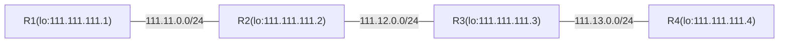

# LDP

> 本页介绍 MikroTik RouterOS 的标签分发协议（LDP），用于建立 IPv4/IPv6 标签交换路径（LSPs），详细说明环回 IP 地址和 IP 连通性等前提条件，并提供一个四路由器示例配置。

# LDP

MikroTik RouterOS 实现了用于 IPv4 和 IPv6 地址族的标签分发协议（RFC 3036、RFC 5036 和 RFC 7552）。LDP 是一种执行一系列过程并交换消息的协议，标签交换路由器（LSRs）通过该协议将网络层路由信息直接映射到数据链路层交换路径，从而在网络中建立标签交换路径（LSPs）。

## MPLS 前提条件

### “环回” IP 地址

虽然不是严格必需，但建议为参与 MPLS 网络的路由器配置“环回”IP 地址（不附加到任何真实网络接口），供 LDP 用于建立会话。

这有两个目的：

- 由于任意两台路由器之间只有一个 LDP 会话，无论它们之间连接了多少条链路，环回 IP 地址可确保 LDP 会话不受接口状态或地址变化的影响。
- 使用环回地址作为 LDP 传输地址可确保在数据包附加多个标签（如 VPLS 场景）时，倒数第二跳弹出行为正确。

在 RouterOS 中，可以通过创建一个无端口的虚拟桥接接口并向其添加地址来配置“环回”IP 地址。例如：

```ros
/interface/bridge/add name=lo
/ip/address/add address=10.255.255.1/32 interface=lo
```

### IP 连通性

由于 LDP 为活动路由分发标签，基本要求是正确配置 IP 路由。默认情况下，LDP 为活动 IGP 路由分发标签（即直连路由、静态路由以及路由协议学习到的路由，BGP 除外）。

有关如何正确设置 IGP 的说明，请参阅相应的文档章节：

- [OSPF](../unicast/ospf/index.md)
- [静态路由](../routing-decision.md)
- 等

LDP 支持 ECMP 路由。

在继续 LDP 配置之前，您应该能够从网络的任何位置访问任何环回地址。可以使用 ping 工具从环回地址到环回地址验证连通性。

## 示例配置

假设我们已有四台配置好的路由器，且 IP 连通性正常。



### IP 可达性

这里不深入讨论路由设置，以下是 IP 和 OSPF 配置的快速导出：

```ros
#R1
/interface/bridge
add name=loopback
/ip/address
add address=111.11.0.1/24 interface=ether2
add address=111.111.111.1 interface=loopback

/routing/ospf/instance
add name=default_ip4 router-id=111.111.111.1
/routing/ospf/area
add instance=default_ip4 name=backbone_ip4
/routing/ospf/interface-template
add area=backbone_ip4 dead-interval=10s hello-interval=1s networks=111.111.111.1 
add area=backbone_ip4 dead-interval=10s hello-interval=1s networks=111.11.0.0/24 

#R2
/interface/bridge
add name=loopback
/ip/address
add address=111.11.0.2/24 interface=ether2
add address=111.12.0.1/24 interface=ether3
add address=111.111.111.2 interface=loopback

/routing/ospf/instance
add name=default_ip4 router-id=111.111.111.2
/routing/ospf/area
add instance=default_ip4 name=backbone_ip4
/routing/ospf/interface-template
add area=backbone_ip4 dead-interval=10s hello-interval=1s networks=111.111.111.2
add area=backbone_ip4 dead-interval=10s hello-interval=1s networks=111.11.0.0/24
add area=backbone_ip4 dead-interval=10s hello-interval=1s networks=111.12.0.0/24

#R3
/interface/bridge
add name=loopback

/ip/address
add address=111.12.0.2/24 interface=ether2
add address=111.13.0.1/24 interface=ether3
add address=111.111.111.3 interface=loopback

/routing/ospf/instance
add name=default_ip4 router-id=111.111.111.3
/routing/ospf/area
add instance=default_ip4 name=backbone_ip4
/routing/ospf/interface-template
add area=backbone_ip4 dead-interval=10s hello-interval=1s networks=111.111.111.3
add area=backbone_ip4 dead-interval=10s hello-interval=1s networks=111.12.0.0/24
add area=backbone_ip4 dead-interval=10s hello-interval=1s networks=111.13.0.0/24

#R4
/interface/bridge
add name=loopback
/ip/address
add address=111.13.0.2/24 interface=ether2
add address=111.111.111.4 interface=loopback

/routing/ospf/instance
add name=default_ip4 router-id=111.111.111.4
/routing/ospf/area
add instance=default_ip4 name=backbone_ip4
/routing/ospf/interface-template
add area=backbone_ip4 dead-interval=10s hello-interval=1s networks=111.111.111.4
add area=backbone_ip4 dead-interval=10s hello-interval=1s networks=111.13.0.0/24

```

验证 IP 连通性和路由是否正常工作

```text
[admin@R4] /ip/address> /tool/traceroute 111.111.111.1 src-address=111.111.111.4
Columns: ADDRESS, LOSS, SENT, LAST, AVG, BEST, WORST, STD-DEV
#  ADDRESS        LOSS  SENT  LAST   AVG  BEST  WORST  STD-DEV
1  111.13.0.1     0%       4  0.6ms  0.6  0.6   0.6    0      
2  111.12.0.1     0%       4  0.5ms  0.6  0.5   0.6    0.1    
3  111.111.111.1  0%       4  0.6ms  0.6  0.6   0.6    0      

```

### LDP 配置

为了开始分发标签，LDP 在连接其他 LDP 路由器的接口上启用，而不在连接客户网络的接口上启用。

在 R1 上配置如下：

```ros
/mpls/ldp
add afi=ip lsr-id=111.111.111.1 transport-addresses=111.111.111.1
/mpls/ldp/interface
add interface=ether2    

```

:::info
请注意，传输地址设置为 111.111.111.1。这使得路由器使用此地址发起 LDP 会话连接，并将此地址作为传输地址通告给 LDP 邻居。
:::

其他路由器配置类似。

R2：

```ros
/mpls/ldp
add afi=ip lsr-id=111.111.111.2 transport-addresses=111.111.111.2
/mpls/ldp/interface
add interface=ether2   
add interface=ether3   

```

R3：

```ros
/mpls/ldp
add afi=ip lsr-id=111.111.111.3 transport-addresses=111.111.111.3
/mpls/ldp/interface
add interface=ether2   
add interface=ether3   

```

R4：

```ros
/mpls/ldp
add afi=ip lsr-id=111.111.111.4 transport-addresses=111.111.111.4
/mpls/ldp/interface
add interface=ether2   

```

LDP 会话建立后，R2 应有两个 LDP 邻居：

```text
[admin@R2] /mpls/ldp/neighbor> print 
Flags: D, I - INACTIVE; O, T - THROTTLED; p - PASSIVE
Columns: TRANSPORT, LOCAL-TRANSPORT, PEER, ADDRESSES
#     TRANSPORT      LOCAL-TRANSPORT  PEER             ADDRESSES    
0 DO  111.111.111.1  111.111.111.2    111.111.111.1:0  111.11.0.1   
                                                       111.111.111.1
1 DOp 111.111.111.3  111.111.111.2    111.111.111.3:0  111.12.0.2   
                                                       111.13.0.1   
                                                       111.111.111.3
```

本地映射表显示为哪些路由分配了哪些标签，以及路由器已将标签分发给了哪些对等体。

```text
[admin@R2] /mpls/ldp/local-mapping> print 
Flags: I - INACTIVE; D - DYNAMIC; E - EGRESS; G - GATEWAY; L - LOCAL
Columns: VRF, DST-ADDRESS, LABEL, PEERS
#       VRF   DST-ADDRESS      LABEL      PEERS          
0  D G  main  10.0.0.0/8       16         111.111.111.1:0
                                          111.111.111.3:0
1 IDE L main  10.155.130.0/25  impl-null  111.111.111.1:0
                                          111.111.111.3:0
2 IDE L main  111.11.0.0/24    impl-null  111.111.111.1:0
                                          111.111.111.3:0
3 IDE L main  111.12.0.0/24    impl-null  111.111.111.1:0
                                          111.111.111.3:0
4 IDE L main  111.111.111.2    impl-null  111.111.111.1:0
                                          111.111.111.3:0
5  D G  main  111.111.111.1    17         111.111.111.1:0
                                          111.111.111.3:0
6  D G  main  111.111.111.3    18         111.111.111.1:0
                                          111.111.111.3:0
7  D G  main  111.111.111.4    19         111.111.111.1:0
                                          111.111.111.3:0
8  D G  main  111.13.0.0/24    20         111.111.111.1:0
                                          111.111.111.3:0

```

另一方面，远程映射表显示邻居 LDP 路由器为路由分配的标签，并通告给本路由器：

```text
[admin@R2] /mpls/ldp/remote-mapping> print 
Flags: I - INACTIVE; D - DYNAMIC
Columns: VRF, DST-ADDRESS, NEXTHOP, LABEL, PEER
 #    VRF   DST-ADDRESS      NEXTHOP     LABEL      PEER           
 0 ID main  10.0.0.0/8                   16         111.111.111.1:0
 1 ID main  10.155.130.0/25              impl-null  111.111.111.1:0
 2 ID main  111.11.0.0/24                impl-null  111.111.111.1:0
 3 ID main  111.12.0.0/24                17         111.111.111.1:0
 4  D main  111.111.111.1    111.11.0.1  impl-null  111.111.111.1:0
 5 ID main  111.111.111.2                19         111.111.111.1:0
 6 ID main  111.111.111.3                20         111.111.111.1:0
 7 ID main  111.111.111.4                21         111.111.111.1:0
 8 ID main  111.13.0.0/24                18         111.111.111.1:0
 9 ID main  0.0.0.0/0                    impl-null  111.111.111.3:0
10 ID main  111.111.111.2                16         111.111.111.3:0
11 ID main  111.111.111.1                18         111.111.111.3:0
12  D main  111.111.111.3    111.12.0.2  impl-null  111.111.111.3:0
13  D main  111.111.111.4    111.12.0.2  19         111.111.111.3:0
14 ID main  10.155.130.0/25              impl-null  111.111.111.3:0
15 ID main  111.11.0.0/24                17         111.111.111.3:0
16 ID main  111.12.0.0/24                impl-null  111.111.111.3:0
17  D main  111.13.0.0/24    111.12.0.2  impl-null  111.111.111.3:0

```

我们可以观察到，路由器已从其两个邻居（R1 和 R3）接收到所有路由的标签绑定。

远程映射表仅对具有直接下一跳的目标具有活动映射。例如，让我们仔细查看 111.111.111.4 的映射。路由表显示网络 111.111.111.4 可通过 111.12.0.2（R3）到达：

```text
[admin@R2] /ip/route> print where dst-address=111.111.111.4
Flags: D - DYNAMIC; A - ACTIVE; o, y - COPY
Columns: DST-ADDRESS, GATEWAY, DISTANCE
    DST-ADDRESS       GATEWAY            DISTANCE
DAo 111.111.111.4/32  111.12.0.2%ether3       110
```

如果我们再次查看远程映射表，唯一的活动映射是从 R3 接收的，分配标签为 19。这意味着当 R2 向该网络路由流量时，将压入标签 19。

```text
17  D main  111.111.111.4    111.12.0.2  19         111.111.111.3:0
```

标签交换规则可以在转发表中查看：

```text
[admin@R2] /mpls/forwarding-table> print 
Flags: L, V - VPLS
Columns: LABEL, VRF, PREFIX, NEXTHOPS
#   LABEL  VRF   PREFIX         NEXTHOPS                                            
0 L    16  main  10.0.0.0/8     { nh=10.155.130.1; interface=ether1 }               
1 L    18  main  111.111.111.3  { label=impl-null; nh=111.12.0.2; interface=ether3 }
2 L    19  main  111.111.111.4  { label=19; nh=111.12.0.2; interface=ether3 }       
3 L    20  main  111.13.0.0/24  { label=impl-null; nh=111.12.0.2; interface=ether3 }
4 L    17  main  111.111.111.1  { label=impl-null; nh=111.11.0.1; interface=ether2 }
```

如果我们查看规则编号 2，该规则表示当 R2 收到带有标签 19 的数据包时，会将标签更换为新标签 19（由 R3 分配）。

从这个示例可以看出，路径上的标签不必是唯一的。

现在查看 R3 的转发表：

```text
[admin@R3] /mpls/forwarding-table> print 
Flags: L, V - VPLS
Columns: LABEL, VRF, PREFIX, NEXTHOPS
#   LA  VRF   PREFIX         NEXTHOPS                                            
0 L 19  main  111.111.111.4  { label=impl-null; nh=111.13.0.2; interface=ether3 }
1 L 17  main  111.11.0.0/24  { label=impl-null; nh=111.12.0.1; interface=ether2 }
2 L 16  main  111.111.111.2  { label=impl-null; nh=111.12.0.1; interface=ether2 }
3 L 18  main  111.111.111.1  { label=17; nh=111.12.0.1; interface=ether2 } 
```

规则编号 0 显示出标签为“**impl-null**”。原因是 R3 是到达 111.111.111.4 之前的最后一跳，无需交换为任何真实标签。已知 R4 是 111.111.111.4 网络的出口点（该路由器是直连网络的出口点，因为流量的下一跳不是 MPLS 路由器），因此它为这条路由通告“隐式空标签”。这告诉 R3 将发往 111.111.111.4/32 的流量以无标签方式转发给 R4，这正是 R3 转发表条目所指示的。

:::warning
当标签不交换为任何真实标签时，此操作称为**倒数第二跳弹出**。它确保当预先知道路由器将需要路由数据包时，路由器无需进行不必要的标签查找。
:::

## 在 MPLS 网络中使用 traceroute

RFC4950 为 MPLS 引入了 ICMP 协议的扩展。基本思想是某些 ICMP 消息可以携带 MPLS“标签栈对象”（即导致特定 ICMP 消息的数据包上的标签列表）。与 MPLS 相关的 ICMP 消息包括超时（Time Exceeded）和需要分片（Fragmentation Needed）。

MPLS 标签不仅携带标签值，还携带 TTL 字段。当对 IP 数据包压入标签时，MPLS TTL 设置为 IP 头中的值。当最后一个标签从 IP 数据包中移除时，IP TTL 设置为 MPLS TTL 中的值。因此，可以通过支持 MPLS 扩展的 traceroute 工具来诊断 MPLS 交换网络。

例如，从 R1 到 R4 的 traceroute 结果如下：

```text
[admin@R1] /mpls/ldp/neighbor> /tool/traceroute 111.111.111.4 src-address=111.111.111.1
Columns: ADDRESS, LOSS, SENT, LAST, AVG, BEST, WORST, STD-DEV, STATUS
#  ADDRESS        LOSS  SENT  LAST   AVG  BEST  WORST  STD-DEV  STATUS         
1  111.11.0.2     0%       2  0.7ms  0.7  0.7   0.7          0  <MPLS:L=19,E=0>
2  111.12.0.2     0%       2  0.4ms  0.4  0.4   0.4          0  <MPLS:L=19,E=0>
3  111.111.111.4  0%       2  0.5ms  0.5  0.5   0.5          0 
```

Traceroute 结果显示数据包产生 ICMP 超时消息时携带的 MPLS 标签。上述结果意味着当 R3 收到 MPLS TTL 为 1 的数据包时，该数据包带有标签 19。这与 R3 为 111.111.111.4 通告的标签一致。同样，在下一轮 traceroute 迭代中，R2 观察到数据包上的标签 19——R2 将标签 19 交换为标签 19，如上所述。R4 收到无标签的数据包——R3 执行了倒数第二跳弹出，如上所述。

### 在 MPLS 网络中使用 traceroute 的缺点

#### 标签交换 ICMP 错误

在 MPLS 网络中使用 traceroute 的一个缺点是 MPLS 处理产生的 ICMP 错误的方式。在 IP 网络中，ICMP 错误简单地路由回导致错误的数据包的源地址。在 MPLS 网络中，产生错误消息的路由器可能甚至没有到 IP 数据包源地址的路由（例如，在非对称标签交换路径或某种 MPLS 隧道的情况下，例如传输 MPLS VPN 流量）。

因此，产生的 ICMP 错误不会路由回导致错误的数据包的源地址，而是沿着标签交换路径继续交换，假设当标签交换路径端点收到 ICMP 错误时，它将知道如何正确路由回源地址。

这导致在 MPLS 网络中 traceroute 不能像在 IP 网络中那样使用——用于确定网络中的故障点。如果标签交换路径在中间任何位置中断，将不会有 ICMP 回复返回，因为它们无法到达标签交换路径的远端端点。

#### 倒数第二跳弹出和 traceroute 源地址

深入理解倒数第二跳行为和路由对于理解和避免倒数第二跳弹出对 traceroute 造成的问题是必要的。

在示例配置中，从 R5 到 R1 的常规 traceroute 将产生以下结果：

```
[admin@R5] > /tool/traceroute 9.9.9.1
     ADDRESS                                    STATUS
   1         0.0.0.0 timeout timeout timeout
   2         2.2.2.2 37ms 4ms 4ms
                      mpls-label=17
   3         9.9.9.1 4ms 2ms 11ms

```

相比之下：

```
[admin@R5] > /tool/traceroute 9.9.9.1 src-address=9.9.9.5
     ADDRESS                                    STATUS
   1         4.4.4.3 15ms 5ms 5ms
                      mpls-label=17
   2         2.2.2.2 5ms 3ms 6ms
                      mpls-label=17
   3         9.9.9.1 6ms 3ms 3ms

```

第一个 traceroute 未从 R3 获得响应的原因是，默认情况下 R5 上的 traceroute 使用源地址 4.4.4.5 进行探测，因为它是到达 9.9.9.1/32 的下一跳路由的首选源地址：

```
[admin@R5] > /ip/route/print
Flags: X - disabled, A - active, D - dynamic,
C - connect, S - static, r - rip, b - bgp, o - ospf, m - mme,
B - blackhole, U - unreachable, P - prohibit
 #      DST-ADDRESS        PREF-SRC        G GATEWAY         DISTANCE             INTERFACE
 ...
 3 ADC  4.4.4.0/24         4.4.4.5                           0                    ether1
 ...
 5 ADo  9.9.9.1/32                         r 4.4.4.3         110                  ether1
 ...

```

当第一个 traceroute 探测（源：4.4.4.5，目的：9.9.9.1）被传输时，R3 丢弃它并产生一个 ICMP 错误消息（源：4.4.4.3，目的：4.4.4.5），该消息被一路交换到 R1。然后 R1 发送 ICMP 错误返回——它沿着标签交换路径被交换到 4.4.4.5。

R2 是网络 4.4.4.0/24 的倒数第二跳弹出路由器，因为 4.4.4.0/24 直接连接到 R3。因此 R2 移除最后一个标签并将 ICMP 错误以无标签方式发送给 R3：

```
[admin@R2] > /mpls/forwarding-table/print
 # IN-LABEL             OUT-LABELS           DESTINATION        INTERFACE            NEXTHOP
 ...
 3 19                                        4.4.4.0/24         ether2               2.2.2.3
 ...

```

R3 丢弃收到的 IP 数据包，因为它收到一个源地址为其自身地址的数据包。后续探测产生的 ICMP 错误正确返回，因为 R3 收到无标签数据包，源地址为 2.2.2.2 和 9.9.9.1，这对路由器来说是可接受的。

命令：

```
[admin@R5] > /tool/traceroute 9.9.9.1 src-address=9.9.9.5
 ...

```

产生预期结果，因为 traceroute 探测的源地址是 9.9.9.5。当 ICMP 错误从 R1 返回 R5 时，9.9.9.5/32 网络的倒数第二跳弹出发生在 R3，因此它永远不会路由到源地址为其自身地址的数据包。

## 优化标签分发

### 标签绑定过滤

在实施给定示例配置的过程中，很明显并非所有标签绑定都是必需的。例如，R1 和 R3 或 R2 和 R4 之间无需交换 IP 路由标签绑定，因为它们永远不会被使用。此外，如果给定网络核心仅为所提到的客户以太网段提供连通性，则分发连接路由器之间网络的标签没有实际用途。唯一重要的路由是到端点或所连接客户网络的 /32 路由。

标签绑定过滤可用于仅分发指定的标签集，以减少资源使用和网络负载。

有两种类型的标签绑定过滤器：

- 应向 LDP 邻居通告哪些标签绑定，在 `/mpls/ldp/advertise-filter` 菜单中配置。
- 应从 LDP 邻居接受哪些标签绑定，在 `/mpls/ldp/accept-filter` 菜单中配置。

过滤器按有序列表组织，指定必须包含被测试前缀的前缀以及邻居（或通配符）。

在给定的示例配置中，可以配置所有路由器，使其仅通告允许到达隧道端点的路由的标签。为此，需要在所有路由器上配置两个通告过滤器：

```ros
/mpls/ldp/advertise-filter/add prefix=111.111.111.0/24 advertise=yes
/mpls/ldp/advertise-filter/add prefix=0.0.0.0/0 advertise=no
```

此过滤器使路由器仅通告被 111.111.111.0/24 前缀包含的路由的绑定，该前缀覆盖环回地址（111.111.111.1/32、111.111.111.2/32 等）。第二条规则是必需的，因为当没有规则匹配时，默认过滤器结果允许所讨论的操作。

在给定的配置中，无需设置接受过滤器，因为通过上述两条规则引入的约定，任何 LDP 路由器都不会分发不必要的绑定。

请注意，过滤器更改不会影响现有映射，因此要使过滤器生效，需要重置邻居之间的连接，可以通过从 LDP 邻居表中移除邻居或重启 LDP 实例来实现。

例如，在 R2 上，我们得到：

```text
[admin@R2] /mpls/ldp/remote-mapping> print 
Flags: I - INACTIVE; D - DYNAMIC
Columns: VRF, DST-ADDRESS, NEXTHOP, LABEL, PEER
#    VRF   DST-ADDRESS    NEXTHOP     LABEL      PEER           
0 ID main  111.111.111.2              17         111.111.111.3:0
1 ID main  111.111.111.1              16         111.111.111.3:0
2  D main  111.111.111.3  111.12.0.2  impl-null  111.111.111.3:0
3  D main  111.111.111.4  111.12.0.2  18         111.111.111.3:0
4 ID main  111.111.111.2              16         111.111.111.1:0
5  D main  111.111.111.1  111.11.0.1  impl-null  111.111.111.1:0
6 ID main  111.111.111.3              17         111.111.111.1:0
7 ID main  111.111.111.4              18         111.111.111.1:0
```

## IPv6 和双栈链路上的 LDP

RouterOS 实现了 RFC 7552 以支持双栈链路上的 LDP。

支持的 AFI 可以通过 LDP 实例选择，也可以在每个 LDP 接口上显式配置。

```ros
/mpls/ldp
add afi=ip,ipv6 lsr-id=111.111.111.1 preferred-afi=ipv6
/mpls/ldp/interface
add interface=ether2 afi=ip
add interface=ether3 afi=ipv6
```

上面的示例启用了 LDP 实例使用 IPv4 和 IPv6 地址族，并通过 `preferred-afi` 参数将偏好设置为 IPv6。另一方面，LDP 接口配置显式设置 **ether2** 仅支持 IPv4，**ether3** 仅支持 IPv6。

主要问题是当存在不同 AFI 混合时如何选择 AFI，以及如果其中一个受支持的 AFI 抖动会发生什么。

发送 hello 的逻辑如下：

- 如果接口只有一个 AFI：
  - 不发送双栈元素。
  - 仅当接口上存在相应 AFI 的 IP 地址时才发送 hello。
- 如果接口具有两个 AFI：
  - 始终发送双栈元素，其中包含 preferred-afi 的值。
  - 如果接口上存在相应地址，则在每个 AFI 上发送 hello。

从所有收到的 hello 中，对等体确定使用哪个 AFI 进行连接，以及为哪些 AFI 绑定和发送标签。要使 LDP 能够使用特定 AFI，必须收到该特定 AFI 的 hello。Hello 数据包包含 LDP 正常操作所需的传输地址。通过比较收到的 AFI 地址，确定主动/被动角色。

接收和处理 hello 的逻辑如下：

- 如果 LDP 实例只有一个 AFI（意味着所有接口只能运行该特定 AFI）：
  - 丢弃来自不受支持 AFI 的 hello。
  - 忽略/忘记 hello 数据包中的双栈元素。
  - 仅为此一个特定 AFI 确定角色。
  - 仅为此一个特定 AFI 发送标签。
- 如果 LDP 实例具有两个 AFI（接口可以具有不同受支持 AFI 的组合）：
  - 丢弃来自接口上未配置为受支持 AFI 的 hello。
  - 如果接口只有一个受支持的 AFI，则忽略/忘记 hello 数据包中的双栈元素（不考虑偏好）。
  - 如果收到的双栈元素中的偏好与配置的 `preferred-afi` 不匹配，则丢弃 hello。

如果 hello 数据包发生变化，仅当标签使用的地址族发生变化时才终止现有会话，否则保留会话。

hello 数据包中的双栈元素仅在接口被确定为双栈兼容时设置：

- 通常这样的接口应能够接收来自两个 AFI 的 hello：
  - 在继续之前，LDP 应等待来自首选 AFI 的 hello。
  - 如果仅收到来自一个 AFI 的 hello：
    - 如果未收到来自首选 AFI 的 hello，则视为错误。
    - 否则，等待缺失的 hello x 秒（x = 3 \* hello-interval）：
      - 如果缺失的 hello 在时间间隔内出现，则将对等体视为双栈。
      - 如果缺失的 hello 未出现，则将对等体视为单栈。
      - 如果缺失的 hello 在时间间隔后出现，则重启会话。
- 双栈元素表示 LDP 希望为两个 AFI 分发标签。

总之，假设 preferred-afi=ipv6，以下 AFI 和双栈元素（ds6）的组合是可能的：

1. ipv4 - 等待 X 秒，如果没有变化，则使用 IPv4 LDP 会话并分发 IPv4 标签。
2. ipv4+ds6 - 等待 IPv6 hello，双栈元素表示应有 IPv6。
3. ipv6 - 等待 X 秒，如果没有变化，则使用 IPv6 LDP 会话并分发 IPv6 标签。
4. ipv6+ds6 - 使用 IPv6 LDP 会话并分发 IPv6 标签。
5. ipv4,ipv6 - 使用 IPv6 LDP 会话并分发 IPv4 和 IPv6 标签。
6. ipv4,ipv6+ds6 - 使用 IPv6 LDP 会话并分发 IPv4 和 IPv6 标签。