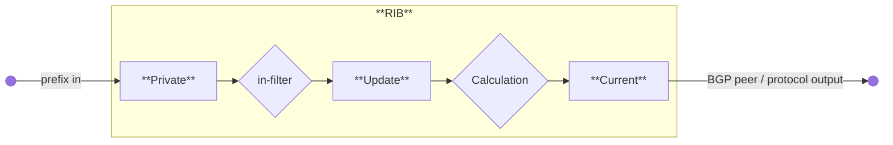

# 路由决策

> MikroTik RouterOS 中的路由决策涉及使用 FIB 和 RIB 表选择数据包传输路径，管理直连网络、默认路由以及硬件卸载，以实现高效的数据包转发。

# 路由决策

import {MD} from '@site/src/components/common';

路由是选择跨网络路径以将数据包从一台主机移动到另一台主机的过程。路径选择（也称为路由决策）依赖于路由信息表。该表包含路由条目，每个条目指定一个目的地以及用于到达该目的地的下一跳。*跳*发生在数据包从一个网段传递到另一个网段时。


通常，路由信息由两部分组成，RouterOS 也不例外：

* **FIB** – 转发信息库（Forwarding Information Base），用于做出数据包转发决策。它包含转发所需的路由信息子集。
* **RIB** – 路由信息库（Routing Information Base），包含从路由源（如直连网络、静态路由、BGP、RIP 和 OSPF）学习到的所有前缀。


## 路由信息库

RIB 包含完整的路由信息，包括静态路由、直连网络以及从动态协议和 MPLS 标签绑定协议（如 OSPF、BGP 和 LDP）学习到的路由。
RIB 不仅仅是简单地存储路由：它还过滤路由信息以计算每个目标前缀的最佳路由，构建并更新 FIB，并在路由协议之间分发路由。

默认情况下，所有路由都组织在单个 **main** 路由表中。

### 直连网络

直连路由表示主机可以直接到达的网络（直接连接到 Layer 2 广播域）。RouterOS 会为每个在 `/ip/address` 或 `/ipv6/address` 下配置了至少一个启用接口的 IP 网络自动创建直连路由。RIB 跟踪直连路由的状态，但不会修改这些路由。对于每条直连路由，都有一个对应的 IP 地址条目，使得：

* 直连路由的 `dst-address` 的 **address** 部分等于 IP 地址条目的网络地址。
* 直连路由的 `dst-address` 的 **netmask** 部分等于 IP 地址条目的地址的掩码部分。
* 直连路由的 **gateway** 等于 IP 地址条目的 [`actual-interface`](../../cli-reference/ip/address.md#actual-interface)（与接口相同，但桥接接口端口除外），并表示可以到达特定 Layer3 网络中直连主机的接口。

直连网络示例：

```text
[admin@TempTest] /ip/route> print where connect 
Flags: D - DYNAMIC; A - ACTIVE; c - CONNECT
Columns: DST-ADDRESS, GATEWAY, ROUTING-TABLE, DISTANCE
    DST-ADDRESS      GATEWAY  ROUTING-TABLE  DISTANCE
DAc 10.155.125.0/24  ether1   main                  0
DAc 192.168.1.0/24   vlan2    main                  0
```

### 默认路由

当表中没有其他路由匹配目的地时，将使用默认路由。在 RouterOS 中，默认路由的 `dst-address` 对于 IPv4 为 **0.0.0.0/0**，对于 IPv6 为 **::/0**。如果路由表包含一条活动的默认路由，则对该表的查找始终成功。

通常，家用路由器的路由表只包含直连网络和一条默认路由，用于将所有出站流量转发到 ISP 的网关：

```text
[admin@TempTest] /ip/route> add gateway=10.155.125.1  
[admin@TempTest] /ip/route> print where dst-address=/0  
Flags: A - ACTIVE; s - STATIC
Columns: DST-ADDRESS, GATEWAY, ROUTING-TABLE, DISTANCE
#    DST-ADDRESS  GATEWAY       ROUTING-TABLE  DISTANCE
4 As 0.0.0.0/0    10.155.125.1  main                  1
```

### 硬件卸载路由

支持 [Layer 3 硬件卸载](../../bridging-and-switching/l3-hardware-offloading.md)（L3HW，也称为 IP 交换或 HW 路由）的设备可以将数据包转发卸载到交换芯片。启用 L3HW 后，符合条件的路由会显示 **H** 标志：

```text
[admin@MikroTik] > /ip/route print where static
Flags: A - ACTIVE; s - STATIC, y - COPY; H - HW-OFFLOADED
Columns: DST-ADDRESS, GATEWAY, DISTANCE
#     DST-ADDRESS       GATEWAY         D
0 AsH 0.0.0.0/0         172.16.2.1      1
1 AsH 10.0.0.0/8        10.155.121.254  1
2 AsH 192.168.3.0/24    172.16.2.1      1
```

默认情况下，所有路由都是硬件卸载的候选对象。您可以通过在单个 IPv4 或 IPv6 静态路由上启用或禁用 [`suppress-hw-offload`](../../cli-reference/ip/route.md#suppress-hw-offload) 选项来微调卸载行为。
例如，如果大多数流量发往服务器网络，则仅对该目的地启用卸载：

```ros
/ip route set [find where static && dst-address!="192.168.3.0/24"] suppress-hw-offload=yes
```

现在只有到 **192.168.3.0/24** 的路由具有 H 标志，表示它将是唯一有资格被选择进行 HW 卸载的路由：

```text
[admin@MikroTik] > /ip/route print where static
Flags: A - ACTIVE; s - STATIC, y - COPY; H - HW-OFFLOADED
Columns: DST-ADDRESS, GATEWAY, DISTANCE
#     DST-ADDRESS       GATEWAY         D
0 As  0.0.0.0/0         172.16.2.1      1
1 As  10.0.0.0/8        10.155.121.254  1
2 AsH 192.168.3.0/24    172.16.2.1      1
```

:::warning
H 标志并不表示该路由实际已被 HW 卸载，它仅表示该路由可以被选择进行 HW 卸载。
:::

### 多路径（ECMP）路由

某些配置（例如负载均衡）需要到给定目的地的多条路径。


ECMP（等价多路径）路由具有多个网关（下一跳）值。所有可达的下一跳都会被复制到 [**FIB**](#转发信息库) 以进行数据包转发。

您可以手动创建这些路由，也可以由 OSPF、BGP 或 RIP 等协议动态学习。到同一目的地的多条同等优选路由会获得 **+** 标志，并由 RouterOS 自动分组（参见下面的示例）。

```text
[admin@TempTest] /ip/route> print 
Flags: D - DYNAMIC; I - INACTIVE, A - ACTIVE; C - CONNECT, S - STATIC, m - MODEM; + - ECMP
Columns: DST-ADDRESS, GATEWAY, DISTANCE
#       DST-ADDRESS      GATEWAY       D
0   AS+ 192.168.2.0/24   10.155.125.1  1
1   AS+ 192.168.2.0/24   172.16.1.2    1
```

默认情况下，ECMP 使用 **Layer3** 哈希策略，该策略对源和目标 IP 地址（IPv4）或源/目标 IP、流标签和 IP 协议（IPv6）进行哈希。
您可以在 `/ip/settings` 和 `/ipv6/settings` 中将哈希策略更改为 **Layer4** 或 **inner Layer3** 哈希。
支持的哈希方法包括：

|          | IPv4                  | IPv6                                      |
|:--|:--|:--|
| L3       | srcIPv4, dstIPv4      | srcIPv6, dstIPv6, flow label, IP proto    |
| L4       | srcIPv4, dstIPv4, srcPort, dstPort, IP proto | srcIPv6, dstIPv6, srcPort, dstPort, IP Proto |
| L3-Inner | srcIPv4, dstIPv4 (如果存在内部 IPv4)srcIPv6, dstIPv6, flow label, IP proto (如果存在内部 IPv6)如果不存在内部报文，则与 L3 相同。 | srcIPv4, dstIPv4 (如果存在内部 IPv4)srcIPv6, dstIPv6, flow label, IP proto (如果存在内部 IPv6)如果不存在内部报文，则与 L3 相同。 |

### 路由选择

可以从不同协议或静态配置中学习到具有相同目的地的多条路由，但只有一条最佳路由用于转发。RIB 运行路由选择算法，为每个目的地从候选路由中选择最佳路由。

只有满足以下条件的路由才能参与路由选择：

* 路由未被禁用。
* 如果路由类型为 *unicast*，则必须至少有一个可达的下一跳。（如果网关来自直连网络且存在活动的直连路由，则认为该网关可达）
* 路由不应是 *synthetic*（合成的）。

距离最低的候选路由将成为活动路由。如果多个候选路由具有相同的距离，则任意选择一条作为活动路由。

例如，

```text
[admin@RB5009_108] /ip/route> print where dst-address=203.0.113.1
Flags: D - DYNAMIC; A - ACTIVE; s - STATIC, o - OSPF
Columns: DST-ADDRESS, GATEWAY, ROUTING-TABLE, DISTANCE
#     DST-ADDRESS     GATEWAY                  ROUTING-TABLE  DISTANCE
  D o 203.0.113.1/32  111.13.0.2%sfp-sfpplus1  main                110
2  As 203.0.113.1/32  111.13.0.2               main                  1
```

在示例中，一条静态路由和一条 OSPF 路由指向同一目的地。OSPF 安装的路由具有较高的默认距离（110），而静态路由的距离为 1。距离较低的路由被选为最佳路由。

### 下一跳查找

下一跳查找是路由选择过程的一部分。其主要目的是找到直接可达的网关地址（下一跳）。只有在选择了有效的下一跳之后，路由器才知道使用哪个接口进行数据包转发。

如果路由的网关地址距离此路由器有几跳远（例如 iBGP、多跳 eBGP），则下一跳查找会变得更加复杂。只有在下一跳选择算法确定了直接可达/立即网关的地址（由 `immediate-gw` 参数显示）后，此类路由才会被安装到 FIB 中。

有必要限制可用于查找立即下一跳的路由集合。例如，RIP 或 OSPF 路由的下一跳值应该是直接可达的，并且只能使用直连路由进行查找。这是通过使用 `scope` 和 `target-scope` 属性实现的。

`scope` 大于最大可接受值的路由不用于下一跳查找。每条路由在其 `target-scope` 属性中指定其下一跳的最大可接受 scope 值。此属性的默认值仅允许通过直连路由进行下一跳查找，但 iBGP 路由除外，iBGP 路由具有较大的默认值，也可以通过 IGP 和静态路由进行下一跳查找。
<Columns>
<Column>
<center>
| Scope | 路由类型      | Target scope |
|:--|:--      |:--|
| 0     |                 |              |
| 10    | Connected       | 5            |
| 20    | IGP (OSPF, RIP) | 10           |
| 30    | Static          | 10           |
| 40    | eBGP            | 10           |
| 40    | iBGP            | 30           |
</center>
</Column>
<Column>
矩阵显示了基于默认 scope 和 target-scope 值，哪种路由类型（行）可以解析哪种路由类型（列）的网关。
<center>
|             | IGP | Static | eBGP | iBGP |
|:--|:--|:--|:--|:--|
| **Connected** |  +  |   +    |  +   |  +   |
| **IGP**       |     |        |      |  +   |
| **Static**    |     |        |      |  +   |
| **eBGP**      |     |        |      |      |
| **iBGP**      |     |        |      |      |
</center>
</Column>
</Columns>

可以通过调整 `target-scope` 值来改变默认行为。例如，如果存在多跳 eBGP 配置，则最好通过 IGP 协议路由或静态路由来解析这些路由的下一跳。为此，我们可以设置输入路由过滤器来更改 `target-scope`，使其大于 IGP 或静态 `scope` 的值。甚至可以通过调整 `scope` 和 `target-scope` 值来通过 iBGP 路由解析 eBGP 路由。

scope 调整的灵活性甚至允许创建一些极端的配置，例如通过 eBGP 解析 OSPF。

路由按 scope 顺序处理，较大 scope 的路由更新不会影响较小 scope 路由的下一跳查找状态。

RIB 为每个地址维护多个下一跳对象，每个对象对应 scope 和网关检查的一种组合。

当您更改路由的 `target-scope` 或网关检查时，***不会影响其他路由***，因为这些属性附加在下一跳对象上，而不是路由上。

无效的 scope 值会自动修复：

* 如果下一跳 scope 设置为 255 - RouterOS 将通过将其 scope 设置为 254 在内部修复此错误。
* 如果路由的 scope 不大于网关查找的最大可接受 scope，RouterOS 通过将下一跳 scope 设置为 `target-scope + 1` 来修复错误。

您可以在 `/routing/nexthop` 菜单中查看实际的 `scope` 和 `target-scope` 值。

您可以通过设置 `check-gateway` 参数来扩展网关检查。路由器通过 ARP 探测、ICMP 消息或活动的 BFD 会话来验证网关可达性。默认情况下，它每 10 秒发送一次 ICMP 回显请求（*ping*）或 ARP 请求（*arp*）。如果网关在 1 秒内未响应，则请求超时；两次超时后，网关被标记为不可达。收到回复后，网关恢复可达并重置超时计数器。在 `/routing/settings` 菜单中调整这些间隔。

```
[admin@CCR2004_2XS_111] /routing/settings> print 
               single-process: no 
  check-gateway-ping-interval: 10s
   check-gateway-ping-timeout: 1s 
     check-gateway-ping-count: 2  
```

:::danger
设置为非点对点接口的 `gateway` 不能用于转发目的地距离此路由器多跳的数据包。
:::

您不能在此类网关上使用 `check-gateway` 参数，因为目标 IP 未知。

### 路由存储

路由信息的存储方式旨在最小化常见情况下的内存使用。这些优化可能存在不明显的极端情况并影响性能。

所有路由和网关都按前缀/地址保存在单个层级结构中。

```
    Dst [4]/0 1/0+4                             18  <-- 前缀数量
         ^  ^ ^ ^ ^
         |  | | | |
         |  | | | \- Route distinguisher 或 Interface Id 占用的字节数
         |  | | \--- vrf/routing table
         |  | \----- AFI
         |  \------- 前缀的网络掩码长度
         \---------- 前缀值占用的字节数

         [如有变更，恕不另行通知]
    
```

每个 'Dst' 条目对应一个唯一的 'dst-address'（对于路由）或网关地址。每个 'Dst' 条目需要一个或多个 'T2Node' 对象。

所有具有相同 'dst-address' 的路由都保存在 Dst 中，并按路由优先级排序的列表中。
:::info
**最坏情况**：具有相同 'dst-address' 的路由过多会非常慢，即使它们处于非活动状态。更新包含数万个元素的排序列表会降低性能。
:::
路由顺序仅在路由属性更改时才会改变。如果路由变为活动/非活动，顺序不会改变。

每条路由都有三份路由属性副本：

* **private** -- 在通过入过滤器之前从对等体接收到的属性。
* **updated** -- 应用入过滤器后的结果。
* **current** -- 路由当前使用的属性。

定期（在需要时），***updated*** 属性会根据 ***private*** 属性计算。这发生在收到路由更新或入过滤器更新时。

当路由表重新计算时，***current*** 属性将设置为 ***updated*** 属性的值。



这意味着，通常如果没有入过滤器更改路由属性，***private***、***updated*** 和 ***current*** 共享相同的值。

路由属性保存在几个组中：

* L1 数据 - 所有标志、额外属性列表、as-path；
* L2 数据 – 下一跳、RIP 或 OSPF 度量、BGP 度量、路由标签、发起者以及类似属性。
* L3 数据 – distance、scope、内核类型和 MPLS 信息。
* 额外属性 - communities、originator、aggregator-id、cluster-list、未知属性。

例如，具有许多不同的 `distance` 和 `scope` 路由属性组合将使用更多内存！

使用正则表达式匹配 communities 或 as-path 会缓存结果以加速过滤。每个 as-path 或 community 值都有所有正则表达式的缓存，该缓存按需填充匹配结果。
:::info
**最坏情况**：在 `in-filter` 中更改属性将使路由程序使用更多内存！因为 ***private*** 和 ***updated*** 属性将不同！拥有大量不同的正则表达式会使匹配变慢并占用大量内存！因为每个值都会有一个包含数千条目的缓存！
:::

有关路由协议使用内存的详细信息，请参阅 `/routing/stats/memory` 菜单。

## 转发信息库

FIB（转发信息库）包含数据包转发所需信息的副本：

* vrf 表
* 活动路由
* 策略路由规则
* 其他路由决策规则

每条路由都有一个 **dst-address** 属性，指定了该路由可以用于的所有目标地址。如果多条路由适用于特定 IP 地址，则使用最具体（网络掩码最长）的一条。在路由表包含多条具有相同 **dst-address** 和网络掩码的路由的情况下，所有同等最佳的路由将合并为一条 [ECMP](#多路径-ecmp-路由) 路由，安装到 FIB 中并标记为 ''active''。

只有一条最佳路由可用于数据包转发。
找到与给定地址匹配的最具体路由称为 **路由表查找**。

当转发决策使用附加信息（例如数据包的源地址）时，称为 **策略路由**。策略路由实现为策略路由规则列表，根据数据包的目标地址、源地址、源接口和路由标记（可由防火墙 mangle 规则更改）选择不同的路由表。

### 路由表查找

FIB 使用数据包中的以下信息来确定其目的地：

* 源地址
* 目标地址
* 源接口
* 路由标记

可能的路由决策包括：

* 本地接收数据包
* 丢弃数据包（静默丢弃或向数据包发送者发送 ICMP 消息）
* 在特定接口上将数据包发送到特定 IP 地址

路由决策操作由 [/routing/settings](../../cli-reference/routing/settings.md) 中通过 `policy-rules` 参数定义的策略规则确定。
默认情况下：

```ros
[admin@CCR2004_2S+_107] /routing/settings> print 
               single-process: no         
  check-gateway-ping-interval: 10s        
   check-gateway-ping-timeout: 1s         
     check-gateway-ping-count: 2          
                 policy-rules: mangle     
                               vrf-lookup 
                               vrf-unreach
                               local      
                               user       
                               main  
 ```

* 在由 mangle 规则标记的路由表中查找目的地。
* 如果接口属于 VRF 或数据包被引导到 VRF，则尝试在 VRF 表中查找。
* 如果 VRF 查找失败，则拒绝该数据包。
* 检查数据包是否需要本地投递（目标地址是路由器的地址）。
* 处理用户定义的 [路由规则](../../cli-reference/routing/rule.md)（来自 "user" 链）。
* 在 `main` 路由表中查找目的地。

根据所需任务的复杂性，您可以更改默认规则的顺序或通过添加自定义规则来微调配置。

例如，如果目的地 1.2.3.4 必须仅在 `other_table` 中解析，并且您还打算使用 mangle，则添加您的路由规则并将 mangle 操作移到自定义规则之下：

```ros
[admin@r1] /routing/settings> set policy-rules=vrf-lookup,vrf-unreach,local,user,mangle,main
[admin@r1] /routing/rule> add dst-address=1.2.3.4 action=lookup-only-in-table table=other_table
[admin@r1] /routing/rule> print 
Flags: X - disabled, I - inactive; * - default 
 0    dst-address=1.2.3.4 action=lookup-only-in-table table=other_table 
 ```

如果规则的动作是：

* `drop` 或 `unreachable`，则将其作为路由决策过程的结果返回。
* `lookup`，则在规则指定的路由表中查找数据包的目标地址。如果查找失败（没有路由匹配数据包的目标地址），则 FIB 继续处理下一条规则。
* `lookup-only-in-table` 与 `lookup` 类似，不同之处在于如果表中没有路由匹配该数据包，则查找失败。

否则：

* 如果路由类型为 blackhole，则返回此动作作为路由决策结果。
* 如果这是直连路由或网关值为接口的路由，则返回此接口和数据包的目标地址作为路由决策结果。
* 如果此路由的网关值为 IP 地址，则返回此地址和关联接口作为路由决策结果。
* 如果此路由有多个下一跳值，则根据配置的 [哈希策略](#多路径-ecmp-路由) 以轮询方式选择其中一个。

请记住，通常不建议将接口设置为静态路由的网关。接口网关仅在两种情况下有用：

* 在点对点类型的接口上；
* 在目标地址直接连接的接口上。

如果路由决策在广播网络上返回接口和数据包的目标地址作为结果，路由器将尝试通过发送 ARP 探测来解析数据包的目标地址。如果同一广播域中没有主机具有该 IP 地址，则转发将失败，因此此类网关不能用于路由目的地距离此路由器多跳的数据包。