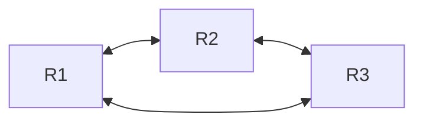
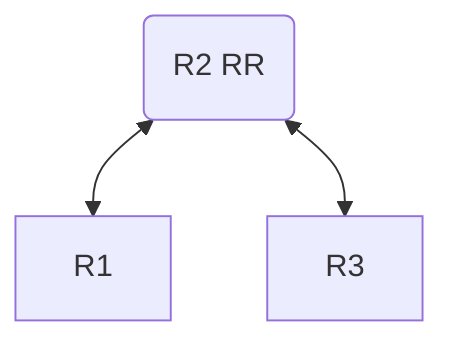

# Peering Sessions（对等会话）

> 介绍如何建立BGP会话。

# Peering Sessions（对等会话）

**eBGP**会话的目的是在自治系统（AS）之间交换路由信息。通常，eBGP会话建立在网络出口点的直连物理或逻辑网络（单跳链路）上，使用默认参数时，如果对等体距离多跳，则连接将失败。
在EVPN设置中，运营商通常在由IGP路由的环回地址上运行eBGP会话。这意味着连接不再位于直连网络上，除非配置了[`multihop`](../../../../cli-reference/routing/bgp.md#multihop)`=yes`，否则连接将失败。

AS_PATH属性用于防止路由环路。如果列表包含自己的AS号（ASN），则丢弃该路由；但在某些特定设置中，这不是期望的行为。例如，MPLS L3VPN设置需要使用[`input.allow-as`](../../../../cli-reference/routing/bgp.md#input.allow-as)参数覆盖默认的环路预防机制，以允许CE路由器接受来自多归属或互连站点且包含自身ASN的路由。

默认情况下，下一跳会改为自身，原因显而易见，但在某些设置中（例如EVPN叠加网络），这种行为也不可取。要覆盖默认行为，请将[`nexthop-choice`](../../../../cli-reference/routing/bgp.md#nexthop-choice)参数设置为`propagate`。

## 内部BGP（iBGP）对等

与**eBGP**相反，**iBGP**用于在自治系统内交换路由信息。它通过内部网络传播从eBGP对等体学习到的外部路由。

默认情况下，**iBGP**会话被视为多跳，并运行在内部网关协议（IGP）之上，如[OSPF](../ospf/areas-and-virtual-links.md)或ISIS，这些协议提供环回地址之间的可达性。外部路由的下一跳会被传播，IGP负责下一跳解析。在较小的设置中，为降低配置复杂度，可以通过将[`nexthop-choice`](../../../../cli-reference/routing/bgp.md#nexthop-choice)参数设置为`force-self`并在直连网络上运行iBGP会话，从而在没有底层IGP的情况下使用iBGP。

当路由在iBGP对等体之间传播时，自身AS号不会添加到AS Path列表中；相反，使用水平分割（split-horizon）进行环路保护，即从iBGP对等体学习到的路由不会通告给另一个iBGP对等体。为克服水平分割的限制，每个iBGP路由器必须连接到其他所有iBGP路由器，形成**全互联（full mesh）**。



全互联的问题在于可扩展性，总连接数为`n*(n-1)/2`。为简化大规模iBGP网络，使用[路由反射器（RR）](#dynamic-sessions)来消除全互联的需求。它建立客户端-服务器关系，客户端仅与路由反射器建立对等，从而将连接数减少到`n-1`。



RR的引入打破了标准水平分割规则以实现路由反射，因此使用**ORIGINATOR_ID**和**CLUSTER_LIST**属性来防止路由环路。

## 会话配置

[`/routing/bgp/connection`](../../../../cli-reference/routing/bgp.md#routingbgpconnection)菜单定义了BGP出站连接，同时作为入站BGP连接的模板匹配器。

以下是一个非常基础的BGP配置示例。假设Router1的IP为192.168.1.1，AS号为65531；Router2的IP为192.168.1.2，AS号为65532：

```ros
#Router1
/routing/bgp/instance
add name=myInstance as=65531

/routing/bgp/connection
add name=toR2 remote.address=192.168.1.2 instance=myInstance local.role=ebgp
```

```ros
#Router2
/routing/bgp/instance
add name=myInstance as=65532

/routing/bgp/connection
add name=toR1 remote.address=192.168.1.1 instance=myInstance local.role=ebgp
```

[`local.role`](../../../../cli-reference/routing/bgp.md#local.role)是必填参数，描述会话的性质：是**eBGP**会话（如本例）、[**iBGP**](#internal-bgp-ibgp-peering)会话，还是作为iBGP**路由反射器**。此外，还有来自[RFC 9234](https://datatracker.ietf.org/doc/rfc9234/)的其他模式，用于**路由泄漏预防和检测**。

连接不需要指定远程AS号；RouterOS会根据收到的第一条**OPEN**消息动态确定。

与其他厂商及旧版RouterOS的`update-source`等效的参数是[`local.address`](../../../../cli-reference/routing/bgp.md#local.address)。在大多数情况下，可以保持未配置，路由器会自动确定地址。

当未指定本地地址时，BGP会根据当前设置尝试猜测：

- 如果对等体是iBGP
  - 如果有环回地址可用
    - 选择最高的环回地址
  - 如果没有环回地址
    - 选择路由器上最高的IP地址
- 如果对等体是eBGP
  - 如果远程对等体的IP不在直连网络上：
    - 如果未设置multihop，BGP会报错
    - 如果启用了multihop：
      - 如果有环回地址可用
        - 选择最高的环回地址
      - 如果没有环回地址
        - 选择路由器上最高的IP地址
  - 如果远程对等体的IP在直连网络上：
    - 如果未设置multihop：
      - 从该直连网络中选择路由器的IP地址
    - 如果设置了multihop：
      - 如果有环回地址可用
        - 选择最高的环回地址
      - 如果没有环回地址
        - 选择路由器上最高的IP地址

该菜单还直接暴露了模板特定参数，在简单场景下无需使用模板即可简化配置。

:::warning
在非安全环境中不应启用子网监听；此类配置可能导致拒绝服务（DoS）攻击。
必须配置防火墙以保护路由器。
更多详情请参阅[`listen`](../../../../cli-reference/routing/bgp.md#listen)参数。
:::

### 活动会话列表

检查[`/routing/bgp/session`](../../../../cli-reference/routing/bgp.md#routingbgpsession)菜单以查看会话是否已建立：

```ros
[admin@MikroTik] /routing/bgp/session> print 
Flags: E - established 
 0 E name="toR2" instance=myInstance 
     remote.address=192.168.1.2 .as=65532 .id=192.168.1.1 .refused-cap-opt=no 
     .capabilities=mp,rr,as4 .afi=ip,ipv6 .messages=43346 .bytes=3635916 .eor="" 
     local.address=192.168.1.1 .as=65531 .id=192.168.44.2 .capabilities=mp,rr,gr,as4 .messages=2 
     .bytes=71 .eor="" 
     output.procid=97 .keep-sent-attributes=no 
     .last-notification=ffffffffffffffffffffffffffffffff0015030601 
     input.procid=97 .limit-process-routes=500000 ebgp limit-exceeded 
     hold-time=3m keepalive-time=1m uptime=4s70ms
```

它显示只读的BGP会话缓存信息：当前状态、标志、最后收到的通知以及协商的会话参数。

即使BGP会话不再活动，缓存仍会保留一段时间。从特定会话接收的路由仅在缓存过期时才会被移除，这有助于在BGP会话抖动时减少大量路由表重计算。

如果BGP首次尝试建立会话时，TCP连接因MD5认证错误、防火墙阻止或任何其他原因而无法建立，则不会创建会话条目。

### 参数分组

如果您注意到了，大多数参数都分组在`output`、`input`、`local`和`remote`部分中，这使得配置更易读，也更容易理解选项是应用于`input`还是`output`，或者它是影响路由器本地的值还是尝试匹配远程对等体的参数。
例如：

- 要指定输出选择链，设置[`output.filter-chain`](../../../../cli-reference/routing/bgp.md#output.filter-chain)`=myBgpChain`。
- 会话列表中的`local.bytes`表示已发送的字节数。
- `remote.messages`表示远程对等体已发送的数据包数。
- 以此类推。

### BGP无编号（BGP Unnumbered）

RouterOS能够在不配置接口全局IPv6地址且不指定远程链路本地地址的情况下动态建立BGP会话（BGP无编号连接）。该机制依赖IPv6邻居发现（[RFC 4861](https://datatracker.ietf.org/doc/html/rfc4861)）获取邻居的链路本地地址，并使用[RFC5549](https://datatracker.ietf.org/doc/html/rfc5549)通告带有IPv6下一跳的IPv4 NLRIs。

当[`remote.address`](../../../../cli-reference/routing/bgp.md#remote.address)为空且[`local.address`](../../../../cli-reference/routing/bgp.md#local.address)为接口时，即配置为无编号连接。在此模式下，每个接口仅接受一个连接。
这在大量点对点链路的场景中非常有用，例如使用eBGP作为EVPN底层网络时。

对于未配置全局地址以发送RA回复的路由器，应用以下ND配置：

```ros
/ipv6/nd/prefix/add prefix=none interface=sfp-sfpplus1
```

```ros
[admin@CCR2004_2XS_111] /ipv6/neighbor> print 
Flags: D - DYNAMIC; R - ROUTER
Columns: ADDRESS, MAC-ADDRESS, INTERFACE, VRF
#    ADDRESS                    MAC-ADDRESS        INTERFACE     VRF 
0 DR fe80::de2c:6eff:fec5:a7ff  DC:2C:6E:C5:A7:FF  sfp-sfpplus1  main
```

添加无编号连接配置：

```ros
/routing bgp connection
add instance=myInstance local.address=sfp-sfpplus1 .role=ibgp name=unnumbered_2
```

```ros
[admin@CCR2004_2XS_111] /routing/bgp/connection> print 
Flags: D - DYNAMIC, X - DISABLED, I - INACTIVE 
 0   name="unnumbered_2" instance=myInstance 
     local.address=sfp-sfpplus1 .default-address=fe80::de2c:6eff:fea4:b42f%sfp-sfpplus1 .role=ibgp 
     routing-table=main as=333 

[admin@CCR2004_2XS_111] /routing/bgp/session> print 
Flags: E - ESTABLISHED 
 0 E name="unnumbered_2-1" instance=v6_test 
     remote.address=fe80::de2c:6eff:fec5:a7ff%sfp-sfpplus1 .as=333 .id=203.0.113.2 .capabilities=mp,rr,enhe,gr,as4 .afi=ipv6 
     .messages=5181 .bytes=98439 .eor="" 
     local.role=ibgp .address=fe80::de2c:6eff:fea4:b42f%sfp-sfpplus1 .as=333 .id=203.0.113.1 .cluster-id=203.0.113.1 
     .capabilities=mp,rr,enhe,gr,as4 .afi=ipv6 .messages=5181 .bytes=98439 .eor="" 
     output.procid=20 
     input.procid=20 ibgp 
     multihop=yes hold-time=3m keepalive-time=1m uptime=3d14h20m55s640ms last-started=2026-02-12 18:26:59 prefix-count=0 
```

### 动态会话

BGP对等体配置可能相当复杂且不易扩展；例如，Hub-and-Spoke（中心-分支）设置或iBGP路由反射器设置。

假设我们有一个路由反射器设置，连接了两个对等体。为简化配置并使其可扩展，我们将使用BGP模板设置公共参数，并配置连接监听环回地址范围，这样无需在路由反射器上进行任何配置即可添加更多对等体。


**前提条件**

- 接口上的IP连通性
- 接口上已配置并运行OSPF

**路由反射器**

在配置BGP之前，我们需要添加环回地址并启用OSPF以分发环回路由：

```routeros
/ip address
add address=203.0.255.1 interface=lo
/routing ospf interface-template add interfaces=lo area=backbone passive
```

接下来创建带有公共参数的BGP模板，以及一个BGP会话以监听我们的环回（203.0.255.0/24）地址范围：

```routeros
/routing bgp instance
add as=65000 name=bgp_inst
/routing bgp template
set default afi=ip multihop=yes nexthop-choice=propagate hold-time=10s
/routing bgp connection
add instance=bgp_inst local.address=203.0.255.1 .role=ibgp-rr name=rr remote.address=\
    203.0.255.0/24 templates=default listen=yes
```

要添加新的BGP对等体，请在对等体与路由反射器之间创建IP连接，并配置BGP连接到反射器的环回地址：

**Peer_1**

```routeros
/ip address
add address=203.0.255.11 interface=lo
/routing ospf interface-template add interfaces=lo area=backbone passive

/routing bgp instance
add as=65000 name=bgp_inst
/routing bgp connection
add instance=bgp_inst local.role=ibgp name=to_rr remote.address=203.0.255.1
```

**Peer_2**

```routeros
/ip address
add address=203.0.255.12 interface=lo
/routing ospf interface-template add interfaces=lo area=backbone passive

/routing bgp instance
add as=65000 name=bgp_inst
/routing bgp connection
add instance=bgp_inst local.role=ibgp name=to_rr remote.address=203.0.255.1
```

**Peer_N**

```routeros
/ip address
add address=203.0.255.1N interface=lo
/routing ospf interface-template add interfaces=lo area=backbone passive

/routing bgp instance
add as=65000 name=bgp_inst
/routing bgp connection
add instance=bgp_inst local.role=ibgp name=to_rr remote.address=203.0.255.1
```

更多用例请参阅EVPN，其中在[EVPN Overlay](../evpn.md#bgp-evpn-overlay)设置中使用了此方法。