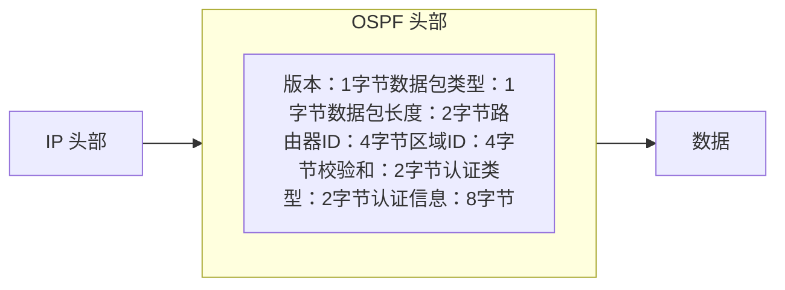
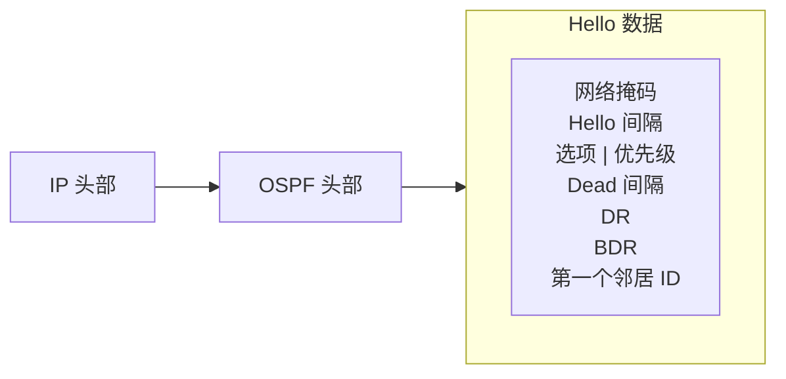

# 邻居关系

> 介绍邻居关系及邻接关系是如何建立的。

# 邻居关系

OSPF 是一种链路状态协议，它将路由器接口视为一条 OSPF 链路。当 OSPF 启动时，它会将本地**链路状态数据库**中所有链路的状态添加进来。

在 OSPF 网络完全正常运行之前，必须完成几个步骤：

- 邻居发现
- 数据库同步
- 路由计算

链路状态路由协议会分发并复制描述路由拓扑的数据库。链路状态协议的泛洪算法确保每台路由器拥有相同的链路状态数据库。路由表是基于该数据库计算得出的。

完成上述所有步骤后，每个邻居上的链路状态数据库将包含完整的路由域拓扑信息（网络中有多少台其他路由器、路由器有多少接口、路由器之间的链路连接了哪些网络、每条链路的开销等）。

## 基本配置示例

要启动 OSPF v2 和 v3 实例，请添加实例和骨干区域：

```ros
/routing/ospf/instance
add name=v2inst version=2 router-id=1.2.3.4
add name=v3inst version=3 router-id=1.2.3.4
/routing/ospf/area
add name=backbone_v2 area-id=0.0.0.0 instance=v2inst
add name=backbone_v3 area-id=0.0.0.0 instance=v3inst
```

模板用于匹配 OSPF 应发现邻居的接口。可以直接指定网络或接口。

```ros
/routing/ospf/interface-template
add networks=192.168.0.0/24 area=backbone_v2
add networks=2001:db8::/64 area=backbone_v3
add interfaces=ether1 area=backbone_v3
```

## OSPF 路由器之间的通信

OSPF 运行在 IP 网络层之上，协议号为 89。
目的 IP 地址设置为邻居的 IP 地址，或设置为 OSPF 组播地址之一：AllSPFRouters (224.0.0.5) 或 AllDRouters (224.0.0.6)。这些地址将在本文后续部分介绍。
每个 OSPF 数据包都以一个标准的 24 字节头部开始。

<center>

</center>

| 字段 | 描述 |
| :-- | :-- |
| **数据包类型** | OSPF 数据包有几种类型：Hello 数据包、数据库描述（DD）数据包、链路状态请求数据包、链路状态更新数据包和链路状态确认数据包。除 Hello 数据包外，所有这些数据包都用于链路状态数据库同步。 |
| **路由器 ID** | 除非手动配置，否则默认为路由器的某个 IP 地址。 |
| **区域 ID** | 允许 OSPF 路由器将数据包关联到正确的 OSPF 区域。 |
| **校验和** | 允许接收路由器判断数据包在传输过程中是否损坏。 |
| **认证字段** | 这些字段允许接收路由器验证数据包内容未被修改，并确认数据包来自其路由器 ID 出现在数据包中的 OSPF 路由器。 |

五种 OSPF 数据包类型确保 LSA 在 OSPF 网络上的正确泛洪：

- **Hello 数据包** - 发现 OSPF 邻居并建立邻接关系。
- **数据库描述（DD）** - 检查路由器之间的数据库同步状态。在邻接关系建立后进行交换。
- **链路状态请求（LSR）** - 请求邻居数据库中较新的部分。在 DD 交换后确定路由数据库中过时的部分。
- **链路状态更新（LSU）** - 携带一组被明确请求的链路状态记录。
- **链路状态确认（LSack）** - 确认其他数据包类型，以确保可靠通信。

## 邻居发现

OSPF 通过定期从配置的接口发送 Hello 数据包来发现潜在邻居。默认情况下，*Hello 数据包* 每 10 秒发送一次。您可以通过在 OSPF 接口设置中设置 [`hello-interval`](../../../../cli-reference/routing/ospf.md#hello-interval) 来更改此值。当路由器收到邻居返回的、参数匹配的 Hello 数据包时，即获知该邻居路由器的存在。

Hello 数据包的发送和接收也使路由器能够检测邻居的故障。如果在 [`dead-interval`](../../../../cli-reference/routing/ospf.md#dead-interval)（默认为 40 秒）内未收到 Hello 数据包，路由器将开始围绕故障进行路由。“Hello”协议确保邻居路由器在 Hello 间隔和 Dead 间隔参数上达成一致，防止因 Hello 数据包未及时收到而错误地将链路置为关闭状态。

<center>


</center>
| 字段 | 描述 |
| :-- | :-- |
| **网络掩码** | 源路由器接口 IP 地址的 IP 掩码。 |
| **Hello 间隔** | Hello 数据包之间的时间间隔（默认 10 秒）。 |
| **选项** | 用于邻居信息的 OSPF 选项。 |
| **路由器优先级** | 一个 8 位值，用于辅助 DR 和 BDR 的选举（在点对点链路上不设置）。 |
| **路由器 Dead 间隔** | 邻居被视为失效前的时间间隔（默认为 Hello 间隔的四倍）。 |
| **DR** | 当前 DR 的路由器 ID。 |
| **BDR** | 当前 BDR 的路由器 ID。 |
| **邻居路由器 ID** | 源路由器所有邻居的路由器 ID 列表。 |

在每种类型的网络段上，Hello 协议的工作方式略有不同。在点对点段上，只可能有一个邻居，无需额外操作。但是，如果段上可能存在多个邻居，则会采取额外措施以提高 OSPF 的效率。

除非满足以下条件，否则两台路由器不会成为邻居：

- 路由器之间存在双向通信。这通过泛洪 Hello 数据包来确定。
- 接口应属于同一区域。
- 接口应属于同一子网并具有相同的网络掩码，除非其网络类型配置为 **point-to-point**。
- 路由器应具有相同的认证选项并交换相同的密码（如果有）。
- Hello 和 Dead 间隔在 Hello 数据包中应相同。
- Hello 数据包中的外部路由和 NSSA 标志应相同。

:::info
**网络掩码、优先级、DR 和 BDR** 字段仅在邻居通过广播或 **NBMA** 网络段连接时使用。
:::

### 广播子网上的发现

连接到广播子网的节点可以发送单个数据包，该数据包会被所有其他连接的节点接收。这允许自动配置和信息复制。广播子网中另一个重要能力是组播。此能力允许发送单个数据包，该数据包将被配置为接收组播数据包的节点接收。OSPF 利用此能力来发现 OSPF 邻居并检测双向连通性。

每个 OSPF 路由器加入 IP 组播组 **AllSPFRouters** (224.0.0.5)。然后路由器定期向 IP 地址 224.0.0.5 组播其 Hello 数据包。所有加入同一组播组的其他路由器将收到组播的 Hello 数据包。这样，OSPF 路由器通过发送单个数据包来维护与所有其他 OSPF 路由器的关系，而不是向段上的每个邻居发送单独的数据包。

这种方法提供了几个优点：

- 通过组播或广播 Hello 数据包自动发现邻居。
- 与其他子网类型相比，占用更少的带宽。
- 在广播段上，存在 n\*(n-1)/2 个邻居关系，但只需发送 n 个 Hello 数据包即可维护这些关系。
- 如果广播具有组播能力，OSPF 运行不会干扰广播段上的非 OSPF 节点。
- 如果不支持组播能力，所有路由器都将收到广播的 Hello 数据包，即使某个节点不是 OSPF 路由器。

### NBMA 子网上的发现

非广播多路访问（NBMA）段与广播类似。它们支持两台以上的路由器。唯一的区别是 NBMA 不支持数据链路广播能力。由于此限制，OSPF 邻居必须首先通过配置来发现。在 RouterOS 中，静态邻居配置在 [`/routing/ospf/static-neighbor`](../../../../cli-reference/routing/ospf.md#routingospfstatic-neighbor) 菜单中设置。为减少 Hello 流量，连接到 NBMA 子网的大多数路由器应分配路由器优先级 0（RouterOS 中默认设置）。有资格成为指定路由器的路由器应具有非 0 的优先级值。这确保了在 DR 和 BDR 选举期间，Hello 数据包仅发送给有资格的路由器。

### PTMP 子网上的发现

点对多点将网络视为一组点对点链路的集合。

根据设计，PTMP 网络缺乏广播能力，因此 OSPF 邻居必须首先通过配置来发现，这与 NBMA 网络相同。所有通信都通过邻居之间直接发送单播数据包进行。在 RouterOS 中，静态邻居配置在 [`/routing/ospf/static-neighbor`](../../../../cli-reference/routing/ospf.md#routingospfstatic-neighbor) 菜单中设置。在点对多点子网上不选举指定路由器和备份指定路由器。

对于支持广播的 PTMP 网络，可以使用名为“ptmp-broadcast”的混合类型。此网络类型使用组播 Hello 数据包自动发现邻居并检测邻居之间的双向通信。邻居发现后，“ptmp-broadcast”直接向已发现的邻居发送单播数据包。此模式与 RouterOS v6 的“ptmp”类型兼容。

## 主从关系

在数据库同步开始之前，必须建立信息交换的层级顺序，以确定哪台路由器首先发送**数据库描述**（**DD**）数据包（**主路由器**）。主路由器是路由器 ID 较高的那台。这是一种基于路由器 [`priority`](../../../../cli-reference/routing/ospf.md#priority) 的关系，用于安排邻居之间的数据交换，它不影响 DR/BDR 选举（**DR** 不一定是**主路由器**）。

## 数据库同步

OSPF 路由器之间的链路状态数据库同步非常重要。不同步的数据库可能导致路由表计算错误，进而引发路由环路或黑洞。

OSPF 使用两种类型的数据库同步：

- 初始数据库同步。
- 可靠泛洪。

当两个邻居之间的连接首次建立时，会发生*初始数据库同步*。OSPF 在邻居连接首次建立时使用显式数据库下载。此过程称为**数据库交换**。OSPF 路由器不是发送整个数据库，而是仅在一系列 OSPF **数据库描述（DD）** 数据包中发送其 LSA 头部。路由器仅在前一个数据包被确认后才发送下一个 DD 数据包。当收到整个 DD 数据包序列后，路由器便知道它缺少哪些 LSA 以及哪些 LSA 较新。然后路由器发送**链路状态请求（LSR）** 数据包请求所需的 LSA，邻居通过**链路状态更新（LSU）** 数据包泛洪 LSA 作为响应。收到所有更新后，邻居即被称为**完全邻接**。

可靠泛洪是另一种数据库同步方法。此方法在邻接关系已建立且 OSPF 路由器必须通知其他路由器 LSA 变更时使用。当 OSPF 路由器收到此类链路状态更新时，它会在链路状态数据库中安装新的 LSA，向发送方发送确认数据包，将 LSA 重新封装到新的 LSU 中，并将其发送到除接收接口之外的所有接口。

OSPF 通过比较序列号来确定 LSA 是否最新。序列号从 0x80000001 开始。数字越大，LSA 越新。每次记录被泛洪时序列号递增，接收更新的邻居会重置最大老化计时器。LSA 每 30 分钟刷新一次，但即使没有刷新，LSA 也会在数据库中保留最长老化时间 60 分钟。

并非所有 OSPF 邻居之间的数据库总是同步的。OSPF 根据网络段决定数据库是否必须同步。例如，在点对点链路上，路由器之间的数据库总是同步的。在以太网网络上，数据库仅在特定的邻居对之间同步。

### 广播子网上的同步

在广播段上，存在 n\*(n-1)/2 个邻居关系。如果 OSPF 路由器尝试与子网上的每台 OSPF 路由器同步，则会在子网上发送大量的链路状态更新和确认数据包。


这个问题通过为每个广播子网选举一个**指定路由器**和一个**备份指定路由器**来解决。所有其他路由器仅与这两个被选举的路由器同步并形成邻接关系。这种方法将邻接数量从 n\*(n-1)/2 减少到仅 2n-3。

右侧的图片说明了广播子网上的邻接形成。R1 是指定路由器，R2 是备份指定路由器。例如，如果 R3 想要向 R1 和 R2 泛洪链路状态更新（LSU），路由器会将 LSU 发送到 IP 组播地址 **AllDRouters** (224.0.0.6)，只有 DR 和 BDR 监听此组播地址。然后指定路由器将 LSU 发送到 AllSPFRouters 地址，更新其余路由器。

#### DR 选举

DR 和 BDR 路由器是根据 Hello 数据包中收到的数据选举出来的。子网上的第一台 OSPF 路由器总是被选举为指定路由器。当添加第二台路由器时，它成为备份指定路由器。当现有的 DR 或 BDR 失效时，将根据配置的路由器 [`priority`](../../../../cli-reference/routing/ospf.md#priority) 选举新的 DR 或 BDR。优先级最高的路由器成为新的 DR 或 BDR。

作为指定路由器或备份指定路由器会消耗额外的资源。如果路由器优先级设置为 0，则该路由器不参与选举过程。当某些较慢的路由器不能担任 DR 或 BDR 时，这一点很重要。

### NBMA 子网上的同步

NBMA 网络上的数据库同步与广播网络上的同步类似。需要选举 DR 和 BDR。数据库最初仅与 DR 和 BDR 路由器交换，泛洪始终通过 DR 进行。唯一的区别是链路状态更新必须被复制并分别发送到每个邻接路由器。