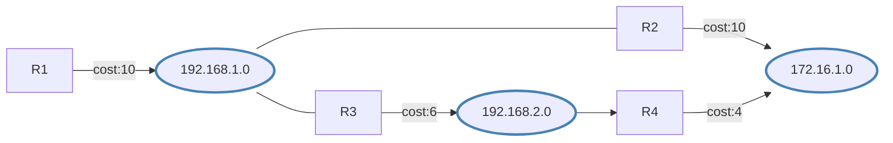
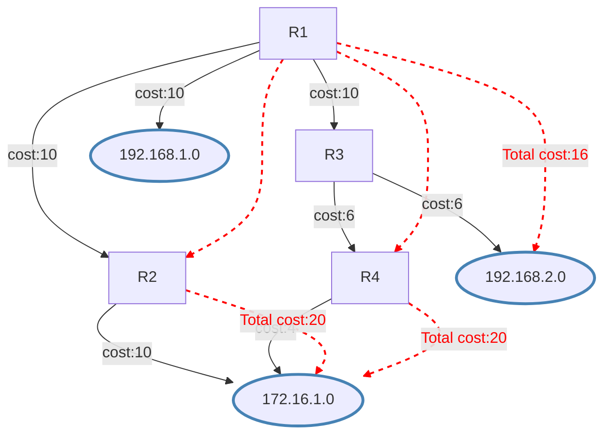

# 路由表计算

> 了解最短路径计算的基础知识。

# 路由表计算

链路状态数据库描述了路由器及其互连链路，这些信息适用于转发决策。它还包含每条链路的开销（度量值）。该度量值用于计算到目标网络的最短路径。

每台路由器可以为其自身的链路方向通告不同的开销值。这会产生非对称链路，即发往目的地的数据包沿一条路径传输，而响应则沿另一条路径返回。非对称路径会增加故障排查的复杂性。
可在 [`/routing/ospf/interface-template`](../../../../cli-reference/routing/ospf.md#routingospfinterface-template) 菜单中更改开销值，或在 [`/routing/ospf/interface`](../../../../cli-reference/routing/ospf.md#routingospfinterface) 菜单中创建静态 OSPF 接口。例如，要匹配 ether2 接口并设置开销为 100：

```ros
/routing/ospf/interface-template
add interfaces=ether2 cost=100 area=backbone_v2
```

Cisco 路由器上接口的开销与该接口的带宽成反比。带宽越高，开销越低。如果需要在 RouterOS 上实现类似的成本，可使用公式 `Cost = 100000000/bw_in_bps`。

OSPF 路由器使用 Dijkstra 的最短路径优先（SPF）算法来计算最短路径。该算法将路由器置于树的根部，并根据到达目的地所需的累计开销计算到每个目的地的最短路径。尽管所有路由器使用相同的链路状态数据库，但每台路由器都会计算自己的树。

## SPT 计算

假设有以下网络。该网络由 4 台路由器组成。出站接口的 OSPF 开销显示在表示链路的线条旁。要为路由器 R1 构建最短路径树，请将 R1 设为根，并计算到每个目的地的最小开销。



已找到到达 172.16.1.0 网络的多条最短路径。这允许对发往该目的地的流量进行负载均衡。此类路由称为[等价多路径（ECMP）](../../routing-decision.md#multipath-ecmp-routes)。构建最短路径树后，路由器将据此构建路由表。网络根据树中计算出的开销进行可达。



路由表计算看似简单；然而，当使用某些 OSPF 扩展或计算 OSPF 区域时，路由计算会变得更加复杂。

## 转发地址

OSPF 路由器可以将**转发地址**设置为除自身以外的其他地址，表示可能存在备选下一跳。在大多数情况下，转发地址设置为 **0.0.0.0**，这表示该路由只能通过通告路由器到达。

满足以下条件时，转发地址会在 LSA 中设置：

- 必须在下一跳接口上启用 OSPF。
- 下一跳地址属于 OSPF 网络提供的网段。

如果 OSPF 能够解析转发地址，则收到此类 LSA 的路由器可以使用该转发地址。如果转发地址未被直接解析，路由器会将 LSA 中转发地址的下一跳设置为网关。如果转发地址完全无法解析，则网关将是发起者 ID。解析仅通过 OSPF 实例路由进行，而非整个路由表。

考虑以下示例配置：


路由器 **R1** 有一条指向外部网络 _192.168.0.0/24_ 的静态路由。OSPF 在 R1、R2 和 R3 之间运行，并且该静态路由被分发到整个 OSPF 网络。

此类配置中的问题显而易见。R2 无法直接到达外部网络。从 **R2** 发往 LAN 网络的流量将通过路由器 **R1** 转发，但网络拓扑图显示 **R2** 可以直接到达与 LAN 网络相连的路由器。

了解转发地址的条件后，您可以配置路由器 **R1** 设置转发地址。在路由器 **R1** 的配置中将 10.1.101.0/24 网络添加到 OSPF 网络中：

```ros
/routing/ospf/interface-template add area=backbone_v2 networks=10.1.101.0/24
```

现在验证转发地址是否生效：

```ros
[admin@r2] /ip/route> print where dst-address=192.168.0.0/24
Flags: D - DYNAMIC; A - ACTIVE; o, y - COPY
Columns: DST-ADDRESS, GATEWAY, DISTANCE
    DST-ADDRESS       GATEWAY            DISTANCE
DAo 192.168.0.0/24    10.1.101.1%ether1       110

```

在所有 OSPF 路由器上，您将看到 LSA 中设置的转发地址不是 0.0.0.0。

```ros
[admin@r2] /routing/ospf/lsa> print where id=192.168.0.0
Flags: S - self-originated, F - flushing, W - wraparound; D - dynamic 

 1  D instance=default_ip4 type="external" originator=10.1.101.10 id=192.168.0.0 
      sequence=0x80000001 age=19 checksum=0xF336 body=
        options=E
        netmask=255.255.255.0
        forwarding-address=10.1.101.1
        metric=10 type-1
        route-tag=0
```

:::tip
10.1.101.0/24 网络中的路由器之间不需要建立 OSPF 邻接关系。
:::