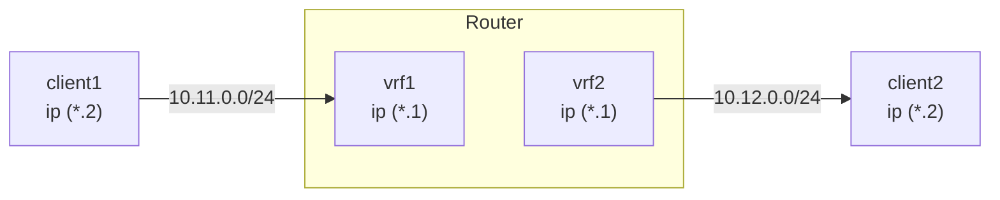

# VRF

> RouterOS 支持创建多个虚拟路由转发（VRF）实例，用于基于 BGP 的 MPLS VPN，实现独立路由表与 IP 前缀隔离。VRF 配置通过 `/ip/vrf` 菜单管理，路由表映射自动创建。每个 VRF 最多支持 1024 个实例，且需要为支持 VRF 的服务进行显式配置。

# VRF

## 描述

RouterOS 允许在单台路由器上创建多个虚拟路由转发（**VRF**）实例。这对于基于 BGP 的 MPLS VPN 非常有价值。与作为 OSI 二层技术的 BGP VPLS 不同，BGP VRF VPN 工作在三层，并在路由器之间交换 IP 前缀。VRF 解决了 IP 前缀重叠的问题，并通过为不同 VPN 提供独立路由来实现所需的隔离性。

您可以配置 VRF-Lite，或使用支持 VPNv4 地址族的多协议 BGP，将 VRF 路由表中的路由分发到其他路由器或同一路由器上的不同路由表。

## 配置

VRF 表在 [**`/ip/vrf`**](../../cli-reference/ip/vrf.md) 菜单中创建。VRF 配置创建后，会自动添加路由表映射（创建同名的动态表）。每个激活的 VRF 始终会有一个映射的路由表。

```ros
[admin@arm-bgp] /ip/vrf> print
Flags: X - disabled; * - builtin
 0  * name="main" interfaces=all

[admin@arm-bgp] /routing/table> print
Flags: D - dynamic; X - disabled, I - invalid; U - used
 0 D   name="main" fib

```

添加 VRF 的顺序很重要。为了正确匹配接口属于哪个 VRF，请按正确顺序放置 VRF（匹配从顶部条目开始，类似于防火墙规则）。

:::info
由于每个 VRF 都有一个映射的路由表，唯一 VRF 的最大数量限制为 1024 个。
:::

考虑以下示例：

```ros
[admin@arm-bgp] /ip/vrf> print
Flags: X - disabled; * - builtin
 0  * name="main" interfaces=all
 1    name="myVrf" interfaces=lo_vrf
```

由于第一个条目匹配所有接口，第二个 VRF 没有添加任何接口。要解决此问题，必须更改条目的顺序。

```ros
[admin@arm-bgp] /ip/vrf> move 1 0
[admin@arm-bgp] /ip/vrf> print
Flags: X - disabled; * - builtin
 0    name="myVrf" interfaces=lo_vrf
 1  * name="main" interfaces=all
```

分配给 VRF 的接口上的直连路由会自动安装到相应的路由表中。

:::info
当接口被分配给 VRF 时，直连路由会被添加到 VRF 路由表中。但是，RouterOS 服务不会仅仅通过在配置中指定 IP 地址就自动知道要使用哪个 VRF。每个服务都需要 VRF 支持和显式配置。有关服务是否支持 VRF 以及 VRF 配置选项的信息，请参阅相应的服务文档。
:::

例如，配置 SSH 服务以监听属于该 VRF 的接口上的连接：

```ros
[admin@arm-bgp] /ip/service> set ssh vrf=myVrf
[admin@arm-bgp] /ip/service> print
Flags: X, I - INVALID
Columns: NAME, PORT, CERTIFICATE, VRF
#   NAME     PORT  CERTIFICATE  VRF
0   telnet     23               main
1   ftp        21
2   www        80               main
3   ssh        22               myVrf
4 X www-ssl   443  none         main
5   api      8728               main
6   winbox   8291               main
7   api-ssl  8729  none         main
```

在 [**`/ip/route`**](../../cli-reference/ip/route.md) 菜单中添加路由时，通过指定 `routing-table` 参数将路由添加到 VRF，并通过在网关 IP 后附加 `@name` 来指示在哪个路由表中解析网关：

```ros
/ip/route/add dst-address=192.168.1.0/24 gateway=172.16.1.1@myVrf routing-table=myVrf
```

当网关被显式设置为在另一个 VRF 中解析时，可以实现 VRF 之间的流量泄漏，例如：

```ros
# 在 myVrf 中添加路由，但在 main 表中解析网关
/ip/route/add dst-address=192.168.1.0/24 gateway=172.16.1.1@main routing-table=myVrf

# 在 main 表中添加路由，但在 myVrf 中解析网关
/ip/route/add dst-address=192.168.1.0/24 gateway=172.16.1.1@myVrf
```

:::info
如果网关配置中没有显式指定要解析的表，则网关在“main”表中解析。
:::

## 支持的服务

不同的服务可以放置在特定的 VRF 中，服务在该 VRF 中监听传入连接或创建传出连接。默认情况下，所有服务使用 `main` 表，但您可以使用单独的 `vrf` 参数或在 IP 地址末尾附加“@”和 VRF 名称来更改此设置。

以下是支持的服务列表。

| 服务 | 支持 | 注释 |
|---|---|---|
| **[BGP](./unicast/bgp/understanding-bgp.md)** | + | `/routing/bgp/template add name=bgp-template1 vrf=vrf1``/routing/bgp/vpls add name=bgp-vpls1 site-id=10 vrf=vrf1``/routing/bgp/vpn add label-allocation-policy=per-vrf vrf=vrf1` |
| **[电子邮件](../../system-information-and-utilities/e-mail.md)** | + | `/tool/e-mail set address=192.168.88.1 vrf=vrf1` |
| **[IP 服务](../../system-information-and-utilities/services.md)** | + | `telnet`、`www`、`ssh`、`www-ssl`、`api`、`winbox`、`api-ssl` 服务支持 VRF。`ftp` 服务不支持更改 VRF。`/ip/service/set telnet vrf=vrf1` |
| **[L2TP 客户端](../../virtual-private-networks/l2tp/index.md)** | + | `/interface/l2tp-client add connect-to=192.168.88.1@vrf1 name=l2tp-out1 user=l2tp-client` |
| **[MPLS](./mpls/index.md)** | + | `/mpls/ldp/add vrf=vrf1` |
| **[Netwatch](../../diagnostics-monitoring-and-troubleshooting/netwatch.md)** | + | `/tool/netwatch/add host=192.168.88.1@vrf1` |
| **[NTP](../../system-information-and-utilities/ntp.md)** | + | `/system/ntp/client/set vrf=vrf1``/system/ntp/server/set vrf=vrf1` |
| **[OSPF](./unicast/ospf/index.md)** | + | `/routing/ospf/instance add disabled=no name=ospf-instance-1 vrf=vrf1` |
| **[ping](../../diagnostics-monitoring-and-troubleshooting/ping.md)** | + | `/ping 192.168.88.1 vrf=vrf1` |
| **[RADIUS](../../authentication-authorization-accounting/radius.md)** | + | `/radius/add address=192.168.88.1@vrf1``/radius/incoming/set vrf=vrf1` |
| **[RIP](./unicast/rip.md)** | + | `/routing/rip/instance/add name=rip-instance-1 vrf=vrf1` |
| **[RPKI](./unicast/rpki.md)** | + | `/routing/rpki/add vrf=vrf1` |
| **[SNMP](../../diagnostics-monitoring-and-troubleshooting/snmp.md)** | + | `/snmp/set vrf=vrf1` |
| **[EoIP](../../virtual-private-networks/eoip.md)** | + | `/interface/eoip add remote-address=192.168.1.1@vrf1` |
| **[IPIP](../../virtual-private-networks/ipip.md)** | + | `/interface/ipip/add remote-address=192.168.1.1@vrf1` |
| **[GRE](../../virtual-private-networks/gre.md)** | + | `/interface/gre/add remote-address=192.168.1.1@vrf1` |
| **[SSTP 客户端](../../virtual-private-networks/sstp.md#sstp-client)** | + | `/interface/sstp-client/add connect-to=192.168.1.1@vrf1` |
| **[OVPN 客户端](../../virtual-private-networks/openvpn.md#ovpn-client)** | + | `/interface/ovpn-client/add connect-to=192.168.1.1@vrf1` |
| **[L2TP-ether](../../virtual-private-networks/l2tp/index.md#l2tp-ether)** | + | `/interface/l2tp-ether/add connect-to=192.168.2.2@vrf` |
| **[VXLAN](../../bridging-and-switching/vxlan.md)** | + | `/interface/vxlan/add vni=10 vtep-vrf=vrf1` |
| **[Fetch](../../system-information-and-utilities/fetch.md)** | + | `/tool/fetch address=10.155.28.236@vrf1 mode=ftp src-path=my_file.pcap user=admin password=""` |
| **[DNS](../../network-management/dns.md)** | +  从 RouterOS v7.21 开始支持 | 指定路由器在哪个 VRF 中监听 DNS 查询。`/ip/dns/set vrf=vrf1`指定使用哪个 VRF 联系上游服务器。`/ip/dns/set servers=8.8.8.8@vrf1` |
| **[DHCP 中继](../../network-management/dhcp.md)** | +  从 RouterOS v7.15 开始支持 | `/ip/dhcp-relay/set dhcp-server-vrf=vrf1`*如果 DHCP 客户端位于同一 VRF 中，则无需在“ip dhcp-relay”配置中设置特殊参数。* |
| **[远程日志](../../diagnostics-monitoring-and-troubleshooting/log/index.md)** | +  从 RouterOS v7.19 开始支持 | `/system/logging/action add name=remote1 remote=192.168.1.1 target=remote vrf=vrf1` |

## 防火墙中的 VRF 接口

:::warning
在 RouterOS v7.14 之前，带有 in/out-interface 属性的防火墙过滤规则会应用于 VRF 实例内的接口。从 RouterOS v7.14 开始，这些规则不再针对 VRF 内的单个接口，而是针对整个 VRF 接口。
:::

从 RouterOS v7.14 开始，当接口被添加到 VRF 时，会自动创建一个虚拟 VRF 接口。要匹配属于 VRF 接口的流量，请在防火墙过滤规则中使用 VRF 虚拟接口，例如：

```ros
/ip/vrf/add interfaces=ether5 name=vrf5
/ip/firewall/filter/add chain=input in-interface=vrf5 action=accept
```

如果多个接口属于同一个 VRF，但您只需要匹配其中一个接口，请使用连接标记。例如：

```ros
/ip/vrf/add interfaces=ether15,ether16 name=vrf1516
/ip/firewall/mangle
add action=mark-connection chain=prerouting connection-state=new in-interface=ether15 new-connection-mark=input_allow passthrough=yes
/ip/firewall/filter
add action=accept chain=input connection-mark=input_allow
```

## 示例

### 简单的 VRF-Lite 设置

考虑一个两个客户 VRF 需要访问互联网的设置：

```ros
/ip/address
add address=172.16.1.2/24 interface=public
add address=192.168.1.1/24 interface=ether1
add address=192.168.2.1/24 interface=ether2

/ip/route
add gateway=172.16.1.1

# 添加 VRF 配置
/ip/vrf
add name=cust_a interface=ether1 place-before 0
add name=cust_b interface=ether2 place-before 0

# 添加 vrf 路由
/ip/route
add gateway=172.16.1.1@main routing-table=cust_a
add gateway=172.16.1.1@main routing-table=cust_b

# 伪装本地源地址
/ip/firewall/nat/add chain=srcnat out-interface=public action=masquerade
```

可能有必要确保到达“public”接口的数据包能够到达正确的 VRF。
这可以通过标记来自 VRF 客户的新连接，并根据“public”接口上传入数据包的路由标记来引导流量来解决。

```ros
# 标记新的客户连接
/ip/firewall/mangle
add action=mark-connection chain=prerouting connection-state=new new-connection-mark=\
    cust_a_conn src-address=192.168.1.0/24 passthrough=no
add action=mark-connection chain=prerouting connection-state=new new-connection-mark=\
    cust_b_conn src-address=192.168.2.0/24 passthrough=no

# 标记路由
/ip/firewall/mangle
add action=mark-routing chain=prerouting connection-mark=cust_a_conn \
    in-interface=public new-routing-mark=cust_a
add action=mark-routing chain=prerouting connection-mark=cust_b_conn \
    in-interface=public new-routing-mark=cust_b
```

### 静态 VRF 间路由

通常，您应该使用 [BGP](./unicast/bgp/understanding-bgp.md) 的本地导入和导出功能在 VRF 之间交换所有路由。如果这还不够，可以使用静态路由来实现这种所谓的路由泄漏。

您可以通过两种方式安装一条路由，其网关位于与路由本身不同的路由表中。

第一种方式是在添加路由时在网关字段中显式指定路由表。这仅在将路由和网关从“main”路由表泄漏到不同的路由表（VRF）时可能。示例：

```ros
# 在 'vrf1' 路由表中添加到 5.5.5.0/24 的路由，网关在 main 路由表中
add dst-address=5.5.5.0/24 gateway=10.3.0.1@main routing-table=vrf1
```

第二种方式是在网关字段中显式指定接口。指定的接口可以属于某个 VRF 实例。示例：

```ros
# 在 main 路由表中添加到 5.5.5.0/24 的路由，网关在 'ether2' VRF 接口上
add dst-address=5.5.5.0/24 gateway=10.3.0.1%ether2 routing-table=main
# 在 main 路由表中添加到 5.5.5.0/24 的路由，以 'ptp-link-1' VRF 接口作为网关
add dst-address=5.5.5.0/24 gateway=ptp-link-1 routing-table=main
```

如您所见，有两种变体——将网关指定为 *ip\_address%interface* 或仅指定一个 *interface*。在大多数情况下，对广播接口使用第一种。对点对点接口使用第二种，如果路由是某个 VRF 中的直连路由，也可以对广播接口使用第二种。例如，如果您在接口 *ether2* 上有一个地址 `1.2.3.4/24`，并且该接口被放入 VRF，则在该 VRF 的路由表中存在到 `1.2.3.0/24` 的直连路由。即使 *ether2* 是广播接口，也可以在不同路由表中添加仅使用接口作为网关的静态路由 `1.2.3.0/24`：

```ros
add dst-address=1.2.3.0/24 gateway=ether2 routing-table=main

```

### 静态 VRF-Lite 直连路由泄漏

有时需要从另一个 VRF 访问直接连接资源。在此示例中，两个直连网络各自位于自己的 VRF 中，您希望允许 client1 访问 client2。



```ros
/ip/address
add address=10.11.0.1/24 interface=sfp-sfpplus1
add address=10.12.0.1/24 interface=sfp-sfpplus2

# 添加 VRF 配置
/ip/vrf
add name=vrfTest1 interface=sfp-sfpplus1 place-before 0
add name=vrfTest2 interface=sfp-sfpplus2 place-before 0

```

通过将网关设置为“interface@vrf”，可以在特定 VRF 上访问直连网络。

```ros
# 添加 vrf 路由
/ip/route
add dst-address=10.11.0.0/24 gateway="sfp-sfpplus1@vrfTest1" routing-table=vrfTest2
add dst-address=10.12.0.0/24 gateway="sfp-sfpplus2@vrfTest2" routing-table=vrfTest1

```

**验证路由和可达性**

```text
[admin@CCR2004_2XS] /ip/route> print detail
Flags: D - dynamic; X - disabled, I - inactive, A - active;
c - connect, s - static, r - rip, b - bgp, o - ospf, i - is-is, d - dhcp, v - vpn, m - modem, y - bgp-mpls-vpn; H - hw-offloaded; + - ecmp

    DAc   dst-address=10.11.0.0/24 routing-table=vrfTest1 gateway=sfp-sfpplus1@vrfTest1 immediate-gw=sfp-sfpplus1 distance=0 scope=10 suppress-hw-offload=no
          local-address=10.11.0.1%sfp-sfpplus1@vrfTest1

 1  As   dst-address=10.12.0.0/24 routing-table=vrfTest1 pref-src="" gateway=vrfTest2 immediate-gw=vrfTest2 distance=1 scope=30 target-scope=10
          suppress-hw-offload=no

 2  As   dst-address=10.11.0.0/24 routing-table=vrfTest2 pref-src="" gateway=vrfTest1 immediate-gw=vrfTest1 distance=1 scope=30 target-scope=10
          suppress-hw-offload=no

    DAc   dst-address=10.12.0.0/24 routing-table=vrfTest2 gateway=sfp-sfpplus2@vrfTest2 immediate-gw=sfp-sfpplus2 distance=0 scope=10 suppress-hw-offload=no
          local-address=10.12.0.1%sfp-sfpplus2@vrfTest2

```

```text
[admin@cl2] > /ping 10.11.0.2 src-address=10.12.0.2
  SEQ HOST                                     SIZE TTL TIME       STATUS
    0 10.11.0.2                                 56  64 67us
    1 10.11.0.2                                 56  64 61us
    sent=2 received=2 packet-loss=0% min-rtt=61us avg-rtt=64u

```

:::warning
尝试泄漏重叠网络是行不通的。
:::

**访问另一个 VRF 中路由器的本地地址**

```text
[admin@cl2] > /ping 10.11.0.1 src-address=10.12.0.2
  SEQ HOST                                     SIZE TTL TIME       STATUS
    0 10.11.0.1                                                   timeout
    1 10.11.0.1                                                   timeout
    sent=2 received=0 packet-loss=100%

```

使用“interface@vrf”网关的方法仅在路由器转发数据包时有效。要访问本地 VRF 地址，您需要路由到 VRF 接口。

```ros
# 添加 vrf 路由
/ip/route
add dst-address=10.11.0.0/24 gateway=vrfTest1@vrfTest1 routing-table=vrfTest2
add dst-address=10.12.0.0/24 gateway=vrfTest2@vrfTest2 routing-table=vrfTest1

```

```text
[admin@cl2] > /ping 10.11.0.1 src-address=10.12.0.2
  SEQ HOST                                     SIZE TTL TIME       STATUS
    0 10.11.0.1                                 56  64 67us
    1 10.11.0.1                                 56  64 61us
    sent=2 received=2 packet-loss=0% min-rtt=61us avg-rtt=64u

```

### 动态 VRF-Lite 路由泄漏

对于足够大的设置，静态路由泄漏是不够的。考虑与静态路由泄漏示例相同的设置，并添加 IPv6 地址，仅用于演示。

```ros
/ip/address
add address=10.11.0.1/24 interface=sfp-sfpplus1
add address=10.12.0.1/24 interface=sfp-sfpplus2

# 添加 VRF 配置
/ip/vrf
add name=vrfTest1 interface=sfp-sfpplus1 place-before 0
add name=vrfTest2 interface=sfp-sfpplus2 place-before 0

/ipv6/address
add address=2001:1::1 advertise=no interface=sfp-sfpplus1
add address=2001:2::1 advertise=no interface=sfp-sfpplus2

```

您可以使用 [BGP VPN](../../cli-reference/routing/bgp.md#routingbgpvpn) 来泄漏本地路由，而无需实际建立 BGP 会话。

```ros
/routing/bgp/vpn
add export.redistribute=connected .route-targets=1:1 import.route-targets=1:2 label-allocation-policy=per-vrf name=bgp-mpls-vpn-1 \
    route-distinguisher=1.2.3.4:1 vrf=vrfTest1
add export.redistribute=connected .route-targets=1:2 import.route-targets=1:1 label-allocation-policy=per-vrf name=bgp-mpls-vpn-2 \
    route-distinguisher=1.2.3.4:1 vrf=vrfTest2
```

:::warning
请注意导入/导出 route-target。如果设置不当，将导入来自同一 VRF 的本地 VRF 路由。
:::

现在 VRF 之间的直连路由被交换了。

```text
[admin@CCR2004_2XS] > /routing/route/print where dst-address in 111.0.0.0/8 && afi=ip4
...
 Ac   afi=ip4 contribution=active dst-address=111.11.0.0/24 routing-table=vrfTest1 gateway=sfp-sfpplus1@vrfTest1 immediate-gw=sfp-sfpplus1 distance=0 scope=10
       belongs-to="connected" local-address=111.11.0.1%sfp-sfpplus1@vrfTest1
       debug.fwp-ptr=0x202421E0
 Ay   afi=ip4 contribution=best-candidate dst-address=111.12.0.0/24 routing-table=vrfTest1 label=17 gateway=vrfTest2@vrfTest2 immediate-gw=sfp-sfpplus2
       distance=200 scope=40 target-scope=10 belongs-to="bgp-mpls-vpn-1-bgp-mpls-vpn-2-connected-export-import"
       bgp.ext-communities=rt:1:2 .atomic-aggregate=no .origin=incomplete
       debug.fwp-ptr=0x202425A0
 Ay   afi=ip4 contribution=best-candidate dst-address=111.11.0.0/24 routing-table=vrfTest2 label=16 gateway=vrfTest1@vrfTest1 immediate-gw=sfp-sfpplus1
       distance=200 scope=40 target-scope=10 belongs-to="bgp-mpls-vpn-2-bgp-mpls-vpn-1-connected-export-import"
       bgp.ext-communities=rt:1:1 .atomic-aggregate=no .origin=incomplete
       debug.fwp-ptr=0x202424E0
 Ac   afi=ip4 contribution=active dst-address=111.12.0.0/24 routing-table=vrfTest2 gateway=sfp-sfpplus2@vrfTest2 immediate-gw=sfp-sfpplus2 distance=0 scope=10
       belongs-to="connected" local-address=111.12.0.1%sfp-sfpplus2@vrfTest2
       debug.fwp-ptr=0x20242240

```

IPv6 也一样：

```text
[admin@CCR2004_2XS] /routing/route> print detail where dst-address in 2001::/8 && afi=ip6
...
 Ac   afi=ip6 contribution=active dst-address=2001:1::/64 routing-table=vrfTest1 gateway=sfp-sfpplus1@vrfTest1 immediate-gw=sfp-sfpplus1 distance=0 scope=10
       belongs-to="connected" local-address=2001:1::1%sfp-sfpplus1@vrfTest1
       debug.fwp-ptr=0x20242300
 Ay   afi=ip6 contribution=active dst-address=2001:2::/64 routing-table=vrfTest1 label=17 gateway=vrfTest2@vrfTest2 immediate-gw=sfp-sfpplus2 distance=200
       scope=40 target-scope=10 belongs-to="bgp-mpls-vpn-1-bgp-mpls-vpn-2-connected-export-import"
       bgp.ext-communities=rt:1:2 .atomic-aggregate=no .origin=incomplete
       debug.fwp-ptr=0x202425A0
 Ay   afi=ip6 contribution=active dst-address=2001:1::/64 routing-table=vrfTest2 label=16 gateway=vrfTest1@vrfTest1 immediate-gw=sfp-sfpplus1 distance=200
       scope=40 target-scope=10 belongs-to="bgp-mpls-vpn-2-bgp-mpls-vpn-1-connected-export-import"
       bgp.ext-communities=rt:1:1 .atomic-aggregate=no .origin=incomplete
       debug.fwp-ptr=0x202424E0
 Ac   afi=ip6 contribution=active dst-address=2001:2::/64 routing-table=vrfTest2 gateway=sfp-sfpplus2@vrfTest2 immediate-gw=sfp-sfpplus2 distance=0 scope=10
       belongs-to="connected" local-address=2001:2::1%sfp-sfpplus2@vrfTest2
       debug.fwp-ptr=0x20242360

```

### 动态 VRF-Lite 路由泄漏（旧版变通方法）

在 RouterOS v7.14 之前，没有机制可以将路由从同一路由器上的一个 VRF 实例泄漏到另一个 VRF 实例。

作为一种变通方法，可以在两个本地配置的环回地址之间创建隧道，并将每个隧道端点分配给自己的 VRF。然后，动态路由协议或静态路由可以在两个 VRF 之间泄漏路由。

这种方法的缺点是必须在每对需要泄漏路由的 VRF 之间创建隧道（形成全网状），即使只有几个 VRF，也会显著增加配置的复杂性，更不用说更复杂的设置了。

例如，在 5 个 VRF 之间泄漏路由需要 n × (n − 1) / 2 个连接，这导致在一台路由器上需要 20 个隧道端点和 20 个 [OSPF](./unicast/ospf/index.md) 实例。

两个 VRF 的示例配置：

```ros
/interface/bridge
add name=dummy_custC
add name=dummy_custB
add name=lo1
add name=lo2

/ip/address
add address=111.255.255.1 interface=lo1 network=111.255.255.1
add address=111.255.255.2 interface=lo2 network=111.255.255.2
add address=172.16.1.0/24 interface=dummy_custC network=172.16.1.0
add address=172.16.2.0/24 interface=dummy_custB network=172.16.2.0

/interface/ipip
add local-address=111.255.255.1 name=ipip-tunnel1 remote-address=111.255.255.2
add local-address=111.255.255.2 name=ipip-tunnel2 remote-address=111.255.255.1

/ip/address
add address=192.168.1.1/24 interface=ipip-tunnel1 network=192.168.1.0
add address=192.168.1.2/24 interface=ipip-tunnel2 network=192.168.1.0

/ip/vrf
add interfaces=ipip-tunnel1,dummy_custC name=custC
add interfaces=ipip-tunnel2,dummy_custB name=custB

/routing/ospf/instance
add disabled=no name=i2_custB redistribute=connected,static,copy router-id=192.168.1.1 routing-table=custB vrf=custB
add disabled=no name=i2_custC redistribute=connected router-id=192.168.1.2 routing-table=custC vrf=custC
/routing/ospf/area
add disabled=no instance=i2_custB name=custB_bb
add disabled=no instance=i2_custC name=custC_bb
/routing/ospf/interface-template
add area=custB_bb disabled=no networks=192.168.1.0/24
add area=custC_bb disabled=no networks=192.168.1.0/24

```

**结果**

```ros
[admin@rack1_b36_CCR1009] /routing/ospf/neighbor> print
Flags: V - virtual; D - dynamic
 0  D instance=i2_custB area=custB_bb address=192.168.1.1 priority=128 router-id=192.168.1.2 dr=192.168.1.1 bdr=192.168.1.2
      state="Full" state-changes=6 adjacency=41m28s timeout=33s

 1  D instance=i2_custC area=custC_bb address=192.168.1.2 priority=128 router-id=192.168.1.1 dr=192.168.1.1 bdr=192.168.1.2
      state="Full" state-changes=6 adjacency=41m28s timeout=33s

[admin@rack1_b36_CCR1009] /ip/route> print where routing-table=custB
Flags: D - DYNAMIC; A - ACTIVE; c, s, o, y - COPY
Columns: DST-ADDRESS, GATEWAY, DISTANCE
     DST-ADDRESS       GATEWAY                         DISTANCE
  DAo 172.16.1.0/24     192.168.1.1%ipip-tunnel2@custB       110
  DAc 172.16.2.0/24     dummy_custB@custB                      0
  DAc 192.168.1.0/24    ipip-tunnel2@custB                     0

[admin@rack1_b36_CCR1009] > /ip/route/print where routing-table=custC
Flags: D - DYNAMIC; A - ACTIVE; c, o, y - COPY
Columns: DST-ADDRESS, GATEWAY, DISTANCE
    DST-ADDRESS       GATEWAY                         DISTANCE
  DAc 172.16.1.0/24     dummy_custC@custC                      0
  DAo 172.16.2.0/24     192.168.1.2%ipip-tunnel1@custC       110
  DAc 192.168.1.0/24    ipip-tunnel1@custC                     0

```

### 最简单的 MPLS VPN 设置


在此示例中，创建了一个基本的 [MPLS](./mpls/index.md) 骨干网（由两台运营商边缘（PE）路由器 PE1 和 PE2 组成），并配置为在属于 *cust-one* VPN 的客户边缘（CE）路由器 CE1 和 CE2 之间转发流量。

**CE1 路由器**

```ros
/ip/address/add address=10.1.1.1/24 interface=ether1
# 使用静态路由
/ip/route/add dst-address=10.3.3.0/24 gateway=10.1.1.2
```

**CE2 路由器**

```ros
/ip/address/add address=10.3.3.4/24 interface=ether1
/ip/route/add dst-address=10.1.1.0/24 gateway=10.3.3.3
```

**PE1 路由器**

```ros
/interface/bridge/add name=lobridge
/ip/address/add address=10.1.1.2/24 interface=ether1
/ip/address/add address=10.2.2.2/24 interface=ether2
/ip/address/add address=10.5.5.2/32 interface=lobridge
/ip/vrf/add name=cust-one interfaces=ether1
/mpls/ldp/add enabled=yes transport-address=10.5.5.2 lsr-id=10.5.5.2
/mpls/ldp/interface/add interface=ether2
/routing/bgp/template/set default as=65000

/routing/bgp/vpn
add vrf=cust-one \
  route-distinguisher=1.1.1.1:111 \
  import.route-targets=1.1.1.1:111 \
  import.router-id=cust-one \
  export.redistribute=connected \
  export.route-targets=1.1.1.1:111 \
  label-allocation-policy=per-vrf
/routing/bgp/connection
add template=default remote.address=10.5.5.3 address-families=vpnv4 local.address=10.5.5.2

# 添加指向远端 BGP 对等体环回地址的路由
/ip/route/add dst-address=10.5.5.3/32 gateway=10.2.2.3
```

**PE2 路由器 (Cisco)**

```
ip vrf cust-one
rd 1.1.1.1:111
route-target export 1.1.1.1:111
route-target import 1.1.1.1:111
exit

interface Loopback0
ip address 10.5.5.3 255.255.255.255

mpls ldp router-id Loopback0 force
mpls label protocol ldp

interface